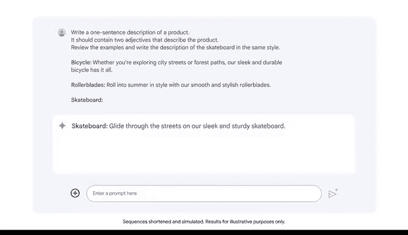

# 029：探索少量样本提示 🧠

在本节课中，我们将要学习一种名为“少量样本提示”的提示工程技巧。通过向大型语言模型提供少量示例，我们可以引导它生成更符合我们期望格式和风格的输出。

## 少量样本提示的概念

你是否曾参考先前的例子来创造新事物？例如，在撰写一份类似的报告时，你可能会参考一份广受好评的报告；或者在设计自己的网站时，以一个相关且吸引人的网站为模型。

示例对大型语言模型同样有用。在你的提示中包含示例，可以帮助模型更好地响应你的请求，并且是获得理想输出的一个特别有效的策略。接下来，我们将探索如何在提示中使用示例。

## 理解“样本”术语

在深入之前，让我们先简要讨论一个技术术语：“样本”。在提示工程中，“样本”一词通常用作“示例”的同义词。

根据提供给大型语言模型的示例数量，提示技术有不同的名称：
*   **零样本提示**：一种在提示中不提供任何示例的技术。
*   **单样本提示**：一种在提示中提供一个示例的技术。
*   **少量样本提示**：一种在提示中提供两个或更多示例的技术。

由于零样本提示中不包含示例，模型需要仅凭其训练数据和提示中包含的任务描述来执行任务。当你寻求简单、直接的回应时，零样本提示最有可能有效。对于需要模型以更具体、更细致的方式回应的任务，零样本提示可能效果不佳。

## 少量样本提示的优势

少量样本提示可以通过在提示中提供额外的上下文和示例来提高大型语言模型的性能。这些额外的示例有助于阐明期望的格式、措辞或通用模式。少量样本提示适用于一系列任务。例如，你可以用它来生成特定风格的内容。

假设你在一家在线零售商工作。你需要为一个新的滑板撰写产品描述。你已经有了现有产品（如自行车和轮滑鞋）的描述。你希望滑板的描述遵循类似的风格和格式。

## 实践：撰写产品描述

我们将从一个包含一些通用指令的提示开始：
> 写一句产品描述。它应包含两个描述该产品的形容词。

我们还需要指定，我们希望Gemini（模型）参考我们提供的示例，并以相同的风格撰写滑板的描述。由于这是一个少量样本提示，我们需要提供能体现我们所需风格的示例。

以下是示例的结构：
*   每个示例包含一个指示所描述产品的标签（如“自行车”、“轮滑鞋”）。
*   每个描述都是一句话，并包含两个形容词（例如，描述自行车用“流畅且耐用”，描述轮滑鞋用“顺滑且时尚”）。

接下来，我们输入标签“滑板”。当我们添加这个标签并将产品描述留空时，我们向Gemini表明，我们希望它像处理另外两个产品描述一样，来完成滑板的描述。

让我们回顾一下输出。输出提供了滑板的产品描述，它符合我们要求的条件，并且写作风格和格式与我们提示中包含的示例相同。

## 关于示例数量的考量

在这个案例中，两个示例足以获得有用的结果。但是，对于提示中应包含的最佳示例数量，并没有明确的规则。一些大型语言模型仅用几个示例就能准确复现模式，而另一些则需要更多示例。同时，如果你在提示中包含过多示例，模型的回应可能会变得缺乏灵活性和创造性，并且可能过于紧密地复现示例。为了在你的特定任务中获得最佳结果，请尝试调整示例的数量。

## 总结

本节课中，我们一起学习了一种能帮助你获得更高质量输出的提示技巧。少量样本提示是一种有效的策略，可以帮助你引导大型语言模型生成更有用的回应。