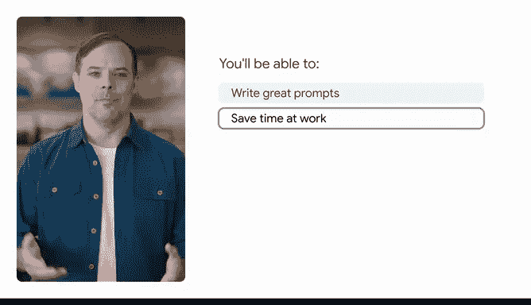
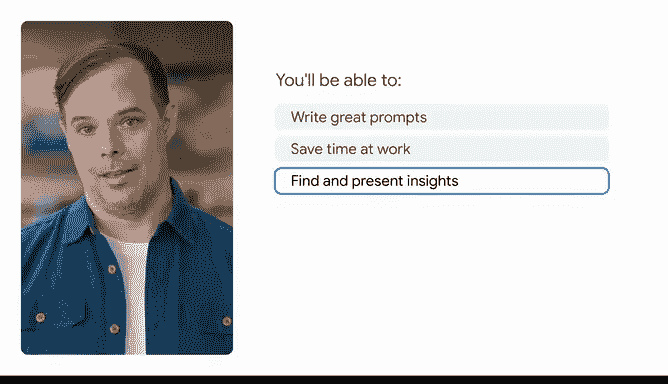
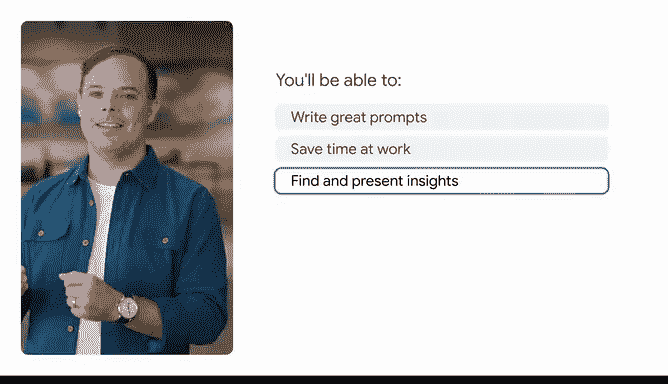

# 043：发现人工智能如何助力工作

在本节课中，我们将要学习如何通过提示工程，利用生成式人工智能来提升工作效率。我们将了解什么是提示，并学习一个用于编写高效提示的通用框架。

## 什么是提示？

上一节我们介绍了课程的目标，本节中我们来看看“提示”究竟是什么。

简单来说，提示是向生成式AI工具提供特定指令的过程，目的是获取新信息或完成某项任务。这些指令被称为“提示”。当我们为生成式AI工具编写提示时，我们是在给它一系列输入，并告诉它我们希望它生成什么。

以下是生成式AI工具的一些能力：
*   一些生成式AI工具可以生成文本或图像。
*   另一些则可以生成视频、音频甚至代码。

## 提示工程：艺术与科学

提示工程既是一门艺术，也是一门科学。为了获得最佳结果，我们需要精确地定义我们的需求。这类似于你帮助队友开始一个新项目的方式：提供背景信息和设定参数，将帮助你从生成式AI中获得最佳输出。

## 课程核心内容概述

接下来，我们将概述本课程将涵盖的核心技能。

首先，你将学习**提示框架**。这是一个用于编写优秀提示的公式。你将在整个课程中使用这个框架。

之后，课程的重点是将提示应用于具体的任务，以节省你的工作时间。

以下是本课程将教你完成的具体任务：
*   你将使用生成式AI进行头脑风暴、制定计划，并为不同受众起草电子邮件。
*   我们将教你如何总结会议记录、分配行动项等。

我们还将教你如何使用生成式AI分析数据和电子表格。

你将编写提示，以帮助发现隐藏在数据中的洞察。然后，你将使用生成式AI将这些洞察转化为图表，并最终将其全部转化为带有演讲要点的演示文稿幻灯片。

接下来，你将学习**高级提示技巧**，以帮助你处理复杂的任务。例如，你将学习如何创建提示，使长期复杂的项目更易于规划和执行。

你还将学习如何设计提示来创建你自己的个性化AI助手，用于诸如面试前练习或为困难的工作对话做准备等事情。

最后，你将学习如何**负责任地使用生成式AI**，包括在工作中和团队中使用它的指导原则。这一点至关重要。生成式AI工具帮助你完成工作，但它们并不替你完成工作。任何使用生成式AI的人都应始终评估和事实核查其输出。

## 关于工具与练习

市面上有很多生成式AI工具。在本课程中，我们将演示如何使用Gemini及其他Google AI工具（如用于Google工作区的Gemini和Google AI Studio）进行提示。但你在本课程中学到的所有技巧和最佳实践，都可以应用于其他生成式AI工具，如ChatGPT、Copilot或Claude。

最后，我们设计本课程是为了让你获得可以立即在工作中使用的技能。因此，你将要学习的所有这些课程和技巧都植根于真实场景。你应该进行实验和尝试，以找出最适合你的方法。在学习本课程时，你可以随时暂停视频，并用你当前正在处理的事情来测试你刚刚学到的内容。

本节课中，我们一起学习了提示的基本概念、提示工程的重要性，并预览了如何通过具体的框架和技巧，利用生成式AI来提升各类工作效率。现在，让我们开始编写我们的第一个提示吧。