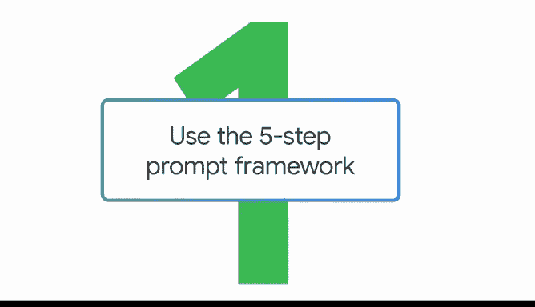
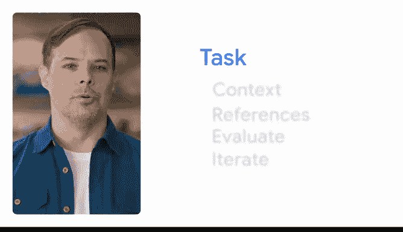
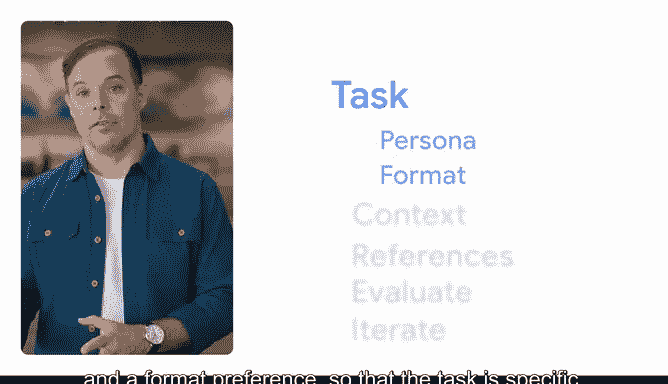
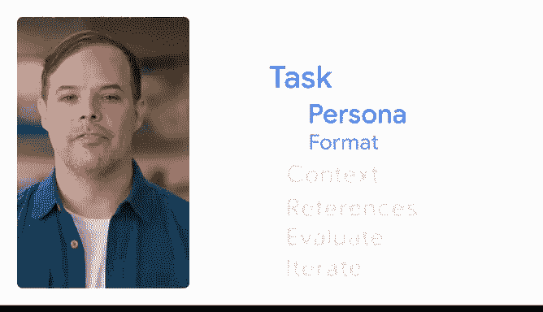
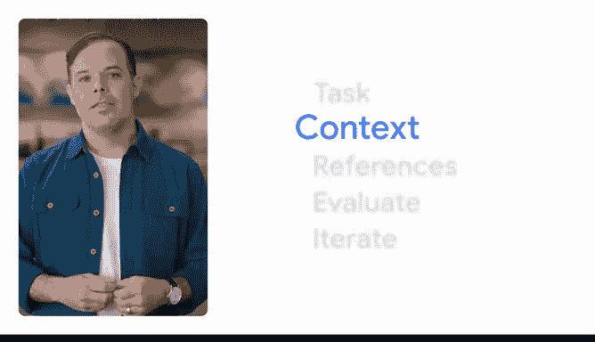
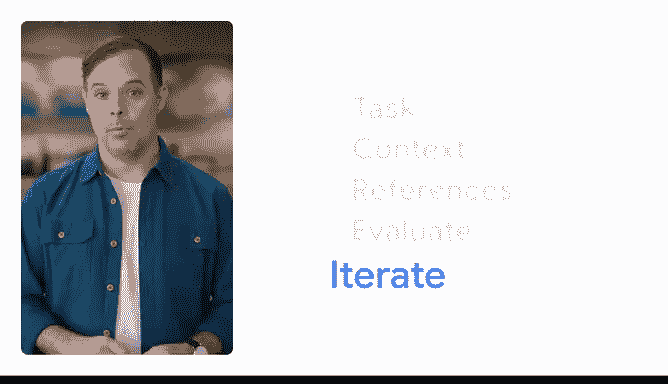

# 044：运用五步提示框架 🧠



在本节课中，我们将学习如何创建有效的提示。一个好的提示遵循一个简单的框架，它能帮助你从生成式AI工具中获得更精准、更有用的输出。

## 概述


我们将介绍一个由五个步骤组成的提示框架：**任务、背景、参考、评估与迭代**。这个框架的核心是“**深思熟虑地创建真正优秀的输入**”。只要记住这个原则，你就能构建出高质量的提示。

---

## 第一步：定义任务 🎯

首先，你需要清晰地描述你希望生成式AI工具帮助你完成的任务。一个明确的任务描述应包含两个关键元素：**角色**和**格式偏好**。



*   **角色**：指你希望AI工具从何种专业知识背景出发。你可以要求它扮演一个特定角色，例如：
    *   一位专业的演讲稿撰写人。
    *   一位拥有15年经验的营销主管。
    *   你也可以要求它为特定受众（如客户或你的经理）生成内容。在设定角色时，描述可以尽可能详细。



*   **格式偏好**：指你希望输出结果以何种形式呈现。例如：
    *   项目符号列表。
    *   简短的句子。
    *   表格。

**公式示例**：
```
任务 = 角色 + 格式 + 核心指令
```
例如：“**扮演一位资深产品经理，以项目符号列表的形式，为我起草一份新功能发布邮件。**”

---

## 第二步：提供背景信息 📖

上一节我们定义了任务，本节中我们来看看如何为任务提供必要的背景信息。背景信息是帮助AI工具理解你具体需求的关键细节。

背景信息能将一个模糊的请求变得具体。例如：



*   **模糊请求**：“给我一些30美元以下的生日礼物点子。”
*   **具体请求（含背景）**：“给我5个生日礼物点子。我的预算是30美元。礼物是送给一位29岁、热爱冬季运动，并且最近刚从单板滑雪转向双板滑雪的朋友。”

通过添加背景（预算、收礼人年龄、兴趣爱好变化），AI工具能提供更贴合实际、更具个性化的建议。

---



## 第三步：引入参考示例 📚


有时，你可以为AI工具提供一些参考示例，以帮助它更好地生成输出。

继续以生日礼物为例，如果你提供了过去送过的成功礼物作为参考，AI工具就能基于这些例子，给出更符合你风格或更实用的建议。

当然，并非所有任务都有明确的参考物，尤其是在处理抽象概念或寻求灵感和创意时，这一步可能不适用。

---

## 第四步：评估输出 🔍

在获得AI的输出后，下一步是进行评估。你需要问自己：我提供的输入是否得到了我需要的输出？输出结果是否符合任务要求、背景设定，并满足格式偏好？

评估是判断提示是否有效的关键环节，它直接导向框架的最后一步。

---

## 第五步：迭代优化 🔄

如果我们评估输出后，发现结果不理想，就需要进行迭代。这意味着你可以通过添加更多信息或调整提示内容来再次尝试。

**代码示例（迭代过程）**：
```python
# 初始提示
prompt_v1 = “写一首关于春天的诗。”
# 评估后，添加更多细节进行迭代
prompt_v2 = “扮演一位中国古代诗人，写一首五言绝句，描绘初春山景的宁静与生机。”
```

迭代是有效提示的核心部分，我们将在课程后续深入探讨。关于这个框架，还有一点很重要：构建有效提示的方法有很多种，**提示本身的实质内容远比其结构的顺序更重要**。只要你坚持“深思熟虑地创建真正优秀的输入”这一原则，你的输出结果就会很棒。

---




## 总结


本节课中，我们一起学习了创建有效提示的五步框架：**任务、背景、参考、评估与迭代**。记住，关键在于清晰定义任务（包含角色和格式），提供充分的背景细节，并在必要时引入参考和进行迭代优化。掌握这个框架，将帮助你更高效地与生成式AI工具协作。