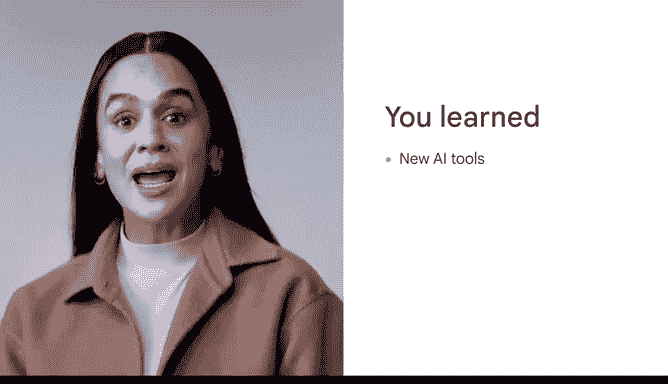

# 046：总结回顾 📚

在本节课中，我们将对前面学习的内容进行总结，回顾如何持续深化对人工智能的理解，并探索如何将AI应用到你的工作中。

---

人工智能的可能性令人鼓舞，希望你继续寻找将AI应用于工作的方法。

在课程的这一部分，我们探讨了如何持续深化你对人工智能的理解。

首先，我们回顾了如何发现和评估新工具。

以下是发现和评估新AI工具的关键步骤：
*   **明确需求**：首先确定你需要AI工具解决的具体问题。
*   **主动搜索**：利用专业社区、科技媒体和官方渠道寻找工具。
*   **评估标准**：从**准确性**、**易用性**、**成本**和**数据隐私**等维度进行综合评估。

接下来，我们介绍了如何从AI创新中寻找灵感。

我们探索了具有创造性的AI模型，并发现AI已经被创造性地融入某些工作领域。

最后，我们识别了在工作场所利用AI的机会，并反思了对AI的理解将如何使你受益。😊

---

做得好。我很享受引导你探索人工智能及其未来。😊

---

**总结**

本节课中，我们一起学习了如何持续深化对AI的理解。我们回顾了发现与评估新AI工具的方法，探讨了如何从行业创新中获取灵感，并思考了在工作场所应用AI的潜在机会。希望这些知识能帮助你在未来的工作和学习中，更有效地利用人工智能技术。