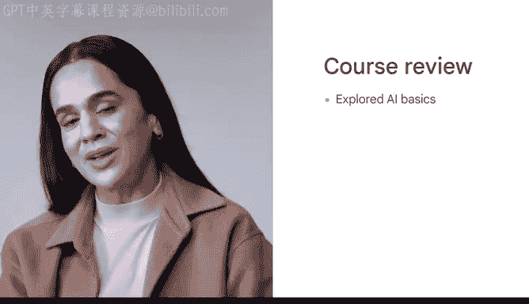
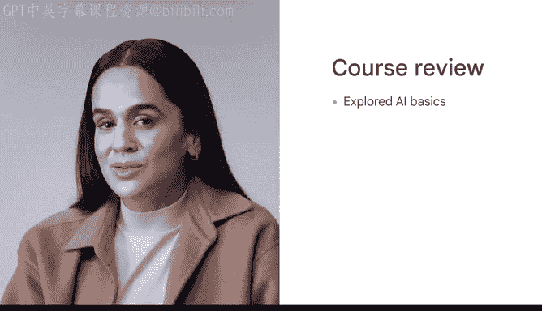

# 047：课程结语 🎉

在本节课中，我们将回顾并总结整个《谷歌人工智能要点》课程的核心内容。我们一起探索了人工智能的基础概念、应用方法以及如何负责任地使用它。

## 课程回顾

首先，我们介绍了人工智能的基础知识。

我们涵盖了一些基础的人工智能概念，例如什么是人工智能以及它如何工作。我们还讨论了人工智能在工作场所中的能力和局限性。

接下来，我们探讨了将人工智能应用于工作任务的方法。

我们介绍了一个**AI模型**的基础知识，以及它如何通过在海量数据上进行训练来完成各种任务。我们还讨论了人工智能工具的各种常见应用。

## 提升生产力与解决问题

上一节我们介绍了AI的应用，本节中我们来看看如何利用AI工具提升生产力。

我们探索了如何利用人工智能工具帮助提高生产力、优化工作流程并解决工作场所中的问题。我们强调了在工作中使用人工智能工具时，人的参与和判断的重要性，这包括在任何由AI辅助的任务中践行个人责任。

## 编写有效的提示

之后，我们学习了如何编写有效的提示。

我们研究了**大型语言模型**如何生成输出。我们也讨论了编写清晰、具体的提示是提示工程的重要组成部分，以及如何分析输出并在必要时修改提示。

## 负责任地使用AI

然后，我们讨论了如何负责任地使用人工智能。

我们涵盖了人工智能工具固有的常见风险和不公平偏见，以及如何减轻它们。我们还讨论了在工作场所使用人工智能可能带来的潜在社会危害和安全后果。

## 保持与时俱进

最后，我们学习了一些保持与人工智能发展同步的策略。

我们探索了如何为工作场所评估人工智能工具，并从其他行业如何利用人工智能进行创新中汲取灵感。我们还确定了在工作场所利用人工智能的方法。

## 总结与未来方向

在本节课中，我们一起学习了人工智能从基础到应用，再到伦理和未来发展的完整知识框架。你的下一步行动取决于你自己。

以下是你可以考虑的一些方向：
*   你可以与行业内的其他人定期安排交流，了解人工智能的最新进展。
*   你可以在公司倡导负责任的人工智能实践。
*   你可以更深入地关注人工智能的某些方面，例如如何最佳地集成**多模态模型**，或最新的提示工程研究技术。
*   你也可以开始在日常工作中利用人工智能，使用本课程介绍的工具或你发现的新AI工具。

无论你的下一步是什么，恭喜你完成了这门课程并学习了更多关于人工智能的知识。