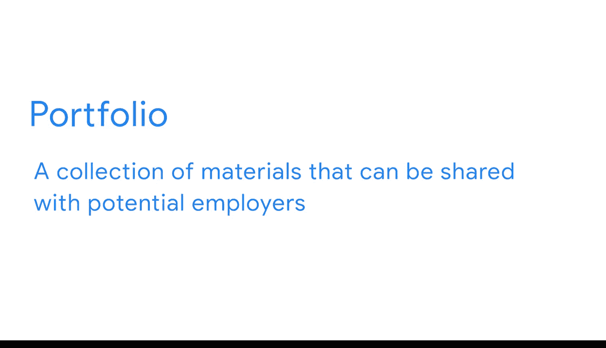

#  001：欢迎加入谷歌商业智能证书项目 🚀

在本课程中，我们将开启谷歌商业智能职业证书项目的学习之旅。你将了解商业智能在现代商业中的核心价值、本项目的结构、你将学到的技能以及来自谷歌的讲师团队。

---

我们的世界在不断变化和发展。各地的公司都在努力引领下一个重大趋势。

消费者期望快速、令人兴奋的产品发布，以及能像魔法般送到家门口的包裹。

在这种惊人的变化中，速度的价值变得不可估量。它确实是当今商业成功最重要的因素之一。

毕竟，能够识别问题或机会固然很好。但真正的价值在于，在问题演变成巨大危机之前识别它，或者在竞争对手之前抓住机会。

如今，关于市场、组织、客户、竞争对手和员工的数据比以往任何时候都多。但仅凭数据本身，我们无法做出更好的决策并快速交付成果。这正是商业智能发挥作用的地方。

**商业智能** 涉及自动化流程和信息渠道，以将相关数据转化为易于决策者获取的可执行洞察。

换句话说，通过向决策者展示当前正在发生的事情，组织会变得更智能、更成功。

一个全国性的餐饮集团可能会分析数百万的客户数据，以优化其食品供应并减少浪费。或者，一家本地医院可以整合众多不同的数据源来审查反馈和结果，以帮助个性化患者体验。

又或者，一家全球制造公司利用来自世界各地的供应链数据，做出更精确的需求预测并确保适当的库存水平。

商业智能的应用是无穷无尽的，商业智能的职业机会也是如此。这个领域涉及如此多样化的组织和行业，无论你的兴趣在哪里，都有适合你的道路。仅在本项目中，你就会了解到从家电制造商到杂货店，从本地工匠到人工智能公司的各种案例。

商业智能专业人士正在各行各业产生影响。至于我，我叫Sally，是谷歌的一名商业智能分析师。我非常高兴地欢迎你加入谷歌商业智能职业证书项目。我将担任本项目第一门课程的讲师。

完成像这样的谷歌职业证书，将帮助你培养雇主在招聘商业智能人才时所寻求的相关技能。你将学习如何使用这个快速发展、高薪领域的工具。当你毕业时，你可以与数百家对招聘谷歌职业证书毕业生感兴趣的美国雇主建立联系。

该项目旨在让你在**3到6个月**内（如果你以兼职方式学习证书）为一份工作做好准备。它非常灵活，只有三门课程，你可以完全在线、按照自己的节奏和方式完成。无论你是想转行、寻找新工作、提升技能还是创业，谷歌职业证书都能为你打开新机遇的大门。

你可能通过谷歌数据分析证书认识我，它是本项目的一个关键基础。你在这里学习的内容依赖于那个基础。因此，你需要确保先获得该证书，或者使用我们即将推出的自我评估来确保你具备相当的知识。

我将在整个第一门课程中陪伴你，确保你学到成功所需的知识。我热爱商业智能世界，非常喜欢使用SQL，并深入研究支持谷歌人员运营的分析技术方面。这个团队致力于谷歌的人员配置、发展和独特包容的文化。

但我并非一开始就从事商业智能。当我最初思考职业道路时，我对成为一名医生感兴趣。但最终我真正喜欢上了生物科学，所以我以为我会成为一名生物医学研究员。当然，数据分析是数据的科学，所以这个领域最终引起了我的兴趣也就在情理之中了。

我以分析师的身份开始了我的职业生涯，现在就在这里。这只是一个例子，每个人的经历都不同。事实上，谷歌职业证书是由拥有数十年经验的行业专业人士设计的，每门课程都将有一位来自谷歌的不同专家指导你。我们将通过视频分享知识，通过实践活动帮助你练习，并带你经历工作中可能遇到的各种场景。

首先，来认识一下我的队友Ed。

你好，我是Ed，是谷歌的一名产品经理。我们将一起探索数据建模和ETL，它代表**提取、转换、加载**。这一切都是为了将数据以你需要的方式放到你需要的地方，以便你进行分析和监控。

接下来，你将认识Terrence。

大家好，我是Terrence，是一名高级商业智能分析师。我真的很期待与你共度时光，一起探索在创建商业智能可视化时如何应用你对利益相关者需求的理解。我们还将使用数据看板来呈现清晰的洞察，以推动各种公司的发展。

嗨，我是Anita，是谷歌的一名高级商业智能分析师。我将指导你完成不同的职业建设主题和活动，包括以作品集创作为特色的课程期末项目。作品集是一套可以与潜在雇主分享的材料。这个激动人心的实践体验将汇集你在本项目中学习的所有内容，并使你能够将技能应用于一个现实的商业场景。

我们都很高兴你来到这里。就我个人而言，已经迫不及待要开始了。你准备好迈出加入我们商业智能行业的第一步了吗？让我们开始吧。

---

在本节课中，我们一起了解了商业智能如何通过将数据转化为洞察来驱动现代商业决策，认识了谷歌商业智能证书项目的结构、目标以及讲师团队。我们明确了该项目旨在为你提供实用的技能，帮助你在3-6个月内开启商业智能领域的职业生涯。现在，让我们带着这份了解，正式开启学习之旅。