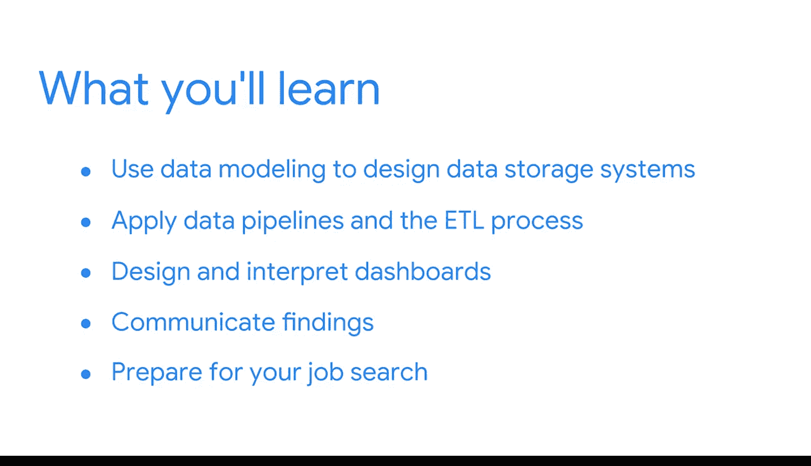

**谷歌商业智能课程：1：课程1介绍** 🎯

在本课程中，我们将开始探索商业智能行业。无论你是行业新人还是已有经验，本课程都将为你揭示BI的职业路径、核心角色以及如何开展有影响力的项目。

***

选择从事商业智能职业有无数的理由。

享受分析性思考或对数字感兴趣，是成为BI专业人士的绝佳动力。

但BI的世界远不止于此。或许你热衷于解决问题。

简化流程或为他人消除痛点。

也许你拥有出色的沟通技巧。并且你希望运用这些技巧来分享见解，帮助你的团队做出有效决策。

许多BI从业者乐于创建能简化任务、让同事能投入更多时间到其他项目中的工具。

BI专业人士的灵感来源多种多样。

但当我与谷歌的同事们交流时，他们最热爱的一点，仅仅是运用自己的才能让他人感到快乐。

知道自己让他人的工作变得更轻松或节省了大量时间，会带来巨大的满足感。

而现在，你让我感到快乐，因为你来到这里，准备探索BI这条激动人心且回报丰厚的职业道路。

***

在第一个课程中，你将开始了解BI行业。

如果这对你是一个新领域，你将学习如何识别最适合你技能和兴趣的职业路径和雇主类型。

你还将思考BI分析师与BI工程师的角色差异。

如果你已具备一些BI经验，本课程将为你打开通往更迷人职业机会的新大门。

你将理解如何开展一个有影响力的BI项目。

你将接触到专业人士日常用于制定商业决策和改进流程的BI工具与技术。

BI与数据分析之间的异同将被阐明。

我们将共同探索处理数据时背景信息的重要性，并学习如何克服一些常见的局限性，例如人为偏见。

***

随后在整个课程项目中，你将持续获得新技能。

你将运用**数据建模**来设计数据存储系统，例如**数据仓库**、**数据集市**和**数据湖**。

你将在ETL过程中应用**数据管道**。

设计和解读**数据看板**将是你学习的重要组成部分，与利益相关者沟通你的发现也同样重要。

最后，你将通过制定个人策略、拓展职业人脉和准备求职材料，为求职做好准备。

本课程的大部分内容建立在核心的数据分析概念之上。

因此，如果你在该领域有一些经验，或者你已经获得了谷歌数据分析专业证书，那么你绝对来对了地方。

***

如果你不确定自己是否具备学习本课程的必要先决条件，接下来将有一个不计分的评估来检验你的准备情况。

此外，我们会在每门课程中包含来自谷歌数据分析证书课程的有用资源，供你复习关键概念。

现在，让我们开始构建你的BI技能与知识体系。

请继续下一课，保持学习势头。🚀

***

**总结**

本节课我们一起学习了选择BI职业的多种动机、本课程将为新人及有经验者提供的不同价值、以及整个课程项目将涵盖的核心技能模块，包括数据建模、管道、看板及求职准备。课程建立在数据分析基础之上，并提供了相应的支持资源。