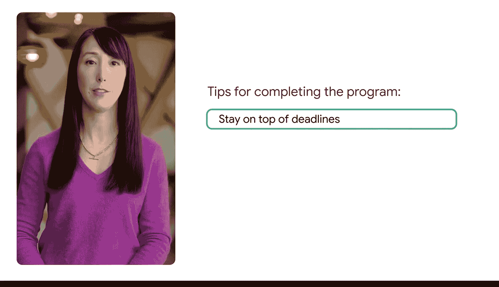
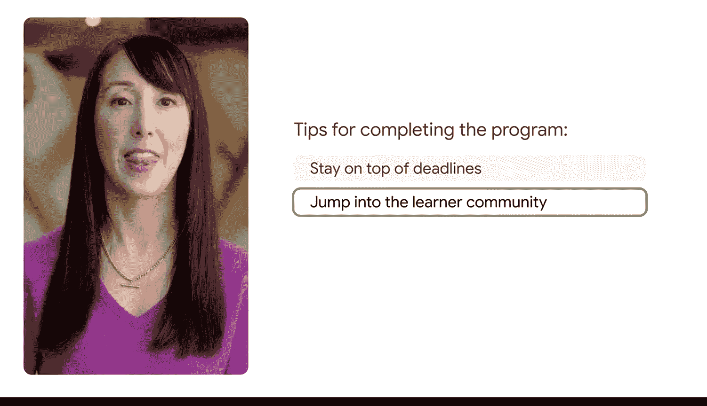
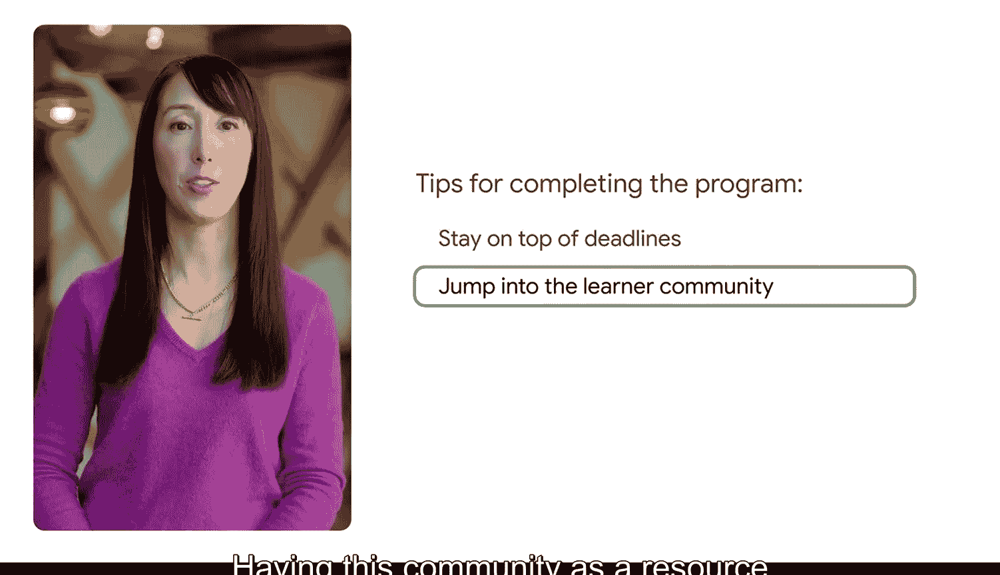
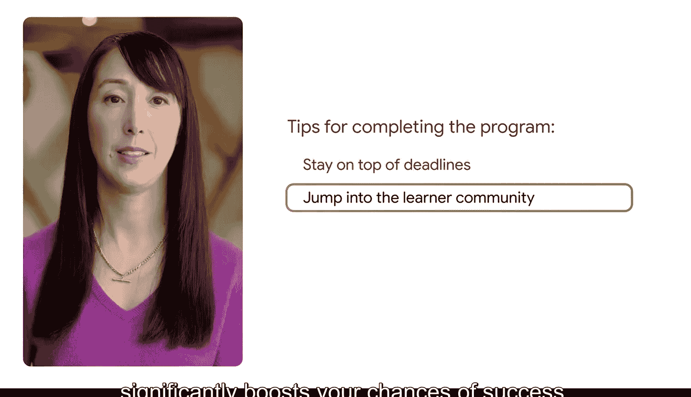
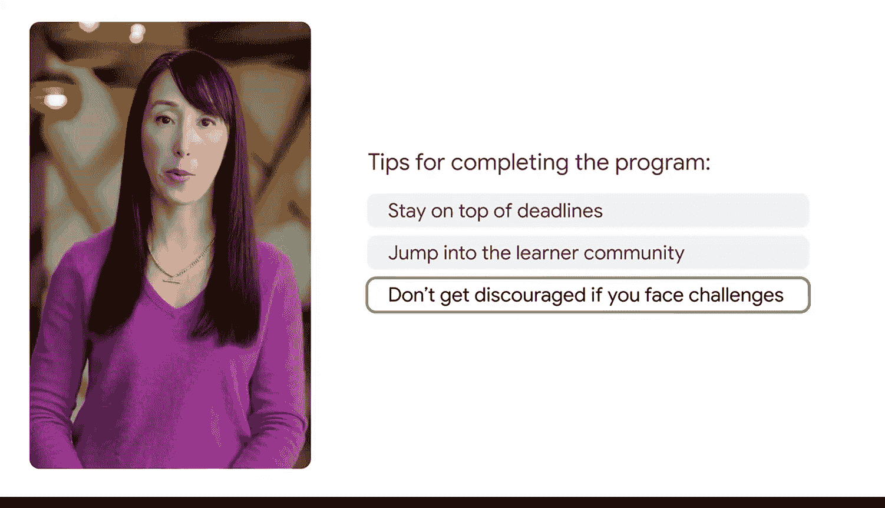
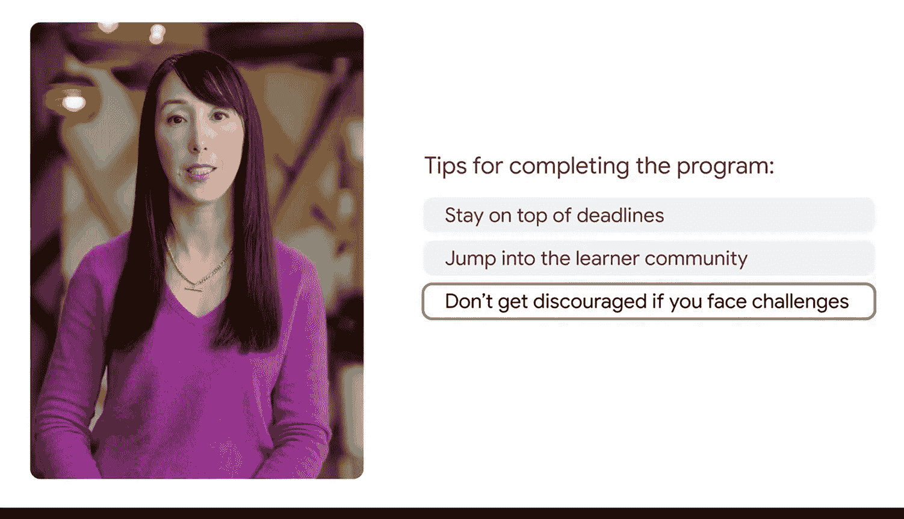

#  003：开启您的谷歌商业智能证书之旅 🚀

在本节课中，我们将一起了解谷歌商业智能证书项目的概况、它能为你带来的价值，以及如何成功完成课程并开启职业生涯。课程由谷歌“Grow with Google”团队的Amanda介绍，旨在为你提供清晰的学习路径和支持资源。

我是来自“Grow with Google”团队的Amanda。我们是谷歌职业证书项目背后的团队。我们非常高兴你决定攻读商业智能领域的证书。

谷歌的专家们创建了这个项目，旨在帮助你培养为就业做好准备的技能。一旦你完成证书课程，你将加入一个由超过100万毕业生组成的社区，他们正在开启新的职业生涯。你将立即解锁一系列资源来帮助你启动职业生涯。

这包括一份谷歌颁发的、受行业认可的证书，你可以将其添加到你的简历和LinkedIn等职业档案中。在你求职的过程中，我们也会一路为你提供支持。我们知道寻找新工作涉及很多方面。

因此，在证书课程的最后，你会发现一门课程，它会向你展示如何具体利用人工智能来简化求职过程。你将识别自己的可转移技能，为不同职位更新简历，并在人工智能的帮助下练习面试。

此外，对于在美国的学习者，你可以免费注册一对一职业辅导，并通过Career Circle访问数千个职位发布。这些宝贵的资源专属于谷歌职业证书的毕业生。

良好的开端是确保你完成课程并获取这些资源的最佳方式。以下是我们为你提供的几条重要建议，助你顺利抵达终点。

首先，务必跟上截止日期，尤其是在最初的这几周。做到这一点的学习者完成证书课程的可能性几乎是其他人的两倍。

其次，立即加入学习者社区。这是一个获取建议并与像你一样的其他学习者建立联系的绝佳场所。拥有这个社区作为遇到困难时可以求助的资源，将显著提升你的成功几率。

最后，如果遇到挑战，请不要气馁。这很正常。记住你来到这里的原因，充分利用可用的支持，并相信只要坚持不懈，你一定能成功。

若想获取谷歌关于职业建议、人工智能使用技巧以及新课程通知的最新信息，请订阅我们的新闻通讯，地址是 `grow.google/updates`。

我们祝愿你在这段激动人心的旅程中一切顺利，并期待在你获取谷歌职业证书的过程中为你提供支持。

