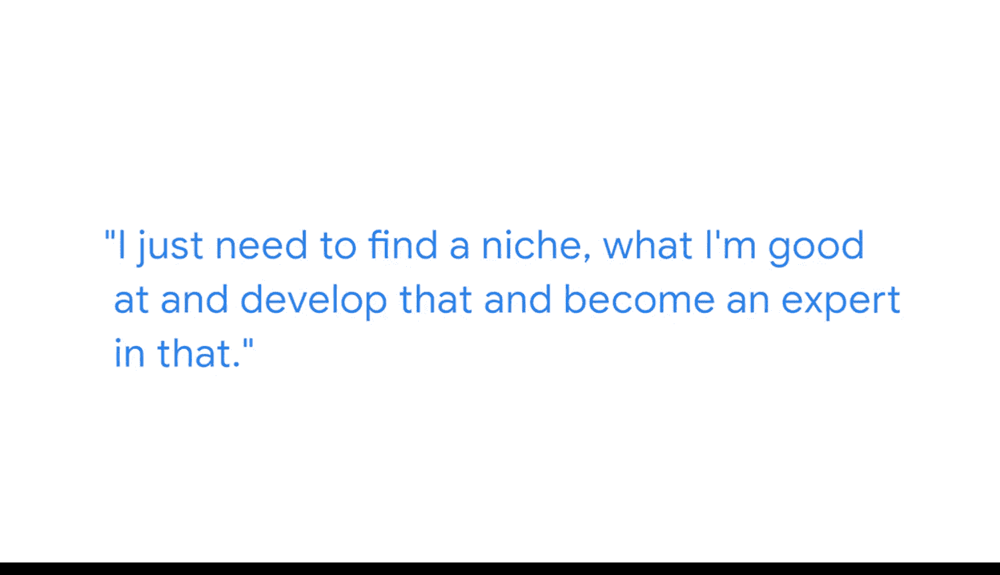

**谷歌商业智能课程：P04：莎莉的个人职业历程** 🚀

在本节课中，我们将跟随谷歌商业智能分析师莎莉，了解她如何进入数据分析领域，以及她对希望进入商业智能领域的新人给出的建议。

---

我叫莎莉，是谷歌的一名商业智能分析师。我的工作是利用数据来帮助改善谷歌的招聘体验。

我进入数据分析领域的方式，是通过多年前参加的一个商业训练营。当时我正考虑成为一名生物医学研究员，参加训练营只是想利用业余时间学习一些新东西。

在训练营中，我们学习了通用的数据分析知识。我发现我似乎有这方面的天赋，一切知识都变得清晰易懂，非常具体，你几乎可以立刻看到分析结果。你可以像搜索一样探索数据，而我热爱解谜，所以我很享受利用不同线索寻找答案的过程。

同时，我也非常喜欢团队合作。这与我之前在科学领域的经历截然不同，那时的工作非常独立，都是自己埋头苦干。但在商业训练营里，我与一群人共同协作，氛围非常社交化且充满乐趣，我们互相支持，我热爱那种感觉。

正是通过这个项目中的团队环境，我获得了第一份工作机会。我在项目中结识了一位比我早一年毕业的学员，当我开始找工作时，他的团队正好有一个职位空缺，于是他联系我询问我是否有意申请。这就是我进入数据分析领域的实际过程。我并非科班出身，一切都是自学的，包括SQL。

起初，我感到自己贡献有限，在这个领域缺乏安全感。因此，我尝试自学Python并涉足机器学习等领域。但最终我发现，我并不需要那样做。我只需要找到自己擅长的细分领域，深入发展并成为那个领域的专家即可。

因此，对于试图进入商业智能领域的人，我给出的建议是：思考数据分析与商业智能之间的区别。就我个人而言，我发现自己非常喜欢SQL，热爱技术层面的工作。因此，我选择专注于商业智能方向。

在更广阔的数据分析领域，你可以根据自己的兴趣，塑造你想要的职业生涯。

---

本节课中，我们一起学习了莎莉从生物医学转向商业智能的职业路径。她的经历告诉我们，进入数据分析领域并非只有科班出身一条路，通过实践训练、发现自身兴趣并专注于一个细分领域深耕，同样可以取得成功。关键在于找到你所热爱并擅长的事情。