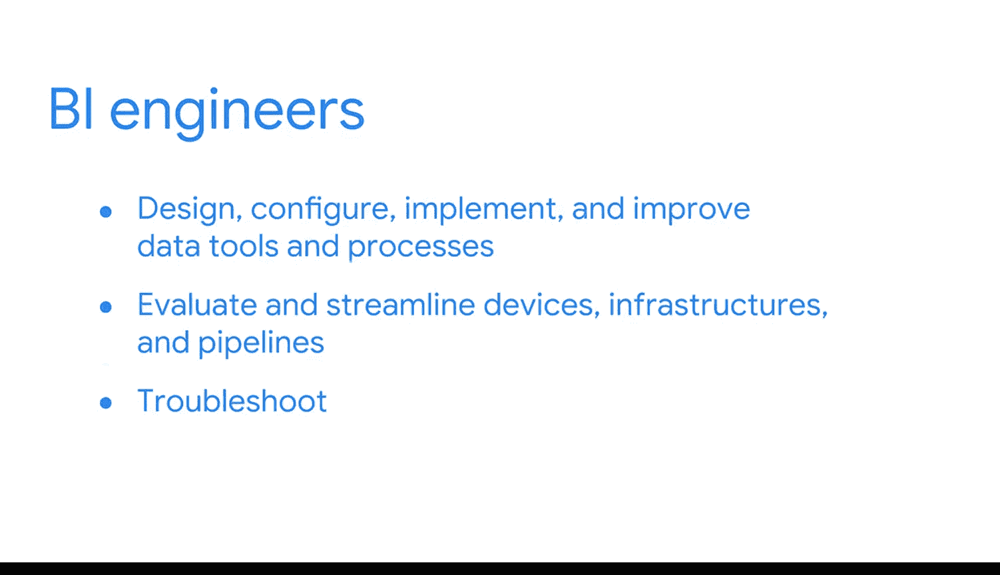

#  005：探索商业智能职业发展 🚀

在本节课中，我们将要学习商业智能（BI）在现代组织中的重要性，并深入了解BI分析师和BI工程师这两个核心角色的职责与价值。我们还将探讨BI领域的职业前景。

---

我们经常听到关于每天产生的海量数据的讨论。这些数据可能很简单，比如用手机拍一张照片或支付账单。也可能很复杂，比如一家全球公司推出新产品或运行多媒体广告活动。实际上，几乎所有事物都在产生数据。

因此，组织需要专家来帮助他们获取正确的数据也就不足为奇了。专家们利用数据寻找增长和改进的方法，并将这些洞察付诸行动。事实上，随着数据量的不断攀升，对能够挖掘数据价值的专业人才的需求也在同步增长。

例如，在我的工作中，我能够自豪地使用数据，为我的利益相关者提供一个快速、清晰的概览，让他们准确了解需要知道的信息，而不会迷失在细节中。我创建的工具使他们能够清晰地评估谷歌人事运营中候选人的招聘和员工体验。

一种实现方式是向我的利益相关者展示在谷歌招聘某人时，整个面试流程需要多长时间。这很重要，因为它能帮助他们判断是否需要招聘更多的招聘人员或面试安排人员，以改善我们候选人的体验。

上一节我们了解了BI如何为组织创造价值，本节中我们来看看BI领域的具体职业角色。

视频中，你将更深入地了解我们BI从业者如何为同事提供价值，以及我们如何帮助塑造组织的未来。这里有许多不同的潜在角色可以探索。例如，在本课程项目中，你将深入了解BI分析师和BI工程师。

以下是BI分析师的主要职责：
*   **需求收集**：从利益相关者、合作伙伴和团队成员那里收集需求。
*   **数据处理**：利用对大型数据集的理解来检索、组织和解读数据。
*   **洞察呈现**：创建可视化图表、数据看板和报告，用于向他人展示和传达洞察。

他们分享的智能信息可能被用于制定决策、开发新流程或创建商业策略。也可能被应用于更深入的分析。

以下是BI工程师的主要职责：
*   **系统构建**：负责设计、配置、实施和改进数据工具与流程。
*   **流程优化**：评估并简化各种设备、基础设施和信息通道（通常称为**数据管道**）。
*   **问题解决**：工程师是出色的故障排除者，帮助解决安全问题、应用程序权限、更新和其他技术挑战。

换句话说，BI工程师管理工具和流程，这使得BI分析师能够将这些工具和流程投入实际工作。然而，同样重要的是要注意，有些公司并不严格区分这两个BI职位，会交替使用“分析师”和“工程师”这两个术语。因此，当你开始探索工作机会时，务必花些时间研究具体职位和组织，以充分了解其工作内容。

无论你最终选择哪条道路，BI职业都有潜力变得非常出色。研究表明，当今所有行业都需要熟练的BI专业人员，但具备相关经验和才能的人才数量不足以满足这一需求。因此，BI专业人员享有强劲的职业前景。事实上，在该行业快速搜索职位空缺，仅在LinkedIn上就能发现数千个机会。

但也许最重要的是，BI专业人员发现他们的工作既有回报又充满成就感，因为我们知道我们所做的事情能让别人的生活变得更美好。在本课程项目接下来的内容中，你将发现一些真正鼓舞人心的例子，展示BI如何产生如此积极的影响。

---

本节课中我们一起学习了数据驱动决策的重要性，明确了BI分析师与BI工程师的核心职责与协作关系，并了解了BI领域广阔的就业前景和职业满足感。