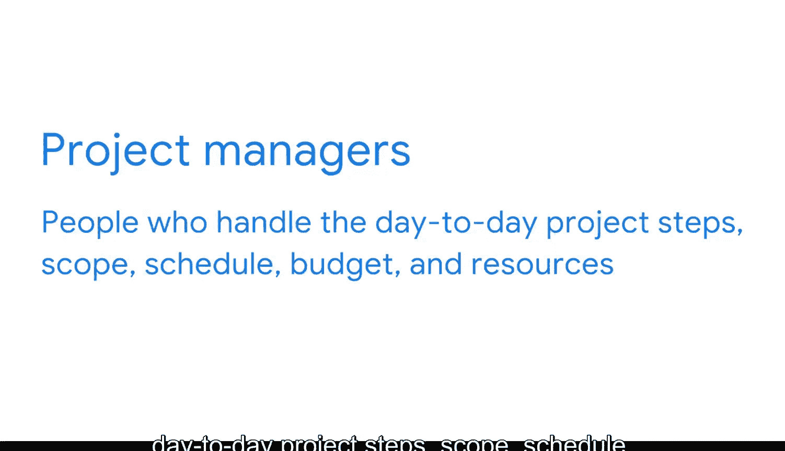

#  006：商业智能团队与合作伙伴

## 概述
在本节课中，我们将要学习商业智能（BI）专业人员如何与组织内外的不同团队和合作伙伴进行协作，以解决复杂问题并成功完成项目。理解这些协作关系对于有效开展BI工作至关重要。

---

当面对极具挑战性的任务或重大问题时，你会怎么做？你已经做了研究，尝试了多种方法，但似乎都行不通。感到沮丧是很自然的。我们都经历过这种情况，但一个更好的策略是直接寻求帮助。俗话说，三个臭皮匠顶个诸葛亮。在商业领域，复杂的问题通常需要5个、10个甚至成百上千的人共同提出潜在的解决方案。

这就是为什么商业智能专业人员在工作中需要与许多不同的团队成员协作。集思广益、共同构建、汇集知识并解决问题，是BI流程的核心。BI专业人员也依赖团队成员为其项目提供重要的输入，并共同制定解决方案。

本视频将分享一些你可能会合作的关键角色的例子。请记住，每个组织对职位的处理方式都不同。因此，你可能会遇到一些差异或重叠，但这将是一个很好的起点。

## 主要合作伙伴角色
以下是BI专业人员经常需要协作的一些关键团队成员。

### API专业人员
首先，是API专业人员。API代表应用程序编程接口。这是一组函数和过程，用于集成计算机程序，形成使它们能够相互通信的连接。

涉及API的角色非常多，包括API策略师、开发人员、工程师和产品负责人。当你在商业智能领域工作时，你可能会与API专业人员合作，为特定项目创建所需的接口，特别是当你的部分数据来自第三方平台时。API的作用是将这些数据引入公司内部数据库，以便构建报告工具和数据看板。

API专业人员使用多种不同的计算语言进行编码，包括Python、Java等。因此，由API合作伙伴来编写针对每个项目和业务需求的特定代码。

### 数据仓储专家
你可能会与数据仓储专家合作，他们负责开发有效存储和组织数据的流程和程序。这些人还帮助确保BI专业人员能够轻松访问他们所需的数据。

### 数据治理专业人员
还有数据治理专业人员。这些团队成员负责对组织的数据资产进行正式管理。这可能涉及基于内部标准和政策来管理数据的可用性、完整性和安全性。这对于确保数据可信且不被误用或损坏非常重要。

### 数据分析师
当然，数据分析师是关键合作伙伴，因为他们负责收集、转换和组织数据。他们是数据专家，始终在审查和验证数据。他们还识别并实施令人兴奋的新分析方法。

### IT信息技术专业人员
另一个关键团队是IT信息技术专业人员。他们测试、安装、维修、升级和维护组织日常使用的硬件和软件解决方案。BI专业人员与IT部门合作，以最大化利用所有可用的数据和数据工具。

### 项目经理
此外，项目经理是关键协作者，他们处理日常的项目步骤、范围、时间表、预算、资源等等。

## 根据项目调整协作对象
有各种各样的贡献者，每个组织都不同。你将与谁合作，取决于公司的规模、可用的工具以及工作的性质。

例如，如果你的项目涉及客户体验，那么客户成功团队对于提供输入至关重要。如果你的项目是关于员工敬业度的，那么你将与人力资源团队密切合作。因为我的工作涉及招聘流程，所以我确实从与谷歌招聘团队成员的协作中受益匪浅。

## 关键的利益相关者
现在，团队中还有另一组至关重要的人，那就是你的利益相关者。在本课程接下来的一个章节中，我们将详细讨论与BI相关的各种利益相关者角色。我们还将探讨不同的利益相关者目标，以及你如何运用你的BI技能来实现这些目标。敬请期待。

---

## 总结
本节课中，我们一起学习了商业智能专业人员需要与哪些关键团队和合作伙伴协作，包括API专家、数据仓储专家、数据治理人员、数据分析师、IT部门以及项目经理。我们还了解到，具体的协作对象会根据项目的性质和公司的具体情况而调整。最后，我们认识到利益相关者是团队中不可或缺的一部分，他们的参与对项目的成功至关重要。理解并建立这些协作关系，是成为一名高效BI专业人员的基础。