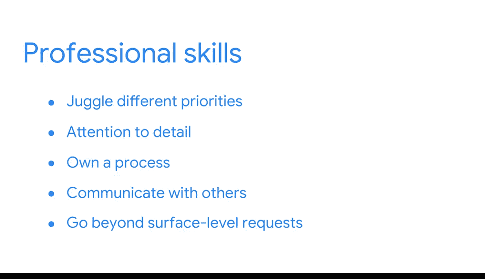

**谷歌商业智能：P07：商业智能最大化数据分析的价值** 🚀

在本节课中，我们将明确商业智能与数据分析的区别与联系，并探讨它们如何共同推动组织的数据成熟度，实现数据驱动决策。

---

随着商业智能和数据分析日益普及，这两个术语常被错误定义、过度简化或在快速沟通中混用。这可能导致混淆，因为BI和DA确实存在显著差异。本节中，我们将理清这些概念。

首先，需要明确的是，BI和DA专业人员都致力于在组织中实现数据驱动决策。他们也都是公司**数据成熟度**的关键组成部分。

**数据成熟度**指一个组织有效利用数据以提取可执行洞察的能力程度。无论这些数据涉及客户、员工、产品、供应商、财务还是其他方面，若无法投入使用，其价值便无法体现。

---

要让数据发挥作用，需要具备专业技能的人员应用相关技术与方法，以实现高水平的数据成熟度。在此过程中，数据分析师主要专注于**利用数据回答“发生了什么”的问题**。

上一节我们介绍了数据分析师的角色，本节中我们来看看商业智能专业人员的目标有何不同。BI专业人员旨在通过构建数据报告工具（例如**数据看板**）来达成更高的数据成熟度。

数据看板持续分析和监控数据。因此，工具创建完成并不意味着工作结束，分析与监控是持续进行的。这是因为BI涉及建立可重复的方法来理解当前运营状况。通过了解现状，公司领导者可以采取行动改善未来状态。

以下是BI可能关注的一些典型问题示例：
*   当前正在瞄准哪些新的销售线索？
*   本月我们获得了多少新客户？
*   我们每周发送给新订阅用户的邮件表现如何？

由于BI的核心是近乎实时的快速监控，其洞察在**立即产生影响时最为有效**。因此，报告工具的使用者希望确保这些工具实用且高效。可以说，**BI专业人员是专业的工具构建者**。

---

构建好工具后，通常由数据分析师来应用这些工具，通过特定的主题或视角审视数据，从而回答问题或解决问题。再次强调，BI的一个重要部分是创建能为用户提供清晰现状快照的数据看板。

这些工具必须具有影响力且易于解读，即使对非技术人员也应如此。所以，如果你喜欢思考如何创建能满足众多不同用户需求的东西，BI领域将让你大展拳脚。BI专业人员通常从事对多个利益相关者都有帮助的大型项目。

此外，在考虑如何融入BI世界时，请注意：BI专业人员是**数据基础设施方面的专家**，并且享受数据分析的技术层面。例如，如果你热爱处理数据集、大数据和计算机编程语言**SQL**，BI将为你提供将查询技能提升到新水平的机会。

---

如果你已获得谷歌数据分析证书，其中包含的内容构成了你的基础知识和经验。现在，这个BI课程将提供一套与之互补的技能组合，并在此基础上进行构建。

它还将为你的简历增添许多极具市场竞争力的才能，为雇主创造一组引人注目的技能组合，并为更多工作机会打开大门。

除了管理大型数据集、用**SQL**编写查询和创建数据看板等技术方面，你还将学习一些非常有价值的专业技能。

以下是这些关键软技能的列表：
*   处理多项优先任务的能力
*   对细节的关注
*   对流程的负责
*   与他人沟通
*   学习如何超越表面需求进行深入挖掘

或许最重要的是，你将发现**与他人协作以真正推动成果的价值**。这正是你构建职业生涯，而不仅仅是拥有一份工作的方式。

---

在未来的课程中，我们将继续探索BI与DA之间的异同。这两个学科相互补充、相互依赖，就像在这些岗位上工作的优秀人才一样。他们共同帮助其组织每天都在数据成熟度阶梯上不断前进。

**总结**：本节课我们一起学习了商业智能与数据分析的核心区别。BI侧重于构建持续监控现状的工具（如数据看板），以实现实时决策；而DA侧重于使用这些工具深入分析数据，回答具体问题。两者相辅相成，共同提升组织的数据成熟度，是数据驱动决策不可或缺的组成部分。