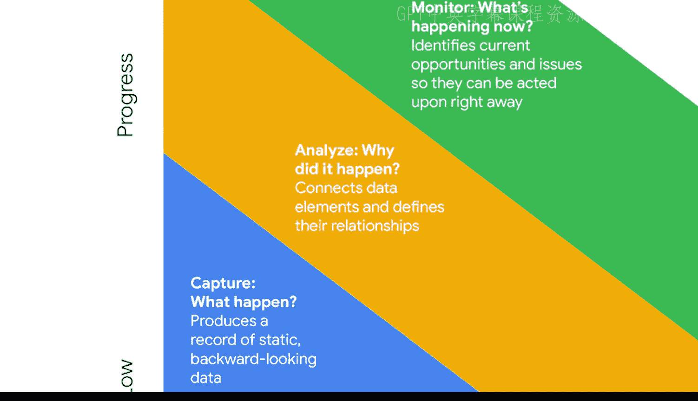
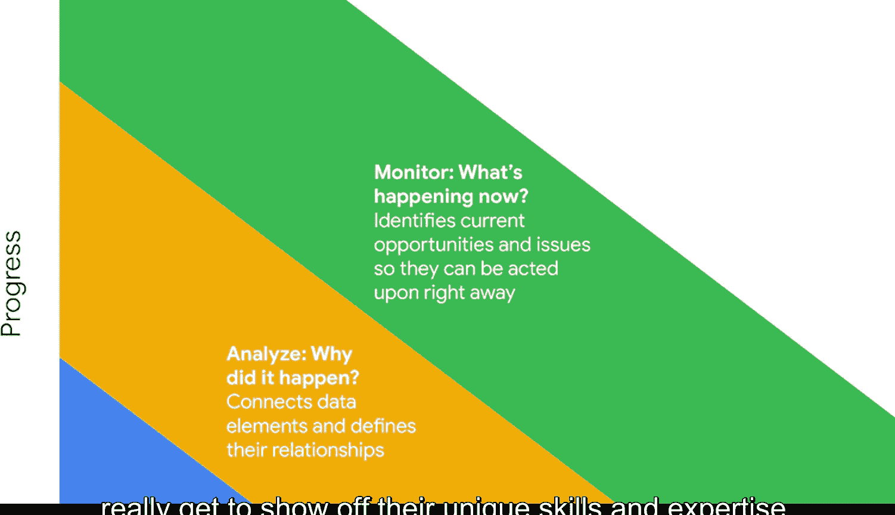

#  008：商业智能的发展阶段 🚀

在本节课中，我们将要学习商业智能的三个核心发展阶段。理解这些阶段对于任何BI专业人士都至关重要，因为它揭示了数据如何从原始记录转化为驱动决策的智能。我们将依次探讨**捕获**、**分析**和**监控**这三个阶段，并了解它们如何共同提升组织的**数据成熟度**。

## 概述：从数据生命周期到BI阶段

如果你已经获得了谷歌数据分析师证书，那么你对**数据生命周期**和**数据分析过程**一定非常熟悉。数据分析师每天在工作中运用这些阶段来获取洞察，从而做出明智的决策。

简单回顾一下，**数据生命周期**是数据经历的一系列阶段，包括：**计划**、**捕获**、**管理**、**分析**、**归档**和**销毁**。而**数据分析过程**则包含六个阶段：**提问**、**准备**、**处理**、**分析**、**分享**和**行动**。

商业智能同样有其发展阶段，这是一个由三个阶段组成的序列，它决定了BI的价值以及组织的**数据成熟度**。数据成熟度是任何BI团队的重要目标，因为高成熟度意味着组织能有效利用其数据来提取可执行的洞察。

在BI中，这三个阶段是：**捕获**、**分析**和**监控**。随着你逐步深入每个阶段，这个过程需要更深层次的探索和调查，因此每个阶段都变得更加复杂。这些阶段可以是自动化的，也可以是手动完成的，但每一个阶段都能带来显著的商业影响，非常值得投入精力。

理解这些阶段以及它们如何使你作为一名BI专业人士受益非常重要。因此，在本视频中，我们将逐一探讨它们。

## 第一阶段：捕获 📥

让我们从**捕获**阶段开始，这是BI过程中的“**发生了什么**”环节。这个阶段涉及**静态的、回顾性的数据**。

以下是捕获信息的两个例子：
*   例如，如果你查询数据库以返回上个月客户购买了什么的数据，这就是捕获信息的一个例子。
*   或者，你可能访问一个列出上一季度损益的电子表格。这也是捕获特定信息记录的一个例子。

记录对BI至关重要，但它们不能让用户轻松地进行深入调查和真正挖掘数据。这限制了它们能够提供的洞察。此外，由于此阶段的数据是僵化的、回顾性的，它对于主动的、前瞻性的决策并不总是非常有用。

捕获信息是BI的必要元素，但仅凭信息本身，我们无法知道哪些方面运作良好、我们如何改进或下一步该做什么。然而，在接下来的步骤中，情况会变得更好。

## 第二阶段：分析 🔍

这引出了第二阶段：**分析**，即BI的“**为什么会发生**”部分。

你已经对这个阶段了解很多，但作为一个快速提醒，**数据分析**是我们得出结论、做出预测并推动明智决策的时候。

因为分析阶段探索事情发生的原因，它更有可能产生有效的计划和策略。通过这种方式，它使BI专业人士能够更好地理解数据点之间的关键关系。他们通过更深入、更广泛甚至并排地检查数据来实现这一点，以识别最初可能并不明显的联系。

## 第三阶段：监控 📊

现在，我们来到了这个过程的最后一部分：**监控**。监控是“**现在正在发生什么**”的阶段，也是BI专业人士真正展示其独特技能和专业知识的地方。

在这个阶段，你将使用自动化流程和信息渠道，例如**数据模型**、**数据管道**、**数据看板**等。这些决策工具获取组织每天创建的数据，并将其转化为利益相关者易于获取的真正智能。

这些BI工具揭示了上升趋势、下降趋势、变化、挑战、机遇等等。决策者然后利用这些工具提供的洞察，主动地朝着业务目标努力。

你将在接下来的课程中学习所有这些BI工具。很快，在本课程中，我将提供一些关于BI专业人士工具箱的基础信息。你可以用它来开始熟悉监控阶段发生的事情。

## 总结

本节课中，我们一起学习了商业智能的三个核心发展阶段：**捕获**、**分析和**监控**。我们了解到，从捕获静态历史数据，到分析其背后的原因，再到实时监控当前动态，每个阶段都增加了数据的深度和价值，共同推动组织的数据成熟度，并最终支持更明智、更主动的业务决策。