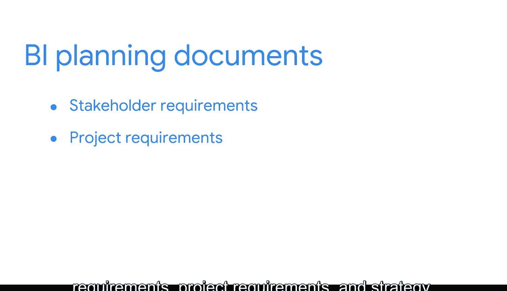

#  009：助力制定成功的商业智能战略 🎯

在本节课中，我们将要学习如何制定一个成功的商业智能战略。战略在生活的许多方面都至关重要，商业智能领域也不例外。我们将从人员、流程和工具三个核心维度，系统地探讨如何构建一个协调、高效且能产生实际价值的BI战略框架。

---

战略在生活的许多方面都扮演着重要角色。以全球最受欢迎的运动——足球为例。比赛的规则相对简单，但战略却极其复杂。根据场上队员及其特定技能，教练必须在多种不同的阵型和战术之间做出选择。无论一名球员多么有天赋，只有当他们深刻理解足球战略时，才能发挥出最佳水平，例如能够识别射门的精确时机或何时应该传球。

国际象棋同样完全关乎战略。每个棋子都有独特的移动方式，例如车在棋盘上水平或垂直移动，马可以跳过其他棋子，而强大的皇后几乎可以移动到任何地方。

数学家已经证明，国际象棋可能出现的棋局变化比宇宙中的原子数量还要多。面对如此多的可能性，拥有清晰的战略对于制定制胜计划至关重要。

同样，制定制胜战略也是商业智能的重要组成部分。你可能还记得数据战略，它涉及对使用数据分析的人员、流程和工具的管理。类似地，**商业智能战略**是对使用商业智能流程的人员、流程和工具的管理。正如你所发现的，BI是复杂的，它需要组织的全方位视角，周密的准备对于制定有效战略是必须的。在本视频中，我们将探讨这是如何运作的。

---

## 人员 👥

上一节我们提到了战略的重要性，本节中我们来看看BI战略的第一个核心要素：人员。这里最重要的事情是确保人们以积极的方式协同工作。有时，公司内的多个部门都在使用BI，但流程是孤立的，这意味着它们缺乏沟通与协作。例如，销售团队可能无法访问重要的营销数据，或者人力资源部门在追踪有价值的员工数据，但仅用于其内部目的。

因此，首先要做的就是与所有相关的团队成员和利益相关者进行沟通，包括组织各个层级的人员，以便获得多样化的视角。可以从询问一些关键问题开始：

以下是需要向团队成员和利益相关者提出的关键问题：
*   我们的BI团队和专业人员是否协调一致？
*   他们的职能是否存在重叠？
*   谁应该负责制定管理BI流程的规则和政策？

请注意，**BI治理**涉及在组织内定义和实施BI系统与框架。这与**数据治理**的概念不同，后者你可能知道是确保公司数据资产得到正式管理的过程。

现在，在“人员”这一步中，最重要的是要询问关于BI流程的愿景，以及该愿景如何与当前的业务战略保持一致。愿景指明了你期望的结果，就像赢得足球比赛或国际象棋对局一样。

---

## 流程 🔄

在明确了人员职责之后，本节我们将转向BI战略的第二个要素：流程。此时，你已经确定了谁将负责管理BI流程的规则和政策。因此，需要向这些人提出一些问题。

以下是关于流程需要探讨的关键问题：
*   我们正在使用哪些解决方案？如何使用？
*   哪些解决方案带来了价值？
*   我们计划实施哪些类型的解决方案？
*   我们将如何交付这些解决方案？
*   我们将如何支持这些解决方案？

此外，拥有一个用户支持框架是流程的关键部分。因此，务必投入足够的时间进行培训和教育，建立反馈系统，并确保用户能从工具中获得价值。

---

## 工具 🛠️

讨论了人员和流程后，本节我们来看看BI战略的最后一个要素：工具。这里需要注意的最重要概念之一是，选择每个工具时都要以用户为中心。考虑哪些仪表板、报告和其他解决方案将最有效。需要提出以下问题：

以下是选择工具时需要评估的方面：
*   不同的用户、团队和部门是否需要不同的技术？
*   我们可以使用哪些技术？
*   如果需要，我们能否获得其他技术？
*   我们将如何衡量成功？

在这里，你需要为每个特定的业务需求建立**关键绩效指标**。很快，你将更深入地了解KPI，并探索组织如何每天使用它们来实现目标。目前，只需理解**KPI是一个可量化的值，与业务战略紧密相连，用于追踪实现目标的进展**。换句话说，KPI指引你实现期望的结果。但为了让KPI发挥作用，重要的是你选择的工具要与为每个特定项目建立的KPI保持一致。

---

## 记录与总结 📝

此过程的最后一步是记录你所学到的一切。许多BI专业人员使用特定的BI文档来记录利益相关者需求、项目需求和战略。

这些是必不可少的工具，能真正帮助你把握全局、保持条理，并在你的组织中产生影响。在接下来的阅读材料中，你将确切学习如何创建这些文档。

最后一点需要记住，你在BI战略中的具体参与程度将根据你的企业和团队的规模与结构而有所不同。但是，全面理解所涉及的所有要素，对任何BI专业人士来说都是一笔宝贵的财富。

---

本节课中，我们一起学习了制定成功商业智能战略的完整框架。我们首先通过类比强调了战略的重要性，然后系统性地探讨了构成BI战略的三个核心支柱：**人员**（确保沟通协作与愿景对齐）、**流程**（明确解决方案、交付与支持）和**工具**（以用户和KPI为中心进行选择）。最后，我们强调了记录一切和根据组织情况灵活调整的重要性。掌握这些要素，将帮助你为组织构建一个坚实、有效且能驱动价值的BI战略基础。