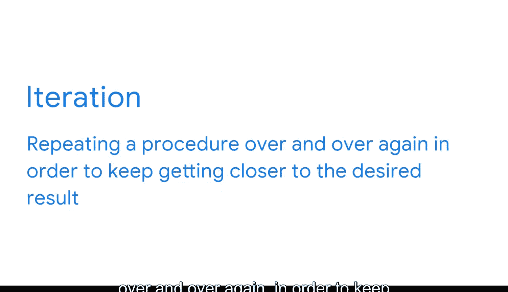

**商业智能基础：P10：商业智能专业人士的工具箱** 🧰

在本节课程中，我们将一起了解商业智能专业人士在日常工作中使用的核心工具。这些工具构成了从数据到洞察的完整工作流。

商业智能看似一个新概念，但其历史实际上已有数百年之久。纵观历史，世界各地的商业领袖都曾利用商业智能来设定最佳实践的标准。“商业智能”这一术语最早可追溯到1865年，出现在《商业轶事百科全书》中。该书用这个术语描述了一位银行家亨利·弗恩斯爵士的成功故事：他通过收集数据并在竞争对手之前迅速采取行动，取得了巨大的商业成功。书中形容弗恩斯“建立了一套完整的商业情报体系”。

现在，让我们登上这趟列车，启动你的商业智能之旅。如同任何旅程一样，第一步是规划你的起点和目的地。在商业智能领域，规划路线需要数据模型，这是你工具箱中的第一件工具。

**数据模型**

数据模型用于组织数据元素并定义它们之间的关系。它们有助于保持跨系统数据的一致性，并向用户解释数据的组织方式。这为商业智能专业人士在浏览数据库时提供了清晰的指引。

上一节我们介绍了数据模型作为路线图的作用。接下来，我们来看看如何在这条路线上运输数据，这需要用到工具箱中的第二件工具：数据管道。

**数据管道**

数据管道是一系列将数据从不同来源传输到最终目的地以进行存储和分析的过程。你可以将数据管道想象成跨越广阔距离的铁路轨道。数据沿着这些通道，以平稳、自动化的方式从原始来源流向目标目的地。但不仅如此，在此过程中，商业智能专业人士需要负责转换这些数据，以便当数据“驶入车站”（即数据库）时，它已经准备就绪，可以投入使用。

以下是数据管道的一个关键示例：
*   **ETL（提取、转换、加载）**：这是一种数据管道，它使数据能够从源系统中收集，转换为有用的格式，并导入数据仓库或其他统一的目标系统。ETL过程在数据集成中扮演着关键角色，因为它使商业智能专业人士能够整合来自多个来源的数据，并让所有数据协同工作。

现在我们已经了解了如何获取和准备数据，接下来是工具箱中的第三件工具，它负责将数据转化为易于理解的洞察：数据可视化。

**数据可视化**

数据可视化是数据的图形化表示。一些流行的数据可视化应用包括Tableau和Looker。这些应用程序使得创建易于理解并能讲述引人入胜故事的可视化图表成为可能。这样，没有太多数据经验的人也能轻松访问和解读他们所需的信息。你可以将数据可视化想象成旅程结束后与朋友和家人分享的照片。最好的照片清晰、令人难忘，并突出显示了你到过的具体地点、参观过的重要景点以及经历过的有趣体验。

商业智能专业人士通常在数据看板中使用数据可视化，这也是我们旅程的最后一站。

**数据看板**

数据看板是一种监控实时传入数据的交互式可视化工具。想象一下火车司机使用的仪表盘。他们密切关注这些工具，以持续观察火车发动机和其他重要设备的状态。仪表盘使司机与控制中心保持联系，确保路线畅通、信号正常运行。司机可以快速扫描仪表盘，识别任何可能影响火车速度或行程的危险或延误。

无论你使用哪种商业智能工具，我们领域中的一个非常重要的概念是迭代。

**迭代**

正如铁路工人不断评估和升级火车、轨道及其他系统一样，商业智能专业人士也始终希望找到新的解决方案和创新方法来改进我们的流程。我们通过迭代来实现这一点。迭代涉及一遍又一遍地重复一个过程，以不断接近期望的结果。这就像铁路工程师反复测试信号系统，以改进和完善它们，确保为铁路旅客提供最安全的环境。

在后续的课程中，你将更深入地学习迭代，并更详细地探索所有这些令人兴奋的工具。你还将探索如何将你在一种工具上的技能和经验迁移并应用到另一种工具上。

**总结**

在本节课中，我们一起学习了商业智能专业人士工具箱中的四大核心工具：**数据模型**（组织数据的蓝图）、**数据管道**（运输和转换数据的通道，如`ETL`流程）、**数据可视化**（将数据转化为直观图形的工具）以及**数据看板**（集成可视化以监控和决策的平台）。同时，我们理解了**迭代**这一贯穿始终的重要理念，即通过持续改进来优化整个商业智能流程。掌握这些工具和概念，是构建有效数据驱动决策体系的基础。