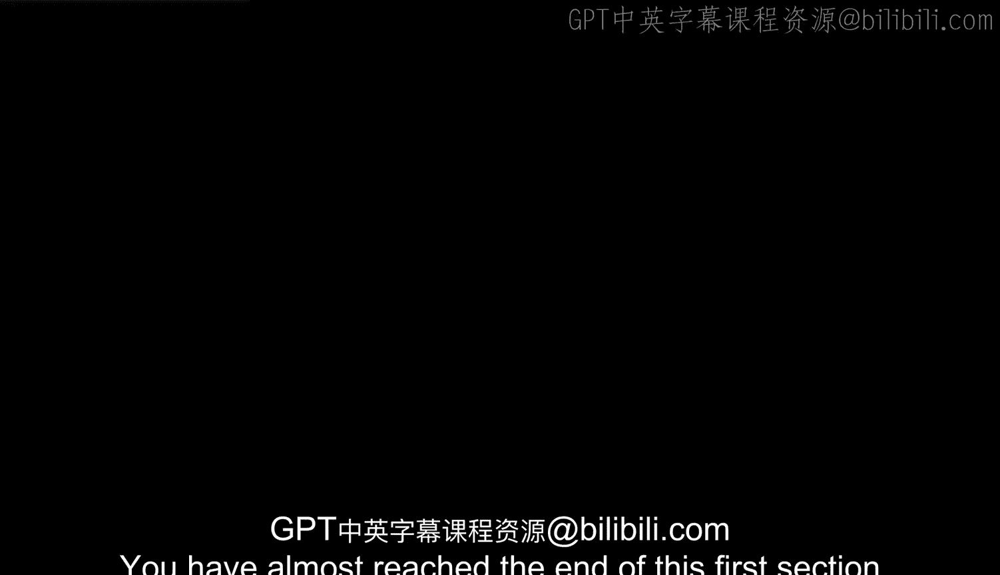

#  011：课程总结

在本节课中，我们将对谷歌商业智能证书课程的第一部分内容进行回顾与总结。

## 概述

您已接近谷歌商业智能证书课程第一部分的尾声。至此，您已初步接触了商业智能的精彩世界，了解了众多潜在的职业路径，并认识到商业智能专业人士每日所作出的宝贵贡献。

## 核心知识回顾

上一节我们介绍了商业智能的基础概念，本节中我们来总结已掌握的关键知识。

您已获得关于商业智能战略的一些关键基础知识，同时也理解了数据成熟度模型，以及商业智能流程与工具如何帮助组织向更高的成熟度水平迈进。

我们涵盖了大量内容。您必然已有很多收获需要思考。这是一件非常好的事情。

这意味着您已收集了“数据”，正在考量所有学到的知识，并开始审视自身的进步。这正是“智能”的核心所在。

## 后续学习展望

随着课程继续，您将在已建立的坚实基础上持续构建。

您还将学习如何利用我们多元化的学习者社区，就像您一样的学员们，以便在此过程中获得所需的支持。

正如之前提到的，与他人协作是应对挑战、集思广益解决方案和整合资源的绝佳方式，就如同与商业智能专业人士合作的团队成员一样。

## 社区互动建议

以下是关于利用学习社区的建议：

*   分享您的职业目标。
*   说明您希望将商业智能技能应用于哪个领域。
*   这是一个与同样对商业智能感兴趣的人们结识和交流的绝佳平台。

希望您能花些时间与其他学习者互动。这将使您的学习体验更加充实和有趣。

## 总结

再次祝贺您截至目前所取得的所有进展。做得非常出色。

在本节课中，我们一起回顾了商业智能的核心价值、基础战略、数据成熟度概念，并展望了后续学习路径与社区协作的重要性。