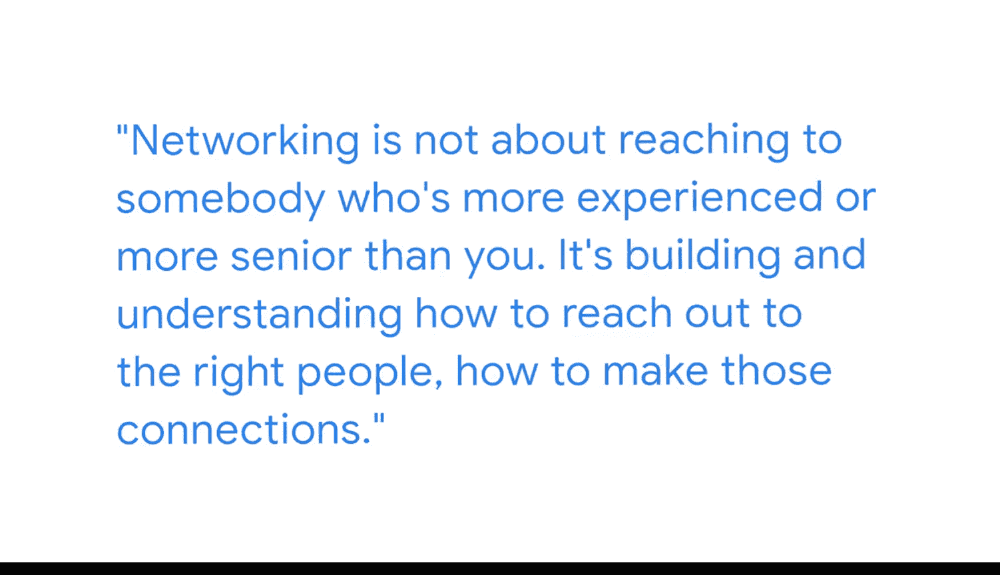

#  012：建立专业联系 👥

## 概述
在本节课中，我们将学习如何建立有效的专业联系。课程内容基于谷歌商业智能专家加甘的分享，他将阐述专业网络的重要性、如何从他人身上学习，以及如何建立互惠互利的职业关系。

我的名字是加甘，我是Fness公司数据与分析团队的负责人。我的团队专注于为合作伙伴提供数据、商业智能报告和可视化解决方案。我们的工作是让数据更有用，以便人们可以利用这些数据做出明智的商业决策。

我职业生涯起步于软件开发。当时还没有专门的数据团队，也没有专门的数据科学职能。如果你问20年前的我，我绝不会想象到自己会在谷歌工作，也绝不会想到这会成为我的全职工作。

## 从他人身上学习
上一节我们了解了专业背景，本节中我们来看看如何向他人学习。在我的职业生涯中，我遇到了许多在商业智能不同方面非常出色的人。当我遇到问题时，我会与人交流。通过长期与不同的人合作，我逐渐成长。

以下是我从不同人身上学到的具体技能：

*   我曾与一位经理共事，她非常擅长编写SQL代码，代码组织得井井有条，我从她身上学到了很多。
*   在我的职业生涯中，我还与另一位擅长组织和理解如何设计指标的人合作过。
*   我遇到过另一位擅长通过数据讲述故事的人。

我有机会与这些我非常钦佩的同事进行非正式的交流与合作，学习他们各自带来的专长。这是一个长期的过程。

## 利用网络机会
从向身边人学习开始，我们来看看更广泛的网络机会。随着时间的推移，出现了许多建立网络的机会。

以下是几种常见的专业网络渠道：

*   存在许多LinkedIn群组。
*   存在许多专业网络，可能在你工作的地方，也可能在外面。
*   你可以加入本地的商业智能、数据科学或分析分会。

随着时间的推移，资源发生了变化，我所利用的资源也随之改变。但我认为，在我商业智能和数据分析经验的早期形成阶段，那些我能理解其专长的人以及他们带来的具体技能，对我非常有用。

## 建立互惠关系
了解了网络渠道后，本节我们来探讨建立联系的本质。建立网络并不一定是联系比你经验更丰富或资历更深的人。关键在于理解如何联系正确的人，如何建立这些连接。

实际上，如果把“建立网络”这个词拿掉，它实际上是**建立良好的专业关系**。就像任何关系一样，这是一种双向的互动。在这种伙伴关系中，你能提供什么？你可能会认为自己没有什么可以贡献，只是想向对方学习。

对方可能在技术专长或经验上更胜一筹，但他们没有你的生活经历、你所在领域的专业知识。他们可能也重视了解你的背景以及你如何努力成长。

## 总结
本节课中，我们一起学习了建立专业联系的核心要点。我们了解到，专业成长不仅限于技术学习，还包括向身边的同事学习他们各自的专长。有效的网络是建立互惠互利的长期专业关系，而不仅仅是单向索取。关键在于主动交流、识别他人优势，并在互动中提供自己独特的视角和价值。