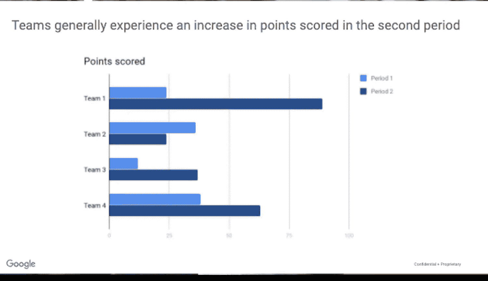

#  014：数据分析流程概述

在本节课中，我们将要学习数据分析的完整流程。这个流程与之前介绍的数据生命周期不同，它专注于如何分析数据以解决问题。理解这个流程将帮助你规划自己的分析工作，并指导你完成本课程的学习。

## 数据分析的六个阶段

本课程的设计遵循数据分析的六个核心步骤：**提问**、**准备**、**处理**、**分析**、**分享**和**行动**。接下来，我们将逐一探讨每个阶段的具体内容。

### 第一阶段：提问 (Ask) ❓

上一节我们介绍了数据分析的整体框架，本节中我们来看看第一个阶段——“提问”。在这个阶段，我们需要完成两件关键任务：定义待解决的问题，并充分理解利益相关者的期望。

以下是“提问”阶段的两个核心任务：

1.  **定义问题**：审视现状，找出其与理想状态之间的差距。问题通常表现为需要清除的障碍或需要纠正的错误。例如，一个体育场馆可能希望**减少球迷在售票口排队的时间**，这里的障碍就是如何让顾客更快地入座。
2.  **理解期望**：确定项目的利益相关者（如你的经理、项目发起人或销售伙伴），并理解他们的目标。利益相关者参与决策、影响行动和策略，并且关心项目结果。与他们清晰沟通至关重要，例如，确认他们是想分析**所有可能影响公司的风险**，还是仅关注**与天气（如飓风、龙卷风）相关的风险**。

作为数据分析师，制定强有力的沟通策略非常重要。这个阶段帮助你聚焦于问题本身，而不仅仅是问题的表象。在后续课程中，你将学习如何提出有效问题，并与利益相关者合作来定义问题。

### 第二阶段：准备 (Prepare) 📦

在明确了问题之后，接下来就进入“准备”阶段。这个阶段的核心是收集和存储用于后续分析的数据。

以下是“准备”阶段的主要学习内容：

*   你将了解不同类型的数据。
*   你将学习如何识别对解决特定问题最有用的数据类型。
*   你将理解确保数据和结果**客观、无偏见**的重要性。这意味着基于分析所做的任何决策都应始终基于事实，并且公平公正。

### 第三阶段：处理 (Process) 🧹

数据准备就绪后，我们需要进入“处理”阶段，以确保数据的质量。在这里，数据分析师需要发现并消除可能影响结果准确性的任何错误和不准确之处。

以下是“处理”阶段常见的任务：

*   **数据清洗**：修正拼写错误、不一致或缺失/不准确的数据。
*   **数据转换**：将数据转换为更有用的格式。
*   **数据合并**：合并两个或多个数据集以使信息更完整。
*   **去除异常值**：移除可能扭曲信息的任何数据点。

此外，你将学习如何检查已准备的数据，确保其完整和正确。这个阶段关乎细节，你还会获得与利益相关者验证和分享数据清洗结果的策略。

### 第四阶段：分析 (Analyze) 📊

处理完数据，我们便来到核心的“分析”阶段。分析你所收集的数据，意味着使用工具来转换和组织信息，以便得出有用的结论、进行预测并推动明智的决策。

数据分析师在工作中使用许多强大的工具。在本课程中，你将重点学习以下两种：

*   **电子表格** (Spreadsheets)
*   **结构化查询语言** (Structured Query Language)，常被称为 **SQL**

### 第五阶段：分享 (Share) 📢

分析完成后，下一步是“分享”阶段。在这里，你将学习数据分析师如何解释结果并与他人分享，以帮助利益相关者做出有效的数据驱动决策。

在分享阶段，**数据可视化**是数据分析师最好的朋友。本课程将强调为什么可视化对于让他人理解数据所传达的信息至关重要。借助合适的视觉呈现，事实和数字变得一目了然，复杂的概念也更容易理解。

我们将探索不同类型的可视化图表和一些优秀的数据可视化工具。你还将通过创建引人入胜的幻灯片和学习如何充分准备回答问题来练习自己的演示技巧。

### 第六阶段：行动 (Act) 🚀

最后，我们来到数据分析流程的“行动”阶段。这是一个激动人心的时刻，企业将采纳你——数据分析师——提供的所有见解，并将其付诸实践，以解决最初的业务问题。

在本课程中，你将基于所学知识采取行动：

*   为你未来的求职做准备。
*   有机会完成一个案例研究项目。

这是一个绝佳的机会，让你能够整合在整个课程中所学的一切。此外，在你的作品集中添加一个案例研究，将帮助你在面试第一份数据分析师工作时从其他候选人中脱颖而出。

---

本节课中我们一起学习了数据分析的六个阶段：**提问**、**准备**、**处理**、**分析**、**分享**和**行动**，并了解了本课程是如何围绕这些步骤构建的。现在你已经掌握了理解本课程运作方式所需的一切知识。我和我的谷歌同事们将在此全程指导你。