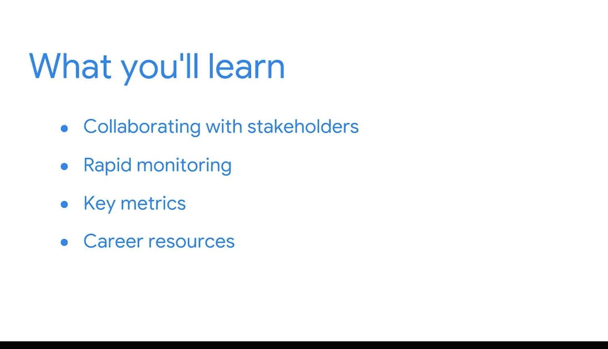

#  017：欢迎来到模块2

## 概述

在本模块中，我们将深入探讨商业智能的实际应用流程。我们将学习如何与利益相关者有效协作，利用BI工具最大化数据价值，并应用快速监控的力量来做出明智的商业决策。

## 课程内容

上一节我们奠定了商业智能的基础知识，本节中我们将聚焦于实际的BI流程。

连接所有这些BI环节的一个共同点是**提问**。我反复观察到，在这个领域最成功的人往往是那些提出大量问题的人。

以下是提问的几个关键方向：
*   我们向同事提问，了解是什么在拖慢流程或造成摩擦。
*   我们询问关于客户、竞争对手以及全球市场动态的问题。
*   我们探究事物的工作原理，以便学习不同的工具和技术。

在我职业生涯初期，我会就不同系统的能力和局限性提出大量问题，即使这些工具并非我日常工作所用。这是因为，仅仅具备基本了解就能让我将团队的工作联系起来，并找到我能做出积极贡献的方式。

例如，当我加入谷歌时，我学习了谷歌的SQL平台以及根据所用工具而不同的SQL语言。有时还会涉及Python和JavaScript等其他我从未接触过的语言。为了熟悉这些，我特意去询问这些工具如何工作，以及我可以向谁请教更多。我鼓励你在自己的职业生涯中，甚至在攻读此证书期间也这样做，因为课程涵盖了大量信息。

在本模块中，我们将首先探索如何与多元化的利益相关者群体成功协作。然后，你将了解近乎实时的快速监控如何让用户收集和报告关键指标，并应用它们来做出更好的决策。

此外，你将通过提升在线形象、制定社交和导师策略，以及构建一个能给未来招聘经理留下深刻印象的作品集，开始积累一些职业资源。

所有这些都始于理解组织的业务需求和重要的交付成果。毕竟，如果你想实现目标，首先必须定义它们。

现在，我有一个问题要问你：你准备好开始了吗？我们出发吧。

## 总结

本节课我们一起学习了模块二的概览，明确了本模块的核心是掌握BI的实际应用流程，其关键在于持续提问。我们了解到本模块将涵盖与利益相关者协作、利用快速监控做决策以及构建职业资源等重要内容。一切始于理解业务需求与目标。