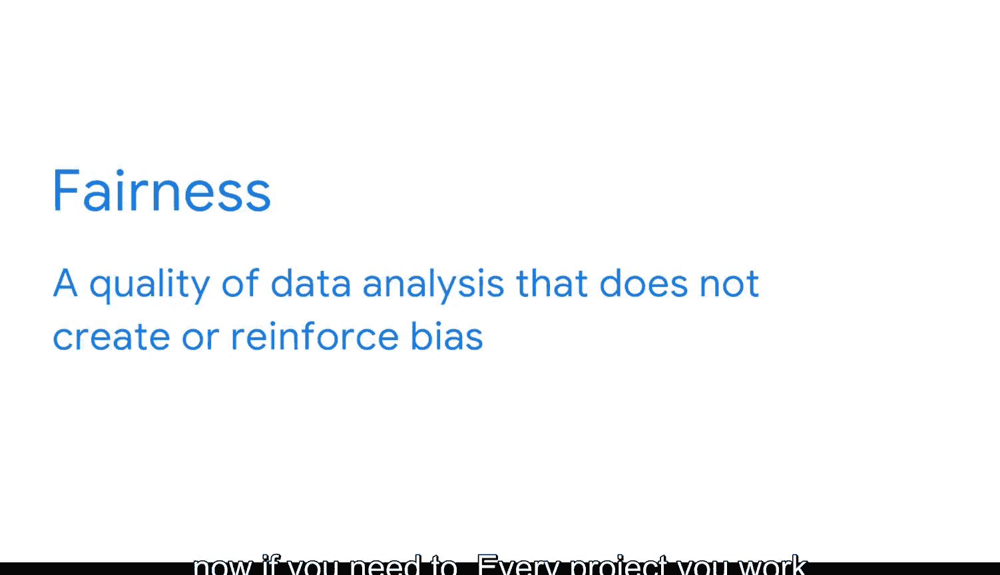

#  019：成为卓越的商业智能沟通专家

在本节课中，我们将要学习商业智能专业人士在与各类利益相关者协作时，所采用的关键沟通策略。这些策略将帮助你明确项目需求、定义交付成果，并有效地分享商业智能洞察。

## 引言

上一节我们介绍了商业智能流程中的典型利益相关者。本节中，我们来看看与这些人员进行有效协作的具体沟通策略。

## 核心沟通策略

商业智能项目在初始阶段通常并非完全清晰。因此，你需要扮演侦探的角色。作为BI专业人士，关键的一部分是知道如何调查当前情况，并寻找线索以更好地理解人们的需求和理想的项目成果。

我的同事和我经常注意到，利益相关者、合作伙伴或协作者可能声称他们需要某样东西，但他们实际需要的却大相径庭。我们的责任是深入探究，帮助他们取得成功。

在这种情况下，强大的沟通技巧将使你能够更深入地挖掘问题、挑战或机遇，从而确定以最有效的方式处理该问题。

## 第一步：提出正确的问题

这个过程始于提出正确的问题。

如果你获得了谷歌数据分析师认证，你曾花费整个课程专注于数据分析流程中的“提问”阶段。简单回顾一下，这涉及理解有效问题与无效问题的区别。了解哪些类型的问题能带来最佳洞察，使你能够通过提问来充分理解利益相关者的期望，尤其是在他们提出的要求与你的专业经验判断其所需不符的情况下。

如果你对“提问”阶段已很熟悉，请继续本课的下一部分。如果你想回顾这些原则，现在可以随时进行。

## 第二步：定义项目交付成果

在通过提问彻底理解项目之后，是时候定义项目交付成果了。交付成果是指为完成项目而必须实现的任何产品、服务或结果。

这可以是一个新的BI仪表板、一份报告、一项已完成的分析、一个流程或决策的文档。基本上，利益相关者要求的任何东西都可以成为交付成果。

在BI领域，最常见的交付成果是向用户提供洞察的仪表板和报告。

以下是确定要制作哪些交付成果的步骤：

*   **列出目标**：列出需要解决的问题、需要克服的挑战或需要最大化的机会。
*   **思考工作流程**：思考所涉及的每个业务流程的工作流程。这有助于你设想哪些类型的仪表板或报告将最有效、需要多少数量，以及它们各自需要哪些具体元素。

例如，当被要求创建一个仪表板时，我会拿一张纸，开始在草图中绘制示例图表。然后我与用户分享这些草图。这有两个好处：首先，确保我对仪表板的设想符合他们的预期；其次，使我能够确认这一切都是合理的。

## 第三步：有效分享商业智能

现在进入最后一步：有效分享商业智能。重要的是要知道如何让复杂的技术数据，对那些不熟悉相关术语和系统的人来说，变得更加简单易懂。

能够以清晰简洁的方式呈现智能信息，是确保决策者理解洞察并能将你的建议付诸实践的基础。

此外，在此过程中，每位BI专业人士的一项重要职责是考虑偏见。正如你可能知道的，偏见是**对一个人、一群人**或一件事**有意识或无意识的偏好或反对**。有许多不同类型的偏见可能影响与数据相关的项目，例如确认偏见、数据偏见、解释偏见和观察者偏见。这些概念在谷歌数据分析师认证课程中有深入讲解，如有需要请现在回顾。

你参与的每个项目都必须以关注公平性为起点，这意味着你的工作不会制造或强化偏见。

BI专业人士拥有很大的影响力，因为我们是**将非常技术性的话题翻译成简单语言**供他人理解的人。确保你的“翻译”是公平的至关重要。毕竟，你的团队信任你。

## 总结

本节课中，我们一起学习了成为卓越商业智能沟通专家的三个核心步骤：**提出正确的问题**以明确需求，**定义项目交付成果**以规划产出，以及**有效分享商业智能**并确保公平性。你将在整个课程中持续构建这些沟通技能，很快你将能够深思熟虑地分享即使是最复杂的BI洞察。