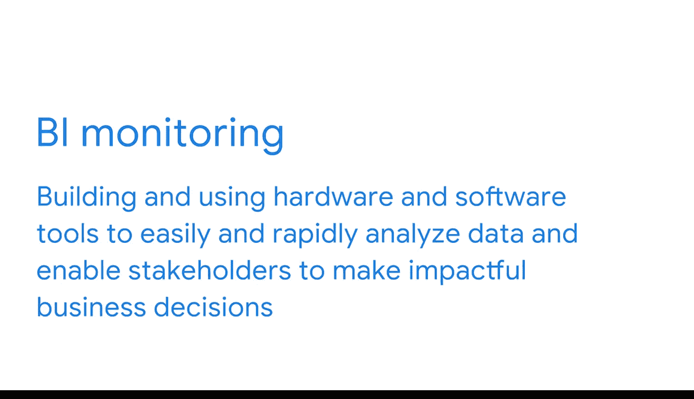

#  020：近实时监控的价值 🎯

在本节课中，我们将探讨商业智能（BI）中近实时监控的价值。我们将通过一个常见的电商场景——购物车放弃——来理解BI专业人员如何利用数据和监控工具来识别问题、支持决策，并最终为企业创造价值。

## 理解问题：购物车放弃现象

你是否曾在网上购物时，将商品加入购物车，但最终决定不购买？我本人就有过这样的经历。我非常热爱烹饪，喜欢在线购买烹饪书籍、香料，或者新的厨房小工具。但有时，在结账前我会改变主意，可能是因为想省钱，或者觉得现有的厨具已经足够完成我的食谱。

当这种情况发生时，在线商店就遇到了所谓的“购物车放弃”问题。根据电商平台Shopify的数据，在线商家每年因购物车放弃而损失的销售额高达180亿美元。这是一个严重的问题，但也是商业智能专业人员非常擅长解决的问题。本视频将探讨其具体运作方式。

## BI如何分析用户旅程

上一节我们认识了购物车放弃问题，本节中我们来看看BI专业人员如何利用数据来分析它。

BI专业人员可以利用数据来识别客户来源，例如是来自谷歌搜索、电子邮件链接还是社交媒体帖子。然后，他们可以将访客在网站上的旅程可视化。他们甚至能够精确定位客户在哪个环节离开，并尝试找出原因。

以下是BI专业人员可能采取的分析步骤：
*   **追踪来源**：识别客户是通过哪个渠道进入网站的。
*   **可视化旅程**：描绘客户在网站上的浏览路径。
*   **定位流失点**：精确找出客户离开的具体环节。

例如，BI专业人员可能会创建一个工具来监控网站结账页面的加载速度。如果团队判定加载时间过长，公司就可以分配资源来提升网站速度，以期在未来留住这位客户。

## 核心概念：指标与KPI

网站页面加载速度的测量就是一个**指标**的例子。**指标**是用于评估BI绩效的、单一的可量化数据点。

一些最重要的指标是**关键绩效指标**，即KPI。KPI是与业务战略紧密相关的可量化值，用于追踪目标的进展。许多人会混淆KPI和指标，但它们是不同的。

需要记住的基本点是：**指标支持KPI，而KPI则支持整体业务目标**。同时，理解KPI是**战略性**的，而指标是**战术性**的，会很有帮助。

回到我们的购物车放弃例子，强有力的KPI可能包括：
*   每笔在线交易的平均价值
*   客户留存率
*   同比增长的销售额

可以这样理解：**战略**是实现目标或达到理想未来状态的计划，它涉及制定和执行计划以完成你试图达成的事项。**战术**则是你如何到达那里，它是用于实现目标的方法，包括行动、事件和活动。战术是作为你达成最终目标战略的一部分，在过程中发生的，就像每个里程碑之间的垫脚石。跨越足够多的里程碑，你就能实现目标。

## BI监控的实施

理解业务目标以及实现目标所需的条件，是BI监控的第一步。**BI监控**涉及构建和使用硬件及软件工具，以便轻松快速地分析数据，并使利益相关者能够做出有影响力的业务决策。

假设我们的电商商家设定了一个目标：在六个月内将购物车放弃率降低15%。那么，BI专业人员将创建一个监控网页加载速度的工具，以帮助实现这个KPI。

## 近实时监控的价值

**快速监控**意味着使用BI工具的人员正在接收实时或接近实时的数据。通过这种方式，关键决策者可以立即知道是否出现了购物车放弃数量的急剧上升，或者某款热门产品是否缺货，又或者客服代表是否接到了异常大量的电话。

立即知晓意味着公司可以尽快解决任何可能出现的问题。这正是BI专业人员为其组织创造真正价值的主要方式之一。

在本课程的后续部分，你将学习更多关于如何选择合适指标的知识。更多精彩内容即将到来。

## 课程总结

本节课中，我们一起学习了近实时监控在商业智能中的核心价值。我们通过“购物车放弃”的案例，理解了BI如何通过分析用户旅程、定义**指标**与**KPI**来识别业务问题。我们明确了**指标**（如页面加载速度）是支持**战略性KPI**（如降低放弃率）的**战术性**工具。最后，我们认识到**快速监控**能让企业即时响应问题，这正是BI创造价值的关键所在。