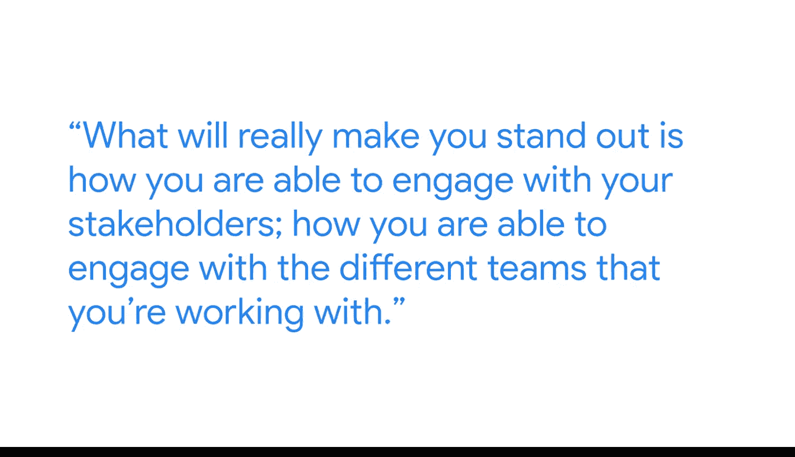

#  021：安妮塔的商业智能职业路径 🧭

在本节课中，我们将跟随谷歌商业智能分析师安妮塔的分享，了解她独特的职业发展轨迹。她将讲述如何从看似不相关的起点进入BI领域，并强调在这一职业中，软技能与硬技能同等重要。

我是安妮塔，谷歌的一名商业智能分析师。

我的第一份工作是在家乡的公共图书馆担任图书管理员。这份工作需要我每天与人交流。人们会询问如何找到某本书，或者需要一些涵盖特定主题的资料。这份工作极大地帮助我学习和掌握了如何与那些可能遇到问题、不知如何解决、但正寻求你帮助的人进行沟通。我认为这是我商业智能职业生涯的一个重要起点。

我进入商业智能领域并非一条直线。最初，我从事应付账款和应收账款方面的工作，帮助客户优化这些流程。正是在与客户合作的过程中，我开始频繁听到他们对数据分析的需求，以及对理解数据的渴望——他们拥有大量数据，但关键是如何从中提取有价值的信息。正是来自客户的这些反馈，引导我走上了探索之路：市面上有哪些工具？我该如何帮助他们发现这些洞察？这引导我经历了一份又一份工作，直到最终我投身于商业智能领域，并且无法想象自己从事其他任何行业。

在我所经历的每一份工作中，无论是作为数据分析师处理应付应收账款，还是在催收部门工作，我都积累了如何通过数据讲述一个成功故事的经验。归根结底，我认为商业智能的核心在于：我们寻找的趋势、模式和洞察是什么？这些将构成一个引人入胜的故事，让人们能够利用这些信息做出决策。

对于想要进入商业智能领域的人，我的一条重要建议是：真正专注于你的人际交往能力和人脉网络。技术技能固然重要，例如**编码**、理解**SQL**和数据库以及我们使用的各种程序，这些是你日常工作的基础。但真正让你脱颖而出的是你与利益相关者互动的能力，你与不同合作团队沟通的方式，以及你如何将他们反馈的所有信息最终综合成那个能帮助他们从数据中获得洞察的最终商业智能产品。

我认为每个人都拥有可迁移的技能。你从事过的每一份工作，经历过的每一次体验，都让你有所收获。如果你花点时间思考一下你从中学到了什么——也许是高中时期的第一份工作，也许是大学期间的一次小组合作经历，你在其中处理棘手的团队动态——每一次经历所带来的技能，都是你可以带入商业智能领域的可迁移技能。

以下是安妮塔分享的核心要点列表：

*   **职业起点多样**：图书管理员的工作培养了沟通与问题理解能力，这是BI工作的宝贵基础。
*   **路径并非直线**：从财务流程优化到接触数据分析需求，职业转换源于发现并响应实际业务痛点。
*   **核心是讲述数据故事**：BI的最终目标是识别`趋势、模式、洞察`，并编织成能支持决策的` compelling story`。
*   **软技能至关重要**：除了**SQL**、数据库等`technical skills`，`people skills`和`networking`能力是脱颖而出的关键。
*   **发掘可迁移技能**：过往所有经历，如`negotiating team dynamics`，都能转化为BI领域所需的宝贵能力。

本节课中，我们一起学习了安妮塔从图书管理员到谷歌BI分析师的非典型职业路径。她的经历告诉我们，进入BI领域可以有多种起点，关键在于培养理解业务、沟通协作的能力，并将技术作为讲述数据故事、驱动决策的工具。无论背景如何，过往经验中积累的可迁移技能都是通往BI职业成功的宝贵财富。