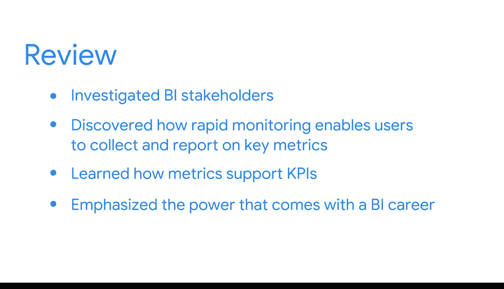

#  023：回顾与展望 🎯

在本节课中，我们将回顾并总结本模块的核心内容，涵盖提升在线影响力、与利益相关者协作、关键指标监控以及商业智能的职业责任。

---

我们已经完成了另一个重要章节的学习。你学习了如何提升在线影响力，并最大化利用社交网络和导师指导的机会。

上一节我们介绍了个人职业发展策略，本节中我们来看看如何与团队协作。

你还研究了各类商业智能（BI）利益相关者，以及一些经过验证的、能有效与他们协作的方法。

你发现了**快速监控**如何让用户收集并报告关键指标，从而使组织能够做出更明智的决策。

此外，你学习了指标如何支持**关键绩效指标（KPI）**，而KPI又如何支持**业务目标**。

我们强调了从事商业智能职业所带来的影响力，以及为何必须时刻将公平性牢记于心。

你的商业智能知识与技能正在持续发展和增长。很高兴能与你一同踏上这段激动人心的旅程。

接下来，你将面临另一项计分评估。为做好准备，请务必查阅列出了所有新学术语词汇的阅读材料。

一如既往，请花时间复习视频、阅读材料和你自己的笔记，以巩固所有学习内容。

---

祝贺你所取得的所有进步。我们很快会再次相见。🚀

**本节课中我们一起学习了**：提升在线形象的方法、与BI利益相关者的有效协作、关键指标的快速监控流程、以及BI从业者的职业责任与影响力。这些知识共同构成了你商业智能技能体系的重要部分。