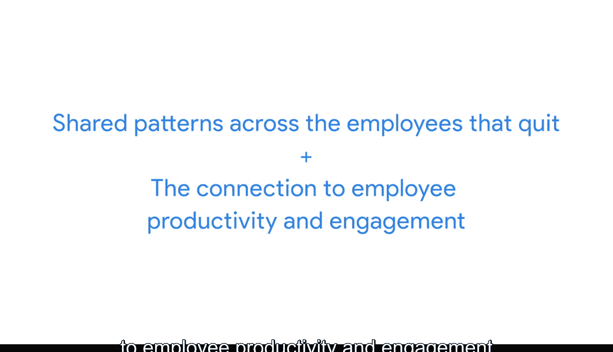

#  024：利益相关者管理

在本节课中，我们将复习数据分析师工作中一个至关重要的方面：理解并管理利益相关者的期望。我们将探讨利益相关者的定义、他们在项目中的重要性，以及如何通过有效沟通确保项目成功。

## 什么是利益相关者？🤔

上一节我们介绍了课程背景，本节中我们来看看“利益相关者”这个核心概念。

利益相关者是指那些在你作为数据分析师所参与的项目中，投入了时间、兴趣和资源的人。换句话说，他们在你所做的工作中拥有“利益”。他们很可能需要你的工作成果来完成他们自己的任务。这就是为什么确保你的工作符合他们的需求，并与团队中的所有利益相关者进行有效沟通如此重要。

## 利益相关者的需求与沟通

你的利益相关者会希望讨论诸如项目目标、达成目标所需的条件，以及你遇到的任何挑战或顾虑等事项。这是件好事，这些对话有助于建立对你工作的信任和信心。

以下是项目中可能涉及的多层级团队成员示例，我们来探讨他们在不同层面上可能需要你提供什么以达成项目目标。

想象你是一名与公司人力资源部门合作的数据分析师。该公司的员工流失率（即员工离开公司的比率）有所上升。人力资源部门想知道原因，并希望你帮助他们找出潜在的解决方案。

*   **人力资源副总裁**：他/她有兴趣识别离职员工的共同模式，并查看其与员工生产力和敬业度是否存在关联。作为数据分析师，你的工作是专注于人力资源部门的问题并帮助找到答案。但副总裁可能太忙而无法管理日常任务，或者可能不是你这项任务的直接联系人。
*   **项目经理**：你将更定期地向项目经理汇报。项目经理负责规划和执行项目，其部分工作是保持项目按计划进行并监督整个团队的进度。在大多数情况下，你需要定期向他们更新进展，告知他们你需要什么才能成功，并说明过程中遇到的任何问题。
*   **其他团队成员**：例如，人力资源管理员需要知道你使用的指标，以便他们设计有效收集员工数据的方法。你可能还会与其他专注于数据不同方面的数据分析师合作。

了解项目中的利益相关者和其他团队成员至关重要，这样你才能与他们有效沟通，并为他们提供在其项目角色中推进工作所需的信息。你们共同努力为公司提供关于这个问题的关键见解。

## 实践案例：分析员工流失

回到我们的例子。通过分析公司数据，你发现员工在公司工作13个月后，其敬业度和绩效有所下降，这可能意味着员工开始感到缺乏动力或与工作脱节，然后往往在几个月后离职。

另一位专注于招聘数据的分析师也分享道，该公司大约在18个月前进行了大规模招聘。你将此信息与所有团队成员和利益相关者沟通，他们就如何向副总裁汇报此信息提供了反馈。

最终，你的副总裁决定实施一项深入的管理层检查制度，与即将在公司工作满12个月的员工进行沟通，以识别职业发展机会。此举成功降低了从第13个月开始的员工流失率。

## 总结与展望

这只是一个如何平衡团队中不同需求和期望的例子。你会发现，在你作为数据分析师参与的几乎每一个项目中，从人力资源副总裁到你的数据分析师同事，团队中的不同人员都需要你的专注和沟通，以推动项目走向成功。

专注于利益相关者的期望将帮助你理解项目目标，在团队中进行更有效的沟通，并建立对你工作的信任。

接下来，我们将讨论如何确定你在团队中的定位，以及如何以专注和决心帮助推动项目前进。