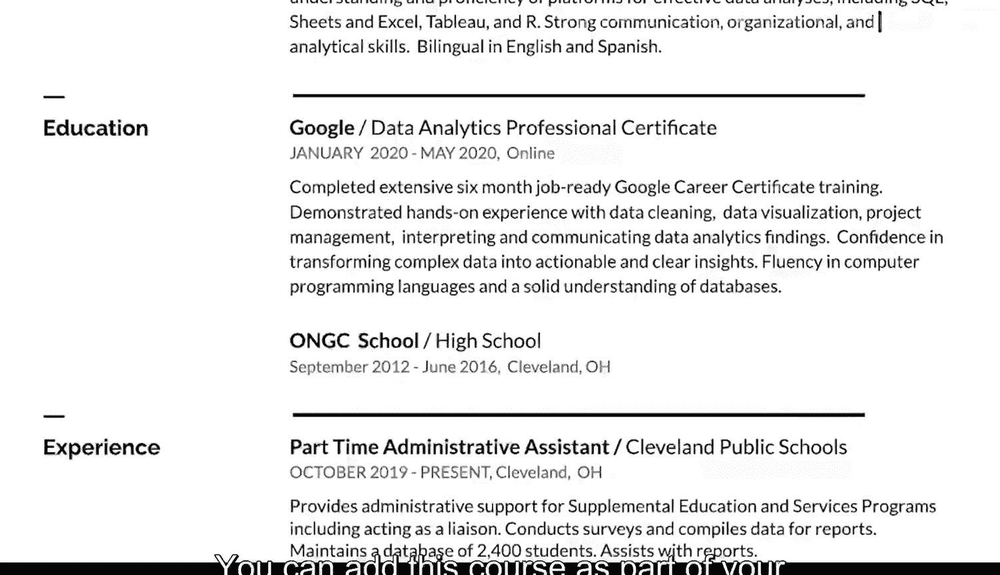

#  027：创建数据仪表板

在本节课中，我们将学习如何构建一份专业的简历，特别是如何将数据分析相关的技能和经验有效地展示出来。一份好的简历就像一张精心拍摄的照片，需要清晰、简洁地捕捉你所有的专业亮点。

## 简历概览：打造你的专业快照

当你拍摄照片时，通常会在一张图像中捕捉多种元素。构建简历也是同理。你希望简历成为你在学业和职业领域所有成就的快照。当招聘经理和招聘人员查看你的简历时，他们应能立刻了解你能为公司带来什么价值。关键在于简洁。

## 简历的核心原则：简洁与聚焦

以下是构建简历时需要遵循的核心原则：

*   **控制篇幅**：尽量将内容控制在一页以内。
*   **精炼要点**：每个描述仅使用2到4个简洁的要点。
*   **聚焦重点**：一页的篇幅能帮助你专注于最能体现你专业身份的关键细节。同时，这也符合招聘人员时间有限的情况，你需要快速吸引他们的注意力。

## 构建简历：从模板开始

上一节我们介绍了简历的核心原则，本节中我们来看看如何实际构建简历。模板是构建全新简历或重新格式化现有简历的绝佳工具。

像 Microsoft Word、Google Docs 甚至一些求职网站都提供可用的模板。模板为你需要填写的信息预留了位置，并自带设计元素，能让你的简历看起来更吸引人。

现在，我们将介绍一系列步骤，帮助你制作专业、易读且无错误的简历。如果你已有简历文档，也可用这些步骤进行优化。

## 简历的结构与内容

构建简历的方式不止一种，但大多数简历都包含以下部分。

### 联系信息

大多数简历将联系信息置于文档顶部。这包括你的姓名、地址、电话号码和电子邮件地址。

*   如果你有多个邮箱或电话号码，请使用最可靠且听起来最专业的那个。
*   最好在邮箱地址中使用你的名字和姓氏，例如 `JaneDoe17@email.com`。
*   确保你的联系信息与你在专业网站上填写的信息一致。
*   联系信息的组织方式由你决定。

### 简历格式选择

选择适合你的简历格式至关重要。

*   **技能型简历**：这种格式更侧重于技能和资历，而非工作历史。适合工作经历有空白期、刚开启职业生涯或正在转行的人士。
*   **时序型简历**：如果你想突出工作历史，可以按时间倒序列出工作经历，从最近的工作开始。如果你有许多与所申请职位相关的工作经历，这种格式很合适。

如果你在修改现有简历，可以保持原格式并调整细节。如果是新建或首次创建简历，请选择对你最合理的格式。网上有大量简历资源，你可以浏览多种不同的简历，以了解你认为最适合自己的格式。

### 个人总结（可选）

决定格式后，你可以开始添加详细信息。有些简历以个人总结开头，但这是可选的。

如果你拥有非传统的数据分析师经验或正在转行，个人总结会很有帮助。

*   如果决定包含总结，请将其控制在一两句话内，突出你的优势以及你能如何帮助所申请的公司。
*   确保总结中包含关于你自己的积极词汇，如“专注的”和“积极主动的”。
*   用数据支持这些词汇，例如你的工作年限或你精通的工具（如 **SQL** 和电子表格）。

个人总结可以这样开头：“拥有超过五年经验的勤奋客户服务代表”。当你完成本课程并获得证书后，你也可以将其加入，例如：“初级数据分析专业人士，最近完成了谷歌数据分析专业证书课程”。

另一个选择是，在构建简历其他部分时先为总结留出位置，待其他部分完成后再撰写总结。这样，你可以回顾已提及的技能和经验，并选取两三个亮点用于总结中。请注意，总结可能会根据你申请的不同工作而略有变化。

### 工作经历

如果你包含工作经历部分，可以添加多种类型的经验。

除了在其他公司的工作，你还可以包括曾担任的志愿者职位以及任何自由职业或已完成的工作。

关键之处在于描述这些经历的方式。尝试以与你所申请职位相关的方式来描述你的工作。

大多数职位描述会列出最低资格或要求。这些是你被考虑录用所需的经验、技能和教育背景。因此，在简历中清晰陈述它们非常重要。如果你符合要求，下一步是查看职位描述中通常也包含的“优先资格”。这些不是必需的，但每匹配一项额外的资格，都会让你成为该职位更具竞争力的候选人。

将你的技能和经验中与职位描述相匹配的任何部分包含进去，都将有助于你的简历脱颖而出。

因此，如果职位描述中提到“有效管理数据资源”这一职责，你希望自己的描述能反映这一职责。例如，如果你曾在当地学校或社区中心志愿工作或任职，你可以说“有效管理课后活动的资源”。之后，你将学到更多方法让你的工作历史为你加分。

以同样的方式描述你的技能和资格也很有帮助。例如，如果职位描述谈到“组织能力”和“与他人合作”，试着回想你相关的经历。也许你曾帮助组织食品募捐活动，或与某人合作创办了一家在线企业。

在你的描述中，你需要突出你在该角色中产生的影响，以及该角色对你产生的影响。如果你帮助一家企业起步或达到新高度，请谈谈那段经历以及你在其中扮演的角色。或者，如果你在一家商店刚开业时就在那里工作，你可以说“通过确保优质的客户服务，帮助成功启动了业务”。如果你在任何工作中使用过数据分析，也一定要将其包含在内。我们稍后将介绍如何添加特定的数据分析技能。

一种方法是在描述中遵循以下公式：

**Accomplished [X] as measured by [Y] by doing [Z].**

以下是一个在简历中可能出现的例子：

“基于领导潜力和学术成就，被选为全国275名参与者之一，参加这个为期12个月的高潜力人才专业发展项目。”

如果你在某段经历中获得了新技能，请务必突出所有这些技能以及它们如何提供了帮助。

### 教育背景

添加工作经验和技能后，你应该包含一个部分来展示你已完成的教育。是的，本课程绝对算数。

你可以将本课程作为你教育背景的一部分添加，也可以在个人总结和技能部分提及它。

### 技能部分

根据你的简历格式，你可能需要添加一个部分来展示你获得的技能，包括在本课程中和其他地方学到的。

除了像 **SQL** 这样的技术技能，你还可以在此部分包含语言能力。掌握英语以外的语言能力只会对你的求职有所帮助。

## 总结与展望

至此，你已经了解了如何使你的简历看起来专业且吸引人。随着课程的深入，你将学到更多让简历脱颖而出的方法。最终，你将拥有一份值得自豪的简历。

接下来，我们将讨论如何让你的简历真正独一无二。