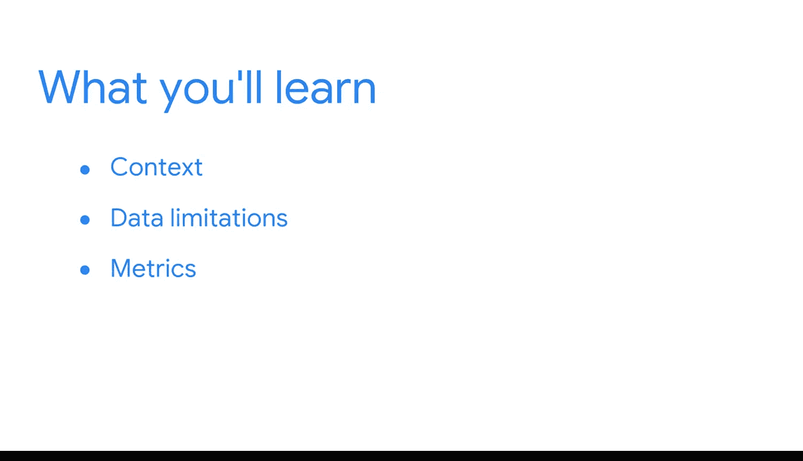

#  028：欢迎来到模块3 🎯

在本模块中，我们将深入探讨商业智能（BI）中的一个核心议题：数据的上下文与局限性。我们将学习如何正确地为数据赋予背景信息，识别常见的数据限制，并掌握BI专业人员用于克服这些挑战的策略。

---

你将开始谷歌商业智能证书课程的另一个模块。这非常棒。你正在把握当下。“把握当下”或拉丁语“Carpediem”是罗马诗人贺拉斯的一句名言。他用这句话来表达我们应该尽可能享受生活的理念，甚至可能需要冒一些风险来活出生命的精彩。

近来，缩写“YOLO”（你只活一次）是表达相同理念的常见方式。有趣的是，最初的“你只活一次”这句话本意是传递一个完全不同的信息。在英语文学中，这类引语最早的实例更像是一种警告。它们的含义是生命宝贵，因此我们应该运用良好的判断力，小心谨慎，保护自己免受伤害。

这是一个广为人知的概念被断章取义的绝佳例子。但许多其他事物也可能被断章取义，包括数据。作为复习，**上下文**是某事物存在或发生的条件。如果你获得了谷歌数据分析师证书，你已经学习了很多关于上下文的知识，以及它如何帮助将原始数据转化为有意义的信息。如果你想复习那些课程，请在继续下一个视频之前进行复习。

对于BI专业人员来说，为我们的数据提供**上下文**至关重要。这为数据提供了重要的视角，并减少了其存在偏见或不公平的可能性。在接下来的几节课中，我们将从BI的角度重新审视上下文。

---

上一节我们介绍了上下文的重要性，本节中我们来看看本模块后续的学习路径。

然后，我们将继续探讨其他一些数据局限性，包括**持续变化**以及**及时把握全局**的能力。我还将分享一些BI专业人员用来预测和克服这些局限性的策略，并且我们将更深入地学习**指标**以及它们与上下文的关系。

后续内容非常丰富。所以，让我们把握当下，继续我们的商业智能冒险之旅。

---

**本节课总结**

在本节课中，我们一起学习了模块3的引入部分。我们回顾了“上下文”的核心概念，即 `上下文 = 数据存在的条件`，并理解了为数据提供正确背景对于避免偏见和产生有意义的洞察至关重要。我们了解到，数据可能像名言一样被“断章取义”，因此BI专业人员必须主动为其赋予上下文。最后，我们预览了本模块将涵盖的其他关键主题：数据的局限性（如持续变化）、把握全局的策略，以及指标与上下文的关联。