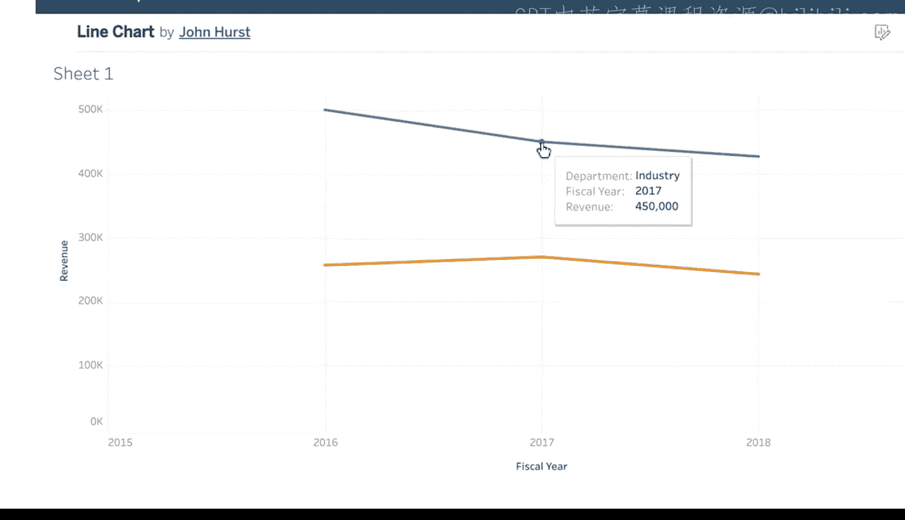

#  029：重新审视情境分析的重要性 📊

在本节课中，我们将学习情境分析在数据可视化和商业智能中的核心作用。我们将探讨如何通过提供清晰的背景信息，使数据更易于理解，并支持更有效的业务决策。

---

让我们尝试一个小实验。想象一下，如果你将一张折线图展示给三个不同的人看，可能会发生什么。

你很可能会得到三种不同的解读。

即使他们理解折线图是用来展示随时间变化的趋势。

一个人可能假设X轴代表几天的时间。

而另一个人可能猜测它展示的是许多年的时间跨度。

或许有人会认为Y轴上的五条彩色线代表不同产品的销售额。

另一个人可能推测它们代表不同客户类型的购买模式。

关键在于，一张配有标题、图例、X轴和Y轴标签，并包含所有数据值的折线图，是一种有效得多的数据可视化方式。

当你通过提供情境来清晰地指明每个项目的含义时，这张折线图就能轻易地被他人理解。

情境有助于消除误解的风险。

这为你的利益相关者节省了时间，并确保他们拥有准确的信息来做出数据驱动的业务决策。

正如你可能知道的，在数据分析中，情境将原始数据转化为有意义的信息。

当你进行情境化时，你是在将事物置于一个更广阔的视角中。

这涉及到考虑其来源和其他相关的背景信息、背后的动机、其所处的更大环境（例如特定的时间段），以及它可能产生的影响。情境化赋予事物更深层的意义，帮助人们更全面地理解它。

这也支持了公平性，并减少了当你的用户试图从你呈现的数据中获取有用见解时产生偏见的机会。

这引出了商业智能环境中的情境。在商业智能中，专业人士非常关心的情境还有另一个方面。

那就是为我们用户创建的工具进行情境化。

促进情境的一个关键实践是将共享的数据放在一个中心位置。

通常，这会是一个设计良好的数据看板。

第二步是确保每个人都有一个通用的方法来与那个看板进行交互。

利益相关者能够轻松理解、访问和使用你创建的数据看板，这一点很重要。

这样，人们就不必去其他地方或切换情境来寻找他们需要的信息。

这使所有用户都能在工作中更加高效。例如，假设一家公司的财务团队需要一个看板来分析整个公司的成本。

于是你设计了一个看板，分享关于每个部门特定支出的关键见解。

但如果后来发现运营部门的成本异常高呢？

财务团队希望能够深入分析该部门的支出，以找出成本增加的根本原因。

因此，对你的看板进行迭代更新就很重要，使其也包含每个部门的支持性信息。

构建有效解决方案的另一个部分是优先考虑组织内存在的跨职能关系。

有必要考虑你正在进行的商业智能工作如何与整体业务目标保持一致，以及你的同事将如何使用它。

例如，如果你的新商业智能工具将监控五个不同的指标，并被10个不同的利益相关者使用，那么考虑每个用户将如何访问和解读数据就很重要。

基本上，要制作一个有效的看板，首先必须了解每个特定的利益相关者将如何实际使用它。

通过花时间仔细思考这一点，你可以确保创建一个强大的看板，而不是许多效果较差的看板。

此外，因为你创建了一个单一的、可访问的共享看板，这促进了用户之间良好的协作。例如，财务团队成员可能对一个看似微小的、同比增长5%的数字感到沮丧。

但销售人员可以将这个数字置于情境中，指出5%实际上是一个好结果，并且高于预期，因为整个市场细分领域正经历10%的衰退。

销售人员可以提供这种特定的市场情境，而财务分析师可能只了解广泛的行业趋势。

一个单一的数据看板输出可以引发无数富有洞察力的对话。

在情境中表达结果有助于你确认你为利益相关者使用了正确的数据。

你也会知道数据格式正确，可以被有效使用和共享，并且结果是合理的。这提升了人们的理解力，并最终带来商业利益。

---

本节课中，我们一起学习了情境分析在数据沟通中的重要性。我们了解到，为图表和数据看板提供清晰的背景信息，可以消除误解、促进协作，并确保利益相关者基于准确的信息做出决策。记住，有效的商业智能不仅仅是展示数据，更是讲述一个清晰、有背景的数据故事。