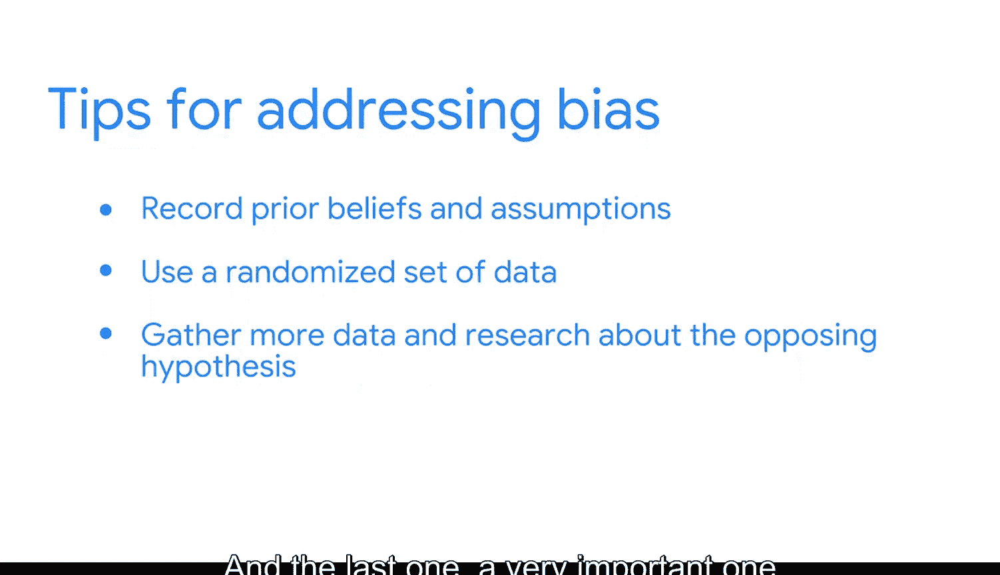

#  031：警惕数据偏见 🧠

在本节课中，我们将学习商业智能分析师在工作中可能遇到的几种数据偏见类型，以及如何通过具体的数据完整性实践来避免这些偏见，从而确保分析结果的客观与准确。

## 数据偏见的类型

上一节我们介绍了数据偏见的概念，本节中我们来看看分析师在常规工作中可能遇到的几种具体偏见类型。

*   **确认偏见**：当分析师在探索或解读数据时，倾向于寻找能证实其先前信念的信息时，就会发生确认偏见。这种情况可能发生在数据分析的任何阶段，包括收集数据、进行探索性分析或解读数据时。
*   **选择偏见**：当我们处理的样本不能代表整个总体时，就会出现选择偏见。当我们处理小数据集或随机化过程未发生时，这种情况可能会自然发生。
*   **历史数据偏见**：当社会文化偏见和信念被反映到系统流程中时，就会产生历史数据偏见。例如，如果人工系统给特定人群的信用评级很差，而分析师使用这些数据来训练自动化系统，那么这个自动化系统现在就会放大或反映这些偏见到结果中。
*   **异常值偏见**：平均值是隐藏异常值和离群点、同时扭曲我们观察结果的好方法。

## 避免数据偏见的实践方法

了解了常见的偏见类型后，接下来我们探讨一些在实际分析中行之有效的、避免偏见的数据完整性实践方法。

以下是我在进行分析并试图避免偏见时，总结出的几个有效建议：

1.  **记录先验信念**：在开始分析之前，记录下我所有的先验信念和假设，以切实认识到我对数据或流程确实存在这些先入为主的观念。
2.  **使用高度随机化的数据集**：使用可能更能代表分析目标的数据集，而不仅仅是图方便。
3.  **收集更多数据并研究对立面**：围绕你假设的对立面收集更多数据并进行研究，以确保你不会忽视那部分信息，或者不会只专注于你认为应该是分析结果的部分。
4.  **警惕异常值**：当平均值分析显示数据一切良好时，我认为是时候更深入地挖掘数据以理解细微差别了。

本节课中我们一起学习了四种主要的数据偏见（确认偏见、选择偏见、历史数据偏见和异常值偏见），并掌握了四项核心的数据完整性实践方法，以帮助我们在分析工作中识别并避免这些偏见，从而得出更客观、可靠的商业洞察。