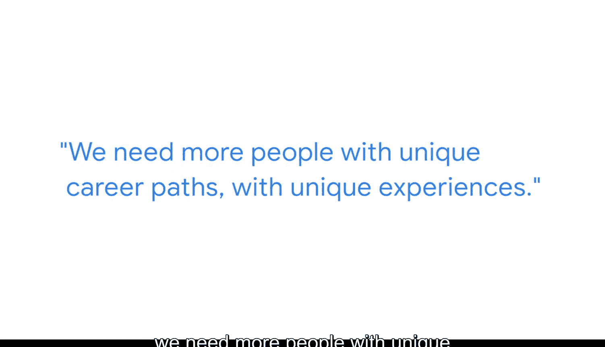

#  036：成为首选候选人 💼

在本节课中，我们将学习谷歌商业智能经理帕特里克·刘分享的见解，了解如何从众多求职者中脱颖而出，成为商业智能分析师职位的首选候选人。我们将重点探讨简历之外的展示方式、招聘经理的评估重点以及如何有效展示你的能力。

帕特里克·刘是谷歌法律部门的商业智能经理，管理着一个由五名分析师组成的团队，负责为整个谷歌法律团队开发数据看板、报告和查询。他最初在谷歌担任的是非技术性职位——法律助理，正是在这个岗位上，他获得了大量接触和处理数据的机会，从而培养了自己的技能。

## 招聘经理的视角

上一节我们介绍了帕特里克的职业背景，本节中我们来看看他作为招聘经理在面试中的关注点。帕特里克已经进行了大约40场商业智能分析师职位的面试。

他通常寻找的是那些具备出色商业判断力的候选人。这些候选人能够提出建议、找到解决方案，并利用数据来支持自己的观点。其核心能力可以概括为：

**商业判断力 = 定义问题 + 分析数据 + 提出可执行的建议**

## 超越简历：作品集的力量

在审阅大量简历时，帕特里克发现许多简历开始变得雷同。真正让他感到兴奋的，是当候选人附上一份作品集的时候，而这么做的申请者并不多。

看到作品集之所以令人兴奋，是因为它能超越一页纸的简历，让招聘经理看到候选人实际的工作能力、他们对数据的热情，并能听到他们自己的“声音”。这能真正帮助招聘经理了解候选人。

## 打造引人入胜的作品集

那么，什么样的作品集最受青睐呢？帕特里克喜欢的不仅仅是成套的仪表盘。

他实际上非常喜欢看到一段视频，无论是在YouTube上还是其他视频平台录制的。因为这能让他看到一个从开始到结束的完整故事。他很享受看候选人的幻灯片，或者看他们演示一个仪表盘：点击不同的小部件，展示趋势，讲述一个故事。这样的作品集更能让他投入。

对于第一次创建作品集的候选人，帕特里克的建议是保持简洁。

假设招聘经理只会花几分钟时间浏览你的仪表盘、报告或查询。你需要思考你希望他们带走的核心信息是什么。你的建议或行动方案应该非常快速、清晰地凸显出来。

不要过多考虑如何给招聘经理留下深刻印象。对帕特里克来说，真正重要的是看到你提出的建议，以及你打算如何用数据来影响业务决策。

## 给求职者的鼓励

最后，作为一名招聘经理，帕特里克想说的是，他真的希望每个人都能成功，希望你能成功。

你属于商业智能行业，我们需要你，我们需要更多拥有独特职业路径和独特经验的人。只有这样，我们才能构建一个更多样化的行业，才能真正提升我们的技能并推动创新。

---

**本节课总结**

本节课中，我们一起学习了如何成为商业智能分析师职位的理想候选人。关键要点包括：超越简历，通过作品集展示你的实际技能和热情；在作品集中，注重用视频或演示来讲述一个完整的数据故事，清晰突出你的商业建议；并且记住，招聘经理寻找的是能利用数据驱动业务决策的独特人才。保持简洁、聚焦核心信息，并自信地展示你的独特价值。