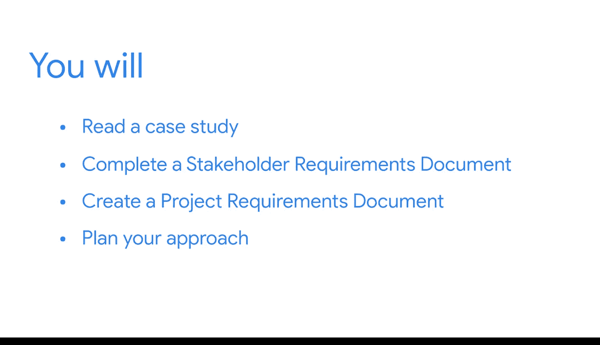

#  037：期末项目介绍

在本节课中，我们将学习期末项目的整体框架、目标及其在求职中的重要性。通过完成这个项目，你将有机会整合并展示在本课程中学到的所有商业智能知识和技能。

---

当候选人在谷歌面试时，我的同事以及人事与人力资源部门的同事都喜欢查看他们的在线作品集。

他们通常对那些能够以清晰且引人入胜的形式展示其知识的候选人更有信心。

当他们审阅希望加入商业智能等团队（例如我所在的团队）的人员的作品集时，数据看板尤其有帮助，因为它们不仅视觉上吸引人，而且直接、易于使用和理解。

因此，我们与招聘经理一起，会同时关注作品集的内容以及看板在设计和组织上的表现，以了解候选人在用户体验上投入了多少思考。

在商业智能领域，拥有一个作品集已变得极为普遍。

在求职期间，展示你对商业智能的知识、你对商业智能工具的使用经验以及你参与过的一些有趣项目，是非常有价值的。

你的作品集能真正帮助你在众多候选人中脱颖而出。

到目前为止，在本课程中，你已经获得了大量知识和即战技能，以帮助你在商业智能领域取得成功。

你了解了商业智能专业人员在组织中的角色以及典型的职业发展路径。

你探索了核心的商业智能实践和工具，并见证了商业智能专业人员如何利用它们产生积极影响。

所有这些都将帮助你成功完成期末课程项目。

此外，你将应用所学到的关于团队成员、利益相关者和客户的知识，例如他们的特定角色或优先事项。

在此过程中，你将确保所选的指标是相关且有效的。

并且你将应用现在所掌握的关于定义策略、收集利益相关者和项目需求的知识。

你将首先阅读具体的案例研究。

这份阅读材料将解释你将要合作的组织的类型、涉及的人员、需要解决的业务问题以及其他关键细节。

你将使用客户提供的信息完成一份利益相关者需求文档。

这将使你能够进一步定义业务问题，理解利益相关者，并思考为了取得成功的成果需要回答哪些重要问题。

然后，你将创建一份项目需求文档，其中包含关于项目目的、关键依赖关系、成功标准等信息。

最后，你将深思熟虑地规划你的方法，为开发有效的解决方案做好准备。

正如你所学的，项目需求文档包括项目目的、受众、关键的看板功能和要求，以及看板应包含的指标和图表。

在后续的课程中，你将继续完成你的期末项目。

当你完成时，你将设计出一些真正能让招聘经理印象深刻的作品。

此外，你还将拥有一份商业智能流程文档，用以展示你的思考过程、你解决业务问题的方法、你获得的关键技能等等。

这些都是面试时可以谈论的绝佳内容。

好的，让我们开始吧。是时候探索你将如何帮助一个组织通过激动人心的商业智能世界前进了。

---

本节课中我们一起学习了期末项目的目标、结构及其在求职中的核心价值。我们了解到，通过完成案例研究、撰写需求文档和设计数据看板，你将构建一个强有力的作品集，以展示你的商业智能能力。