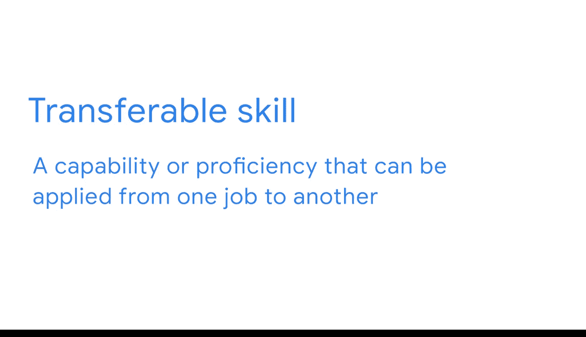

#  038：期末项目评审

## 概述
在本节课中，我们将对商业智能课程期末项目的第一部分进行评审。我们将回顾你在项目规划与文档编制阶段取得的成果，并展望后续步骤。

---

你已经完成了商业智能课程期末项目的第一部分。祝贺你。

当你开始思考未来的求职时，为示例情境规划和记录你的方法是一次宝贵的经历。因此，你将能够通过讨论你的商业智能经验给招聘经理留下深刻印象。这包括理解利益相关者的需求、建立一个清晰直接的项目计划，以及完成一份有效的策略文档。

此外，你将了解如何分享你在识别相关指标和关键绩效指标方面所掌握的一切知识。这是商业智能流程的重要组成部分。同时，正如你所学的，与潜在雇主沟通你的可转移技能非常有帮助。你添加到商业智能笔记中的信息在求职面试时将极其有用。

你的期末项目的下一步将在下一门课程结束时进行。届时，你将利用在此处开发的资产，继续构建你的解决方案。

---

在项目结束时，你将把所有内容整合起来，以最终确定你针对此示例情境的独特方法。请记住，你的文档不必与范例完全一致，但它们应实现相同的目标。你随时可以返回并回顾你所创建的内容，以便为你在本项目中继续取得成功做好准备。目标是拥有一个出色的工作范例，能清晰地向潜在雇主展示你的技能水平。

---

再次祝贺你，并希望你在完成本项目全程时能有一段收获满满的经历。