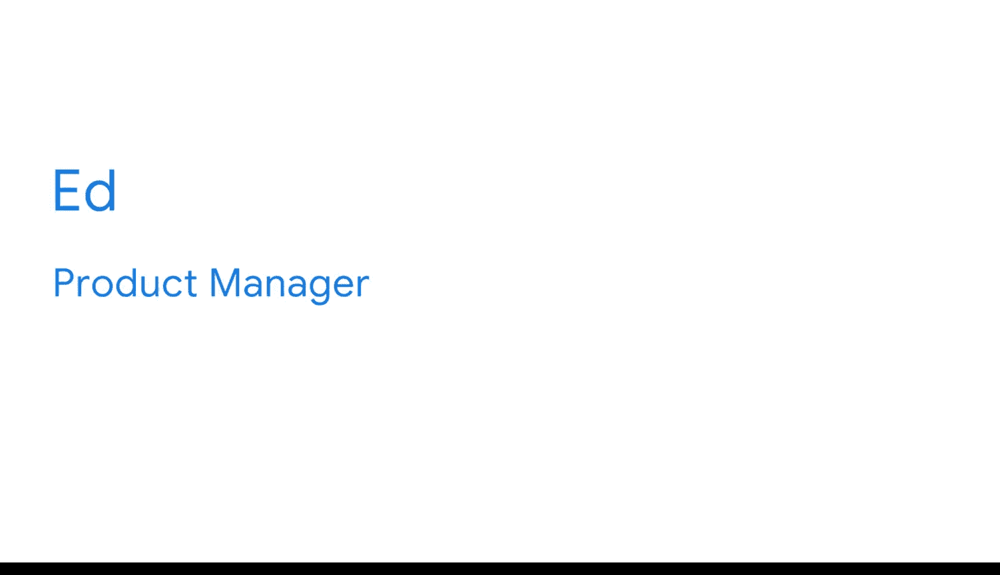
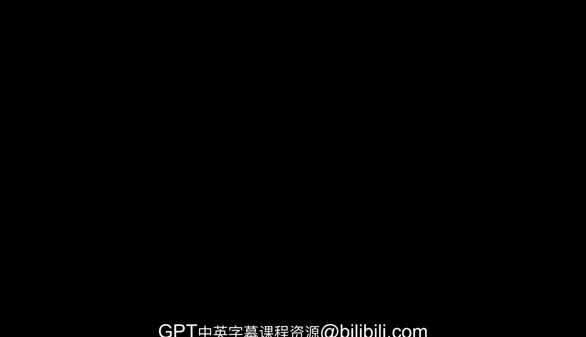

#  039：课程总结 🎉

在本节课中，我们将对谷歌商业智能专业证书的第一门课程进行总结，并展望后续的学习路径。

---

恭喜你完成了谷歌商业智能专业证书的第一门课程。你已经学到了很多知识，现在可以带着这些知识和技能继续前进了。请记住，如果有一天你觉得需要复习或进行额外练习，这些视频、阅读材料和活动内容将随时为你提供支持。

现在，我很高兴地告诉你，你将开始与下一门课程的讲师一起学习。你可能还记得在项目介绍视频中出现的Ed，他是谷歌的一名产品经理。

---

Ed已经准备好帮助你迈出下一步，以完成整个项目并成为一名商业智能专业人士。这门课程将直接建立在你迄今为止所学的所有激动人心的主题之上。它将让你对**数据模型**、**数据管道**、**数据转换**等有更深入的了解。

随着学习的深入，你将持续构建自己的商业智能专业知识。在开始之前，我想感谢你加入这门课程，并选择追求这个令人兴奋的学习机会。我坚信教育是一生的旅程。对我而言，它体现在工作中学习`Python`以加速我的分析，以及阅读关于健康的书籍以成为一个更健康、更有韧性的人。同样，我毫不怀疑你在这里付出的所有时间和努力，都将为你未来选择的任何事业做好更充分的准备。

你已经走了很长的路。请花点时间庆祝你所取得的一切成就。然后，请前往下一门课程。Ed已经准备好并等待着你的到来。再见。

---

**本节课总结**

在本节课中，我们一起回顾了第一门课程的完成，并介绍了下一阶段的学习内容。我们强调了持续学习和实践的重要性，并鼓励你庆祝已取得的成就，为接下来的学习旅程做好准备。