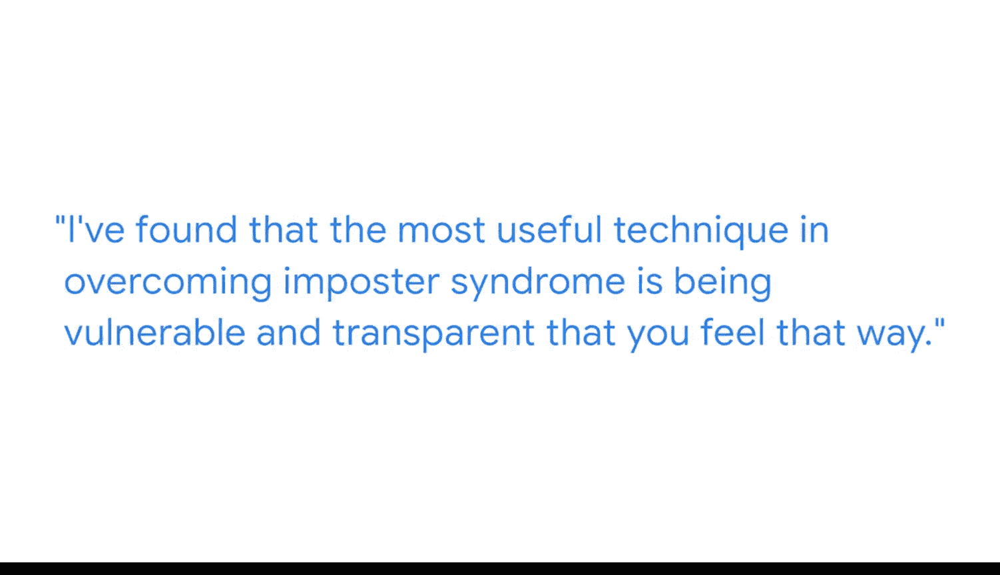

#  041：克服冒名顶替综合征

在本节课中，我们将跟随谷歌产品经理艾德，学习如何识别并克服在职场中常见的“冒名顶替综合征”。这是一种认为自己能力不足、不配当前成就的心理现象。我们将了解它的表现，并掌握实用的应对策略。

## 👋 自我介绍与角色定义

大家好，我是艾德，是谷歌的一名产品经理。

作为一名产品经理，我的职责是定义产品的愿景，并确保该愿景与用户对该产品的实际需求保持一致。

## 🤔 什么是冒名顶替综合征？

对我来说，冒名顶替综合征是一种信念，即你认为自己在技能、视角、背景或经验方面尚未达到应有的水平。

我确实经历过冒名顶替综合征。我与许多在各自专业领域非常、非常精通的人共事，但不可能有人精通所有技能。

## 🔍 症状与不切实际的比较

于是你最终会想，也许我应该能像她一样编程，或者我应该像他一样成为优秀的数据科学家，也许我应该拥有周围每个人似乎都具备的那种视角水平。

但这并不一定是事实。

## 💡 核心策略：聚焦你的独特价值

我认为，专注于你提供的独特视角非常重要，因为每个人的视角、专业知识和兴趣，以及他们应用所有这些的方式，都会有所不同。

因此，你提供的事物组合是独特的，其他人无法提供，仅仅因为你是你自己。

## 🛠️ 实用技巧：展现脆弱与透明

我发现克服冒名顶替综合征最有用的技巧，就是坦诚并透明地承认你有这种感觉。

以下是具体步骤：

首先，找到你信任的人，找到你可以与之交谈的人并告诉他们你的感受。

告诉他们你为何有这种感觉。感到某种情绪并不一定代表你是谁或你的能力如何，它仅仅是一种感受。

能够展现脆弱并说“嘿，我不明白这个”或“我想要多一点信息”，这不仅对你有帮助，对你周围的人也有帮助。

## ⚖️ 平衡视角：关注优势而非仅盯不足

我们倾向于关注负面因素。我们倾向于关注挑战或我们认为需要改进的建设性方面，却没有给自己做得好的事情、我们应该更多发挥的优势给予足够的肯定。

通过理解并真正发挥你的优势，你会比仅仅试图隐藏或逃避失败更加成功。

---

本节课中我们一起学习了冒名顶替综合征的定义与表现。我们了解到，关键在于认识到自己的独特价值，并通过坦诚沟通和聚焦个人优势来克服这种不自信的感觉。记住，你的独特组合是无可替代的。