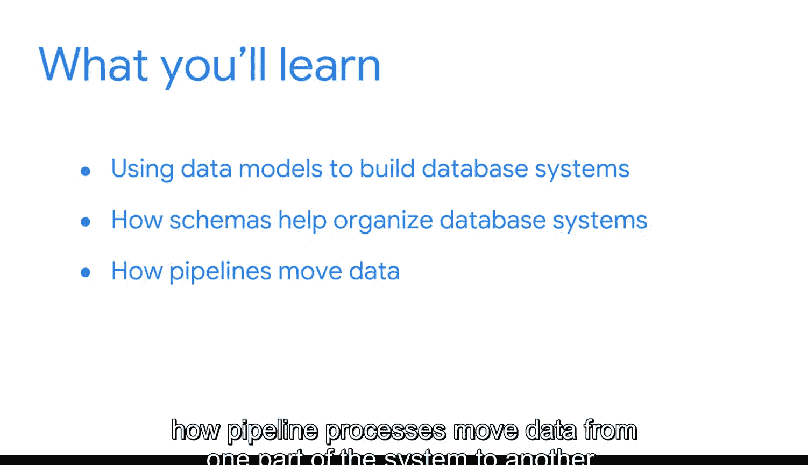

#  042：数据模型、架构与管道 🧠

在本模块中，我们将学习商业智能（BI）专业人员如何利用数据模型来构建数据库系统，理解架构如何帮助他们组织和理解这些系统，以及管道流程如何将数据在系统各部分之间移动。

## 数据建模基础与架构 🔧

上一节我们介绍了本模块的整体目标，本节中我们来看看数据建模的基础知识。

我们将从探索数据建模的基础开始，同时了解常见的架构和关键的数据库元素。数据模型是数据库系统的蓝图，它定义了数据如何组织、关联和存储。

以下是数据建模中涉及的核心概念：

*   **实体**：代表业务中需要跟踪的人、事物、地点或概念，例如“客户”或“产品”。
*   **属性**：描述实体的特征或属性，例如客户的“姓名”或产品的“价格”。
*   **关系**：定义不同实体之间的关联方式，例如“客户”**下单**“产品”。

我们还会考虑业务需求如何决定BI专业人员可能实施的数据库系统类型。例如，需要快速处理大量交易的业务可能选择联机事务处理（OLTP）系统，而专注于复杂分析和报告的业务则可能选择联机分析处理（OLAP）系统。

## 数据管道与ETL流程 ⚙️

理解了数据如何被建模和存储后，本节中我们来看看数据如何流动。

随后，我们将转向管道和ETL（提取、转换、加载）流程。这些是使数据在整个系统中流动，并确保其可访问和有用的工具。ETL流程是数据管道的核心。

以下是ETL流程的三个关键阶段：

1.  **提取**：从各种源系统（如数据库、应用程序、文件）中收集原始数据。
2.  **转换**：对提取的数据进行清洗、标准化、整合和加工，使其符合目标系统的格式和质量要求。例如，将日期格式统一，或合并来自不同系统的客户记录。
3.  **加载**：将转换后的数据存入目标数据库或数据仓库，以供分析和使用。

通过管道，数据得以从操作型系统顺畅地流向分析型系统，为决策提供支持。

## 总结 📝

本节课中我们一起学习了商业智能的基础构件。我们探讨了数据模型如何作为数据库系统的设计图，架构如何组织数据关系，以及ETL管道如何作为数据的输送带，确保原始数据被转化为可用的洞察。掌握这些概念，你将为BI工具箱增添许多重要工具。