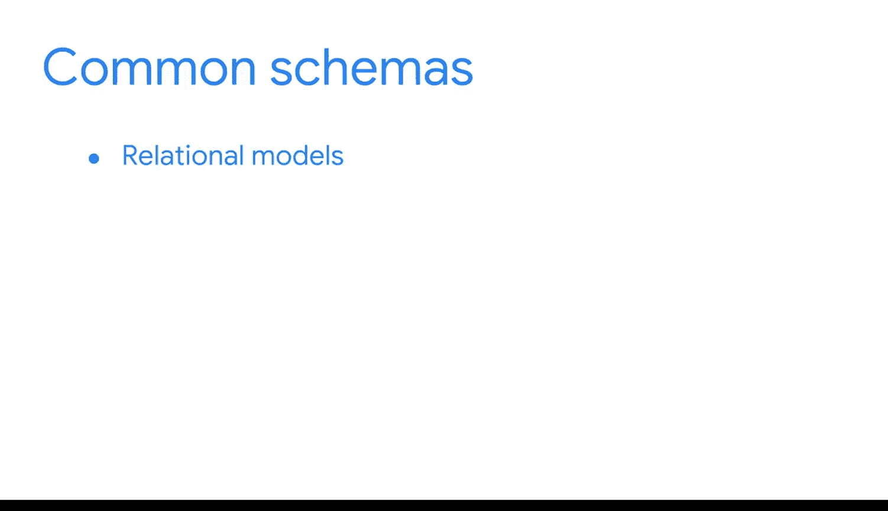

#  043：数据建模、设计模式与架构 📊

在本节课中，我们将要学习数据建模、设计模式与架构的基础概念。这些是商业智能（BI）专业人士构建有效数据系统的核心知识。

## 概述

数据建模是组织数据元素并定义其相互关系的过程。设计模式是创建数据模型的可重用模板，而架构（或模式）则是描述数据组织方式的概要。理解这些概念对于设计和维护高效的BI系统至关重要。

## 数据系统与组织

上一节我们介绍了课程的整体框架，本节中我们来看看数据是如何在各种系统中被组织和存储的。

数据库是存储在计算机系统中的数据集合。为了使数据库有用，数据必须被妥善组织。这包括数据被摄取和移动的**源系统**，以及数据将被使用的**目标数据库**。

以下是几种常见的源系统和目标系统类型：

*   **数据湖**：一种以原始格式存储大量原始数据的数据库系统，直到需要使用时才进行处理。
*   **在线事务处理数据库**：一种为数据处理（而非分析）而优化的数据库。
*   **数据集市**：一种面向主题的数据库，可以是更大数据仓库的子集。
*   **在线分析处理数据库**：一种除了处理外还为分析而优化的工具，可以分析来自多个数据库的数据。

BI专业人员的一个重要职责就是创建目标数据库的模型，并相应地组织系统、工具和存储方式，包括设计数据的组织和存储结构。这些系统都是后续构建BI工具的基础。

## 数据结构与建模

现在，我们了解了数据存储的位置，接下来探讨数据本身的结构以及如何通过建模来理解它。

数据主要分为两类：非结构化数据和结构化数据。**非结构化数据**没有以任何易于识别的方式进行组织。**结构化数据**则以特定格式（如行和列）进行了组织。

理解结构可能具有挑战性，这正是数据建模的用武之地。**数据模型**是一种用于组织数据元素并定义其相互关系的工具。它是帮助保持整个系统数据一致性的概念模型，让我们从理论上理解数据的组织方式。

可以将其想象为费尔南达的“完美商业智能列车系统”的地图。它通过指引你穿越系统来帮助你导航数据库。**数据建模**就是创建这些工具的过程。

## 设计模式与架构

为了创建数据模型，BI专业人员通常会使用所谓的**设计模式**。设计模式是一种利用相关度量和事实来创建模型以支持业务需求的解决方案。可以将其视为一个可重用的解决问题的模板，可应用于许多不同的场景。

你可能更熟悉设计模式的输出——**数据库架构**。架构是描述数据等事物如何被组织的一种方式。在与数据库打交道时，你可能遇到过一些常见的架构，例如：

*   关系模型
*   星型架构
*   雪花型架构
*   非SQL架构

这些不同的架构使我们能够描述用于组织数据的模型。如果说设计模式是数据模型的模板，那么架构就是该模型的概要。

## 总结

本节课中我们一起学习了数据建模、设计模式与架构的核心概念。我们了解到，数据建模是组织数据的蓝图设计过程，设计模式是创建这些蓝图的可复用方法，而架构则是最终蓝图的具体呈现。由于BI专业人员在创建这些系统中扮演着如此重要的角色，理解数据建模是这项工作的基本组成部分。

在接下来的课程中，你将进一步学习设计模式和架构在BI中的具体应用，并有机会亲自实践数据建模。