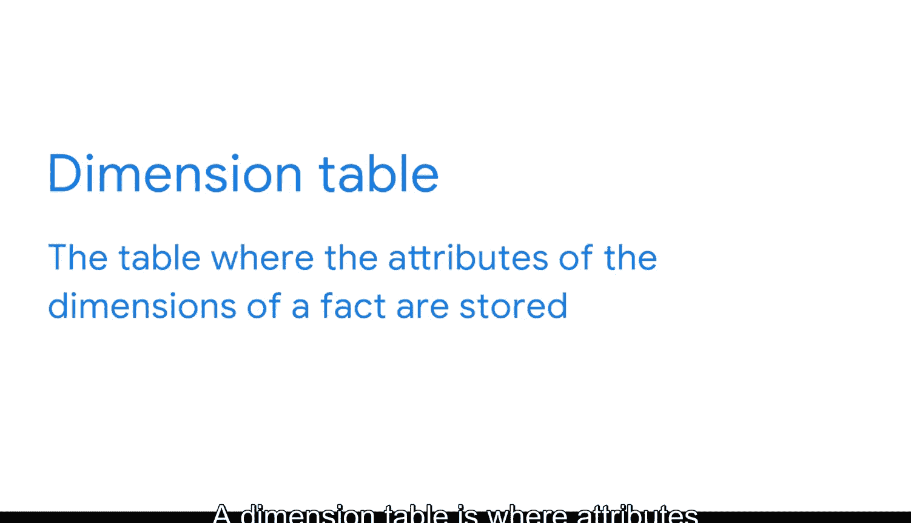

#  044：用维度模型获取事实 📊

在本节课中，我们将学习维度模型的核心概念。这是一种在商业智能领域广泛使用的关系型建模技术，旨在高效地从数据仓库中检索数据。我们将探讨事实、维度和属性的定义，并了解它们如何通过事实表和维度表组织起来。

## 关系型数据库回顾

如果你曾使用SQL处理数据库，可能已经熟悉关系型数据库。本节中，我们将回顾关系型数据库的基本概念，并引入主键和外键，它们是建立表间关系的基础。

在关系型数据库中，数据存储在一系列可以相互连接的表中。这些连接通过**主键**和**外键**建立。

以下是理解主键和外键的关键点：
*   **主键**：是数据库中的一个标识符，它引用一个列或一组列，其中每一行都能唯一标识表中的每条记录。一个表只能有一个主键。
*   **外键**：是数据库表中的一个字段，它是另一个表中的主键。一个表可以有多个外键。

让我们通过一个汽车经销商数据库的例子来具体说明。`BranchID` 是 `car_dealerships` 表的主键，但它是 `product_details` 表的外键。这直接连接了这两个表。同样，`VIN` 是 `product_details` 表的主键，也是 `repair_parts` 表的外键。这些连接实际上在所有表之间建立了关系，即使 `car_dealerships` 表和 `repair_parts` 表也通过 `product_details` 表间接相连。

## 理解维度模型

上一节我们回顾了关系型数据库的基础。本节中，我们来看看一种专门为商业智能优化的关系模型——维度模型。

维度模型是一种关系模型，经过优化，可以快速从数据仓库中检索数据。它可以分解为用于测量的**事实**和用于添加上下文属性的**维度**。

*   **事实**：是一种度量或指标。例如，月销售额就是一个事实。
*   **维度**：是提供关于该事实更多细节和上下文的信息。它回答了谁、什么、哪里、何时、为什么以及如何的问题。如果月销售额是事实，那么维度可以包括每次销售的相关信息，如客户、门店位置和售出的产品。

## 维度与属性

我们已经了解了事实和维度。现在，我们来探讨属性的概念，它进一步描述了维度。

在维度模型中，**属性**是用于描述维度的特征或性质。维度提供关于事实的信息，而属性则提供关于维度的信息。

考虑护照的例子。护照上的一个维度是“头发和眼睛颜色”。如果你有棕色的头发和眼睛，那么“棕色”就是描述该维度的属性。

再举一个简单的例子。在我们的汽车经销商案例中，如果探索“客户”维度，我们可能会有诸如姓名、地址和电话号码等属性列在每个客户名下。

## 事实表与维度表

现在我们已经明确了事实、维度和属性，接下来看看维度模型如何使用这些元素创建两种类型的表：事实表和维度表。

*   **事实表**：包含与特定事件相关的度量或指标。这是存储事实及其与维度关系的主要表格。本质上，事实表中的每一行代表一个事件。整个表可以聚合多个事件，例如一天的销售额。
*   **维度表**：存储事实维度的属性。这些表通过外键连接到相应的事实表，从而为事实赋予意义和上下文。

这就是维度模型中表连接的方式。理解维度建模如何建立连接，将帮助你作为BI专业人员理解数据库设计。这也将澄清数据库模式的概念，模式是设计模式的输出。

## 总结

在本节课中，我们一起学习了维度建模的核心概念。我们从回顾关系型数据库和键（主键、外键）开始，然后深入探讨了维度模型的组成部分：**事实**、**维度**和**属性**。最后，我们了解了这些元素如何组织成**事实表**和**维度表**，并通过键连接起来，形成一个高效的数据检索结构。理解这些概念是掌握商业智能中数据建模和数据库设计的基础。