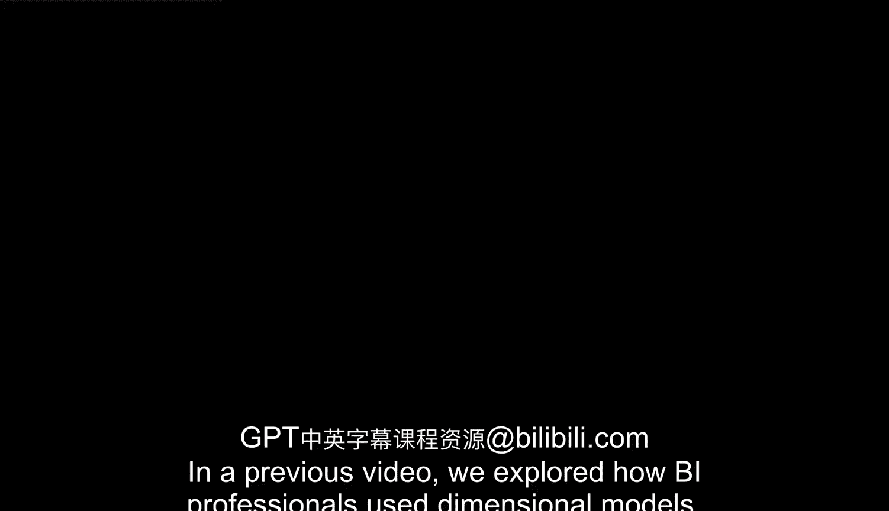
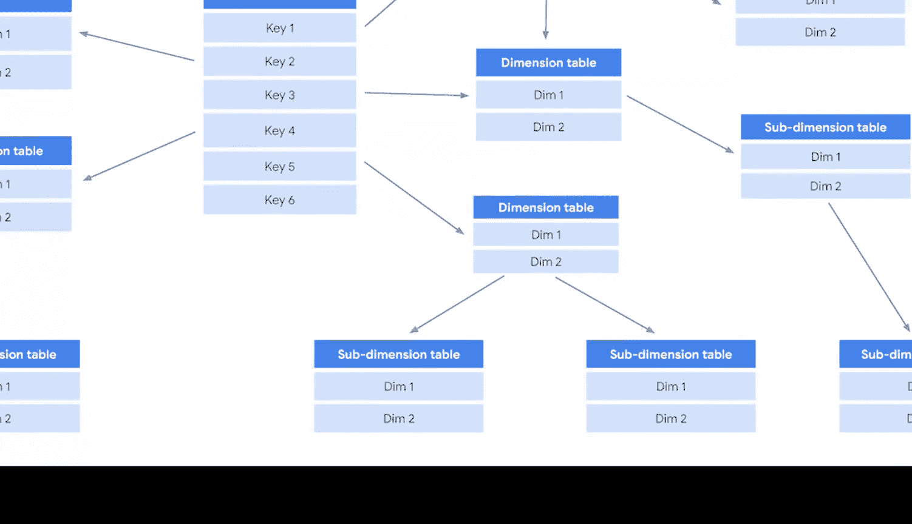

**谷歌商业智能课程：06_01_03：星型与雪花型架构的维度模型** 🏗️

在本节课中，我们将学习维度模型中的两种核心架构：星型架构和雪花型架构。我们将了解它们的定义、结构、特点以及它们在商业智能实践中的应用。

---

在之前的视频中，我们探讨了商业智能专业人员如何使用维度模型。他们通过连接事实、维度和属性来组织数据，从而创建一种设计模式。架构（Schema）就是这种模式的最终输出。

正如你所了解的，架构是一种描述事物（如数据）如何组织的方式。在数据库中，它定义了数据元素的逻辑结构、物理特性以及模型内部存在的相互关系。

可以把架构想象成一张蓝图。它本身不存储数据，而是描述数据的形状以及它如何与其他表或模型关联。数据库中的任何条目都是该架构的一个实例，并将包含架构中描述的所有属性。

在商业智能领域，你可能会遇到几种常见的架构，包括星型架构、雪花型架构以及非规范化（或NoSQL）架构。星型和雪花型架构是实践中维度模型最常见的两种实现形式。

---

上一节我们介绍了架构的基本概念，本节中我们来看看星型架构的具体结构。

星型架构由一个事实表和任意数量的维度表组成。正如其名，这种架构的形状像一颗星星。

**核心结构公式：**
`星型架构 = 1个事实表 + N个维度表`

请注意，每个维度表都直接连接到中心的**事实表**。星型架构的设计目的是为了监控数据，而非深入分析数据。这种方式使分析师能够快速处理数据。因此，它非常适合大规模的信息交付，并且由于表数量有限、关系直接明确，使得数据输出更加高效。

以下是星型架构的主要特点：
*   **结构简单**：所有维度表直接与中心事实表相连。
*   **查询高效**：连接路径短，查询性能通常很高。
*   **易于理解**：模型直观，便于业务用户理解。

---

了解了相对简单的星型架构后，我们来看看更复杂的雪花型架构。

雪花型架构比星型架构更复杂，但其原理相同。它是星型架构的扩展，增加了额外的维度，并且常常包含子维度。这些维度和子维度将架构分解成更具体的表，从而形成雪花状的图案。

就像自然界中的雪花一样，雪花型架构及其内部关系可能非常复杂。

**核心结构描述：**
雪花型架构在星型架构的基础上，将某些维度表进一步规范化，分解成多个相关联的子维度表。

请看示例。请注意，**事实表**仍然位于中心，但现在有子维度表连接到维度表，这形成了一个更复杂的网络。例如，一个“产品”维度可能被规范化为“产品类别”和“产品供应商”等子维度表。

以下是雪花型架构的主要特点：
*   **结构规范化**：减少了数据冗余，节省了存储空间。
*   **更复杂**：表间关系更多，查询时可能需要更多连接操作。
*   **灵活性高**：便于对维度进行更细致的管理和分析。

---

现在，你已经对商业智能中可能遇到的常见架构有了基本了解。理解这些架构可以帮助你认识数据库的不同构建方式，以及商业智能专业人员如何影响数据库的功能。

在后续课程中，你将有机会进一步探索这些不同的架构，甚至尝试自己构建。

---

**总结**

本节课中，我们一起学习了维度模型中的两种关键架构：
1.  **星型架构**：结构简单高效，由一个中心事实表和多个直接相连的维度表组成，适合快速查询和报表。
2.  **雪花型架构**：是星型架构的规范化扩展，通过引入子维度表来减少冗余，结构更复杂但更灵活。

理解它们的区别和适用场景，是设计高效数据仓库和进行有效商业智能分析的重要基础。