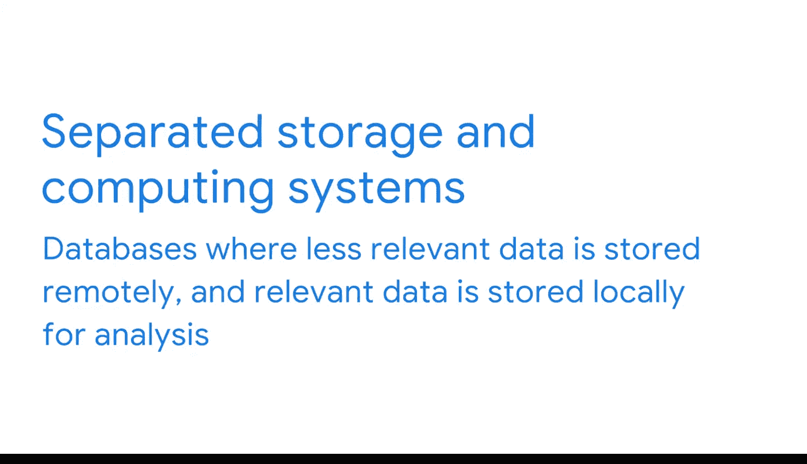

#  046：不同数据类型对应不同数据库 📊

在本节课中，我们将要学习不同类型的数据库框架。理解这些差异对于商业智能专业人员至关重要，因为它直接影响数据如何被存储、处理和使用。我们将探讨几种主要的数据库类型，包括它们的设计理念、适用场景以及它们如何影响数据建模和迁移工作。

---

上一节我们讨论了数据库建模和模式，本节中我们来看看数据库的不同方面。商业智能专业人员需要根据组织的需求考虑数据库的多个维度，因为数据库的框架——包括平台的组织方式以及数据的存储和处理方式——会影响数据的使用方式。

让我们从一个例子开始。设想一家杂货店的数据库系统，它们既要管理日常业务流程，也要分析和从数据中获取洞察。例如，除了让用户管理销售，杂货店的数据库还必须帮助决策者了解顾客购买了什么商品以及哪些促销活动最有效。

在本视频中，我们将查看几个数据库框架的例子，并了解它们彼此之间的不同之处。具体来说，数据库因其数据处理、组织和存储方式的不同而有所差异。因此，了解公司正在使用何种类型的数据库非常重要。根据数据在该平台上的存储和访问方式，你将设计出不同的数据模型。

此外，商业智能专业人员的另一个关键职责是促进数据库迁移。这在技术变革和业务增长时通常是必要的。**数据库迁移**涉及将数据从一个源平台移动到另一个目标数据库。在迁移过程中，用户将当前的数据库模式转换到新的期望状态。这可能涉及添加表或列、拆分字段、移除元素、更改数据类型或其他改进。数据库迁移过程通常需要多个阶段和迭代，以及大量的测试。这对商业智能团队来说是巨大的项目，你通常不会只想简单地复制原始模式到新系统中。

以下是几种主要的数据库类型：

*   **OLTP** 与 **OLAP**：基于数据处理方式的分类。
*   **行式** 与 **列式**：基于数据组织方式的分类。
*   **分布式** 与 **单机**：基于数据存储位置的分类。
*   **存储计算分离** 与 **存储计算一体**：基于数据存储和处理架构的分类。

---

## 基于数据处理方式的数据库

我们首先要探讨的两种数据库技术，OLTP和OLAP系统，是基于数据处理方式进行区分的。

**在线事务处理** 数据库，即 **OLTP** 数据库，是专为数据处理而非分析优化的数据库。OLTP数据库管理数据库的修改，并通过传统的数据库管理系统软件进行操作。这些系统旨在有效地存储事务并帮助确保一致性。

一个OLTP数据库的例子是在线书店。如果两个人将同一本书加入购物车，但库存只有一本，那么首先完成结账流程的人将得到这本书。OLTP系统确保售出的数量不会超过库存。OLTP数据库经过优化，可以读取、写入和更新单行数据，以确保业务流程顺利进行，但它们不一定设计为同时读取多行数据。

接下来，如前所述，**OLAP** 代表 **在线分析处理**。这是一种除了处理之外还为分析优化的工具，可以分析来自多个数据库的数据。OLAP系统同时从多个来源提取数据，以分析数据并提供关键的商业洞察。

回到我们的在线书店例子，一个OLAP系统可以从多个数据仓库中提取关于客户购买行为的数据，以便根据客户的偏好为其创建个性化的主页。OLAP数据库系统使组织能够从各种数据源满足其分析需求。

根据组织的数据成熟度，作为商业智能专业人员，你的首要任务之一可能就是建立一个OLAP系统。许多公司已经部署了OLTP系统来运行业务，但它们会依赖你来创建一个能够优先分析数据的系统。这是获取洞察的关键第一步。

---

## 基于数据组织方式的数据库

现在，我们来看看行式和列式数据库。

顾名思义，**行式数据库** 是按行组织的。表中的每一行都是数据库中的一个实例或条目，关于该实例的详细信息按列记录和组织。这意味着，如果你想从书店数据库中获取过去五年所有销售的平均利润，你将不得不提取这些年份的每一行数据，即使你不需要这些行中包含的所有信息。

另一方面，**列式数据库** 是按列组织的数据库。它们常用于数据仓库，因为对于分析查询非常有用。列式数据库处理数据速度快，只从特定列检索信息。在我们“所有销售的平均利润”的例子中，使用列式数据库，你可以选择专门提取“销售额”列，而不是提取数年的所有行数据。

---

## 基于数据存储位置的数据库

接下来的数据库关注存储位置。

**单机数据库** 是指所有数据存储在同一物理位置的数据库。这对于处理大型数据集的机构来说不太常见，并且随着越来越多的组织将其数据存储转移到在线和云提供商，这种情况将变得越来越罕见。

**分布式数据库** 是分布在多个物理位置的数据系统集合。可以把它们想象成电话簿。实际上不可能将世界上所有的电话号码保存在一本书里，那将非常庞大。因此，电话号码按地理位置划分，分布在多本书中，以便于管理。

---

## 基于存储与处理架构的数据库

最后，我们还有更多存储和处理数据的方式。

**存储计算一体系统** 是在同一位置存储和分析数据的数据库系统。这是一种更传统的设置，因为它使用户能够访问所有需要长期保留在系统中的数据，但随着添加更多数据，可能会变得难以管理。

顾名思义，**存储计算分离系统** 是数据库的一种架构，其中相关性较低的数据被远程存储，而相关数据则本地存储以供分析。这有助于系统更有效地运行分析查询，因为你只与相关数据交互。它还使得可以独立扩展存储和计算能力。例如，如果你有很多数据，但只有少数人在查询它，你就不需要那么多的计算能力，这可以节省资源。

---

## 总结

本节课中我们一起学习了多种影响商业智能工作的数据库框架。理解一个系统是OLTP还是OLAP、是关系型还是列式、是分布式还是单机、是存储计算分离还是一体，甚至是这些类型的某种组合，都至关重要。接下来，我们将更深入地探讨数据组织。