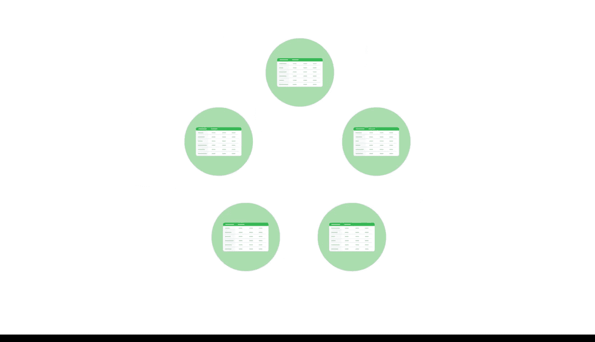

#  047：数据的形态

在本节课中，我们将要学习数据仓库设计的基础概念。我们将回顾数据仓库的定义，并探讨在设计数据仓库时需要考虑的关键因素，包括业务需求、数据的形态与体量，以及数据模型的选择。

你已经学习了数据建模和数据库模式，以及不同类型的数据库在商业智能中的应用。现在，我们将探索如何运用这些概念来设计数据仓库。但在深入数据仓库设计之前，我们先来回顾一下数据仓库究竟是什么。

你可能在本课程的前期内容中记得，数据库是存储在计算机系统中的数据集合。而数据仓库是一种特定类型的数据库，它整合来自多个源系统的数据，以确保数据的一致性、准确性和高效访问。数据仓库用于支持数据驱动的决策制定。通常，这些系统由数据仓库专家管理，但在设计阶段，商业智能专业人员也可能参与协助。

在设计数据仓库时，商业智能专业人员会考虑几个重要事项：业务需求、数据的形态与体量，以及数据仓库将遵循的模型。

业务需求是组织希望回答的问题或希望解决的难题。这些需求有助于确定组织将如何使用、存储和组织其数据。例如，一家存储患者记录以监测健康状况变化的医院，其数据需求与一家分析市场趋势以确定投资策略的金融公司截然不同。

接下来，让我们探讨来自源系统的数据的形态与体量。通常，数据的形态指的是仓库内表的行和列，以及它们的布局方式。当前及未来的数据体量也会影响仓库的设计方式。而仓库将遵循的模型则包括系统的所有工具和约束，例如数据库本身以及将集成到系统中的任何分析工具。

让我们回到书店的例子。为了开发其数据仓库，我们首先需要与利益相关者合作，确定他们的业务需求。你稍后将有机会了解更多关于从利益相关者那里收集信息的知识。但现在，假设他们告诉我们，他们有兴趣衡量门店盈利能力和网站流量，以评估年度促销活动的效果。

现在，我们可以查看数据的形态。考虑系统中表所捕获的业务流程或事件。因为这是一家零售店，主要的业务流程是销售。我们可以有一个销售表，其中包含诸如订购数量、总基本金额、总税额、总折扣和总净额等信息。这些就是事实。作为回顾，事实是业务流程中使用的度量或指标。

这些事实可能与一系列提供更多背景信息的维度表相关联。例如，门店、客户、产品、促销、时间、库存或货币都可以是维度。

这些表中的信息为记录业务流程和事件的事实表提供了更多背景信息。请注意这个数据模型是如何开始成形的。有多个维度表都连接到中心的一个事实表。这意味着我们刚刚创建了一个星型模式。

使用这个模型，你可以回答“年度促销活动的效果”这个具体问题，也可以生成包含其他关键绩效指标和下钻报告的仪表板。在这个案例中，我们从业务的具体需求出发，查看了我们拥有的数据维度，并将它们组织成具有关联关系的表。这些关联关系帮助我们确定，星型模式将是组织这个数据仓库最有用的方式。

理解数据仓库设计背后的逻辑将帮助你开发有效的商业智能流程和系统。接下来，你将更多地使用数据库模式，并学习数据如何从其他来源提取到仓库中。

本节课中我们一起学习了数据仓库的基本概念、设计时需考虑的业务需求、数据形态与体量，以及如何根据这些因素选择合适的数据模型（如星型模式）。理解这些是构建有效商业智能系统的基础。