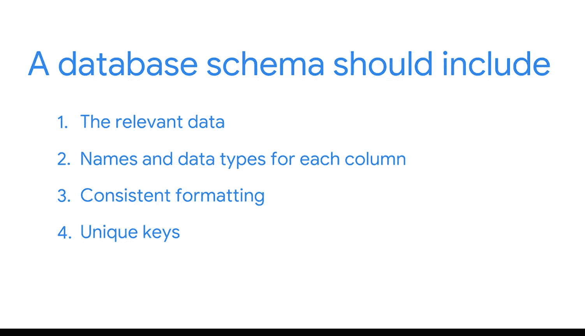

#  048：设计实用的数据库架构 🗄️


在本节课中，我们将要学习如何设计一个实用的数据库架构。一个设计良好的架构是确保数据仓库稳定、高效且易于使用的基石。

## 概述

在之前的课程中，我们学习了如何根据业务需求和数据的形态来设计数据仓库。我们曾以一个例子为基础，创建了一个采用星型模式的维度模型。这个过程有时被称为**逻辑数据建模**。它涉及在物理数据模型中表示不同的表。我们必须决定系统将如何实现这个模型。在本视频中，我们将深入了解一个模式需要具备哪些要素才能发挥其功能。

## 数据库架构的重要性

一个设计良好的数据库架构至关重要。稍后，你将使用你的数据库模式来验证传入的数据，以防止系统错误并确保数据有用。基于所有这些原因，在任何商业智能项目的早期阶段就考虑模式设计是非常重要的。

## 数据库架构的四大要素

一个数据库模式应包含以下四个核心要素。

以下是构成一个实用数据库架构的四个关键组成部分：

1.  **相关的数据**：模式必须包含数据库中所有被描述的数据。如果缺少关键信息，模式就无法成为用户理解数据布局的有效指南。
2.  **列名与数据类型**：模式需要包含数据库中每个表内每一列的**名称**和**数据类型**。这就像厨房抽屉的分类格，让你知道什么东西应该放在哪里，以保持功能正常。
3.  **一致的格式**：确保数据库中所有数据条目具有一致的格式非常重要。每个数据条目都是模式的一个实例。不一致的格式（例如，价格存储为文本而非数字）会导致计算错误。
4.  **唯一键**：数据库中的每个条目都必须有唯一的键。我们在之前的视频中介绍过**主键**和**外键**。正是这些键在表之间建立了连接，使我们能够组合来自整个数据库的相关数据。

## 要素详解与示例

上一节我们介绍了数据库架构的四大要素，本节中我们通过一个书店数据库的例子来具体看看这些要素如何应用。

### 包含所有相关数据

以我们的书店数据库为例，我们知道数据包含大量关于促销、客户、产品、日期和销售的信息。如果我们的模式没有体现这些，那么我们就缺失了关键信息。例如，如果当前的模式无法回答一个特定的业务问题，商业智能专业人员通常需要向现有模式中添加新信息。

**代码示例：添加新列**
假设业务部门想知道哪位客服员工响应了最多的请求，我们就需要将此信息添加到数据仓库并相应地更新模式。
```sql
ALTER TABLE customer_service_logs ADD COLUMN responding_employee_id VARCHAR(255);
```

### 定义列名与数据类型

列名和数据类型定义了数据的结构和含义。例如，在模式中，我们可能有一个用于产品价格的列。

**公式/代码示例：数据类型的重要性**
如果价格数据被存储为字符串类型（例如 `‘$29.99’`），而不是数值类型（例如 `29.99`），它将无法用于查询中的计算，比如汇总销售额。
```sql
-- 错误：字符串无法直接求和
SELECT SUM(‘price‘) FROM sales; -- 会导致错误或意外结果

-- 正确：数值类型可以求和
SELECT SUM(price) FROM sales; -- 返回正确的销售总额
```

### 确保格式一致性

一致性是数据质量的关键。想象一下，我们有两个要合并到一个数据库中的事务系统：一个跟踪发送给用户的促销，另一个跟踪对客户的销售。在源系统中，跟踪促销的市场系统可能有一个“用户ID”列，而销售系统使用的是“客户ID”。为了在我们的仓库模式中保持一致，我们会希望只使用其中一个列名。

此外，如果任何数据条目的列是空的或缺少值，这可能会在后续分析中引发问题。

### 建立唯一键连接

唯一键是关系数据库的骨架。主键唯一标识一个表中的每条记录，而外键则指向另一个表的主键，从而建立关系。

**代码示例：键的定义**
```sql
-- 定义主键
CREATE TABLE products (
    product_id INT PRIMARY KEY,
    product_name VARCHAR(255),
    price DECIMAL(10, 2)
);

-- 定义外键
CREATE TABLE sales (
    sale_id INT PRIMARY KEY,
    product_id INT,
    sale_date DATE,
    FOREIGN KEY (product_id) REFERENCES products(product_id)
);
```

## 总结与持续演进



本节课中我们一起学习了设计一个实用数据库架构的四大要素：包含所有相关数据、明确定义列名与数据类型、确保数据格式的一致性，以及为所有条目建立唯一键。这四大要素将确保你的模式持续有用。


最后需要记住，**开发你的模式是一个持续的过程**。随着你的数据或业务需求的变化，你可以不断调整数据库模式以满足这些新需求。关于这一点，我们很快会有更多内容分享。