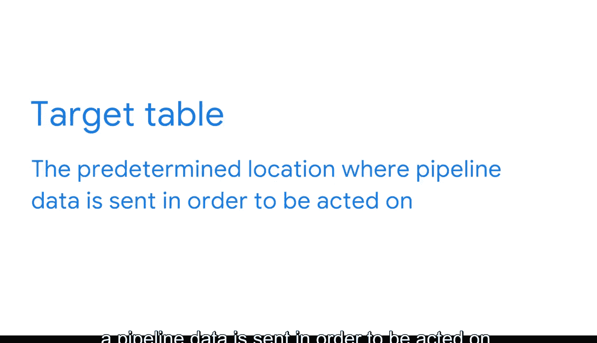

#  049：数据管道与ETL流程 📊➡️📈

在本节课中，我们将要学习数据管道与ETL流程。我们将了解数据管道如何自动将数据从源头运送到目的地，以及在此过程中如何对数据进行转换，使其立即可用。这对于构建和维护数据仓库至关重要。

## 数据管道概述

到目前为止，我们已经学习了很多关于数据如何在数据仓库中组织和存储，以及模式如何描述这些系统的知识。

作为商业智能专业人员，您工作的一部分就是构建和维护数据仓库，这需要考虑所有正在收集和创建数据点的现有系统。

为了简化这一过程，我们使用数据管道。简单来说，数据管道是一系列将数据从不同来源传输到最终目的地以进行存储和分析的过程。它自动化了数据从源头到目标的流动，同时转换数据，使其在到达目的地时即可发挥作用。

换句话说，数据管道用于自动将数据从A点移动到B点，从而节省时间和资源，并使数据更易于访问和使用。本质上，数据管道定义了数据在**何处**、**如何**被组合。它们自动化了涉及提取、转换、组合、验证和加载数据以供进一步分析和可视化的过程。

有效的管道还有助于消除错误和对抗系统延迟。每当有人需要数据或需要重复更新报告时，手动反复移动数据将非常耗时。

例如，如果一个气象站每天获取天气状况信息，由于数据量巨大，手动管理将非常困难。他们需要一个系统来接收数据并将其送到需要的地方，以便将其转化为洞察。

## 数据管道的核心功能

以下是数据管道最实用的功能之一：

*   **整合多源数据**：数据管道可以从多个来源提取数据，进行整合，然后迁移到其适当的目的地。这些来源可能包括关系数据库、具有交易数据的网站应用程序或外部数据源。
*   **自动化摄取**：通常，管道具有推送机制，使其能够近乎实时地或按固定时间间隔从多个来源摄取数据。
*   **定向加载**：数据被提取到管道后，可以加载到其目的地。这可能是数据仓库、数据湖或数据集市（我们将在后续课程中了解更多），或者可以直接提取到BI或分析应用程序中进行即时分析。

## ETL流程详解

通常，在数据从A点移动到B点的过程中，管道还会对数据进行转换。转换包括排序、验证和核查，使数据更易于分析。这个过程被称为**ETL系统**。

**ETL** 代表 **提取（Extract）、转换（Transform）、加载（Load）**。这是一种数据管道类型，它使数据能够从源系统中收集，转换为有用的格式，并导入数据仓库或其他统一的目标系统中。

ETL正日益成为数据管道的标准，因此我们稍后将更详细地了解它。假设一位业务分析师的数据在一个地方，需要将其移动到另一个地方。这时数据管道就派上用场了。但很多时候，源系统的结构并不适合分析，这就是为什么BI专业人员希望在数据到达目标系统之前对其进行转换，以及为什么预先设计好并准备接收数据的数据库模式如此重要。

现在，让我们更详细地探讨这些步骤。您可以将数据管道的功能分为三个阶段：

1.  **摄取原始数据**。
2.  **处理和整合**数据到不同类别。
3.  **转储**数据到用户可以访问的报表表中。

这些报表表被称为**目标表（Target Tables）**。目标表是管道数据被发送到的预定位置，以便进行后续操作。

在移动过程中处理和转换数据非常重要，因为它能确保数据在到达时已准备好被使用。

## 实战演练：构建数据管道

让我们通过一个实例来探索这个过程。假设我们正在与一家在线流媒体服务合作创建数据管道。

首先，我们需要考虑管道的最终目标。在这个例子中，我们的利益相关者希望了解他们的观众人口统计数据，以便为营销活动提供信息。这包括关于观众年龄、兴趣以及所在地的信息。

一旦确定了利益相关者的目标，我们就可以开始思考管道需要摄取哪些数据。在这种情况下，我们需要关于客户的**人口统计数据**。

我们的利益相关者对月度报告感兴趣。因此，我们可以设置管道，使其在每月间隔自动提取我们想要的数据。

数据被摄取后，我们还希望管道执行一些转换，以便数据在交付到我们的目标表时是干净和一致的。请注意，这些表将已经在我们数据库内设置好，以接收数据。

现在，我们将客户的人口统计数据和他们每月的流媒体习惯整合在一个表中，随时可供我们使用。

## 数据管道的优势

数据管道的优点在于，一旦构建完成，它们可以被安排定期自动执行任务。这意味着BI团队成员可以专注于从数据中提取业务洞察，而不必一遍又一遍地重复这个过程。

作为BI专业人员，您工作的很大一部分将涉及创建这些系统，确保它们正确运行，并在业务需求发生变化时更新它们。这是一个非常有价值的优势，您的团队会非常感激。

## 总结

本节课中，我们一起学习了数据管道与ETL流程。我们了解到，数据管道是自动化数据流动的关键，它通过**提取（Extract）、转换（Transform）、加载（Load）** 三个核心步骤，将来自多源的原始数据整合、清洗并加载到目标系统（如数据仓库）中。这不仅节省了手动处理的时间和资源，还确保了数据的质量和一致性，使BI团队能够更高效地从数据中获取洞察，支持业务决策。