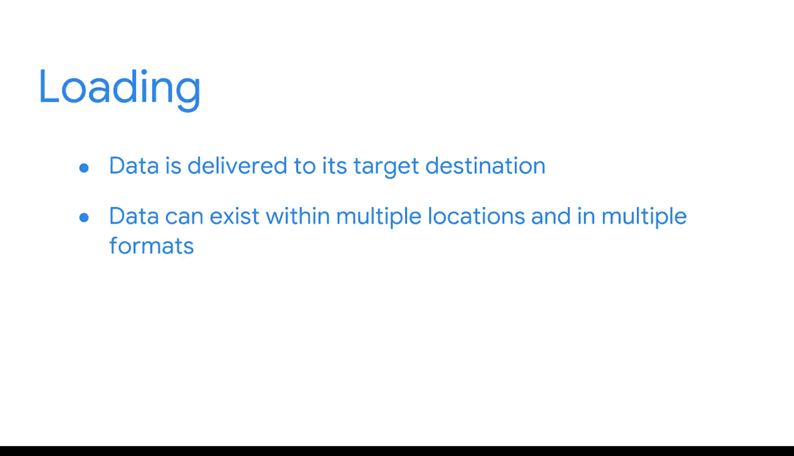

#  050：通过ETL流程最大化数据价值 🚀

在本节课中，我们将要学习一种特定的数据处理流程——ETL（提取、转换、加载）。我们将详细探讨ETL流程的三个核心阶段，了解它如何将原始数据转化为对业务分析有价值的信息。

我们已经学习了很多关于数据管道及其工作原理的知识。现在，我们来讨论一种特定类型的管道：ETL。

之前提到过，ETL能够从源系统中收集数据，将其转换为有用的格式，并导入数据仓库或其他统一的目标系统中。与其他管道类似，ETL流程也分阶段工作，这些阶段就是提取、转换和加载。

## 提取阶段

让我们从提取阶段开始。在这个阶段，管道会访问源系统，然后从中读取并收集必要的数据。许多组织将数据存储在事务型数据库中，例如OLTP系统，这类系统非常适合记录日志。或者，企业可能使用平面文件，例如HTML或日志文件。无论哪种情况，ETL都会通过从源中提取数据并将其移动到临时的暂存表中，使数据变得可用于分析。

## 转换阶段

接下来是转换阶段。具体的转换活动取决于目标系统的结构和格式以及业务案例的需求。但正如你所学的，这些转换通常包括验证、清理数据，并为其进行分析做好准备。在这个阶段，ETL管道还会将源系统中的数据类型映射到目标系统，以便数据符合目标系统的规范。

以下是转换阶段可能涉及的核心活动：
*   **验证**：检查数据的准确性和完整性。
*   **清理**：修正错误、处理缺失值、统一格式。
*   **准备**：将数据重组或聚合为适合分析的格式。
*   **映射**：确保源数据字段与目标系统字段正确对应。

## 加载阶段

最后是加载阶段。这是将数据传送到其目标位置的时候。目标可能是一个数据仓库、一个数据湖，或者一个处理直接数据馈送的分析平台。

请注意，数据一旦被传送，它可以以多种格式存在于多个位置。例如，可能有一个覆盖一周数据的快照表，以及一个包含部分相同记录的更大的存档库。这有助于确保历史数据在系统内得到维护，同时为利益相关者提供重点突出、及时的数据。

如果业务关注于理解和比较月平均销售额，数据将被移入一个为分析查询优化过的OLAP系统中。

ETL流程是一种常见的数据管道类型，商业智能专业人员经常需要构建并与之交互。接下来，你将了解更多关于这些系统及其创建方式的知识。

## 总结

本节课中，我们一起学习了ETL流程的三个核心阶段：提取、转换和加载。我们了解到，ETL通过从各种源系统提取数据，经过验证、清理和格式化等转换操作，最终将其加载到数据仓库等目标系统中，从而将原始数据转化为可用于分析和决策的有价值信息。这是商业智能领域中实现数据价值最大化的关键步骤之一。