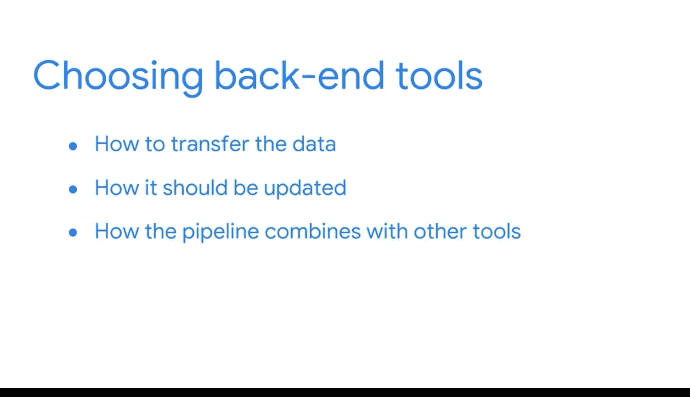

#  051：为任务选择合适的工具 🛠️

## 概述

在本节课中，我们将学习商业智能（BI）专业人员如何为不同的数据处理任务选择合适的工具。我们将探讨如何根据业务需求、利益相关者的数据查看方式以及数据移动的技术要求来做出决策。

## 从数据处理流程到工具选择

在之前的课程中，我们探讨了从不同来源获取数据、将其转换为符合目标格式，并最终推送到用户可以开始获取业务洞察的目的地的整个流程。BI专业人员在构建和维护这些流程中扮演着关键角色，他们会使用多种工具来完成工作。

本节中，我们来看看BI专业人员如何选择正确的工具。

## 组织偏好与通用技能

作为一名BI专业人员，您的组织很可能有偏好的供应商，这意味着您将获得一套可用的BI解决方案。BI领域的一大优点是，不同的工具背后有着非常相似的原则和用途。这体现了可迁移技能的另一个例子。换句话说，您对基本原理的理解可以应用到其他解决方案上，无论您的组织偏好哪一种。

例如，我学习的第一个数据库管理系统是Microsoft Access。这段经历帮助我获得了如何建立表之间连接的基本理解。这让我在职业生涯后期学习新工具时变得更加直接。当我开始使用MySQL时，我已经能够理解其背后的基本原理。

## 选择工具时的考量因素

现在，您也有可能亲自选择将要使用的工具。如果是这种情况，您需要考虑关键绩效指标（KPI）、利益相关者希望如何查看数据以及数据需要如何移动。

### 基于关键绩效指标（KPI）选择

正如您所学到的，KPI是与业务战略紧密相关的可量化价值，用于跟踪实现目标的进度。KPI让我们知道我们是否成功，以便我们可以调整流程以更好地实现目标。

以下是KPI的一些例子：
*   一些财务KPI包括：毛利率、净利润率和资产回报率。
*   一些人力资源KPI包括：晋升率和员工满意度。

理解您组织的KPI意味着您可以基于这些需求来选择工具。

### 基于数据呈现方式选择

接下来，根据利益相关者希望如何查看数据，您可以选择不同的工具。利益相关者可能会要求图表、静态报告或数据看板。

有多种工具可供选择，包括Looker Studio、Microsoft Power BI和Tableau。其他一些工具如Azure Analysis Services、Cloud SQL、Pentaho、SSAS和SSRS SQL Server，也都内置了报告工具。

选择很多。您将在后续课程中获得关于这些不同工具的更多见解。

### 基于后端数据处理需求选择

在考虑了利益相关者如何查看数据之后，您还需要考虑后端工具。这时您需要考虑数据需要如何移动。

例如，并非所有BI工具都能读取数据湖。因此，如果您的组织使用数据湖来存储数据，那么您需要确保选择一个能够处理数据湖的工具。

选择后端工具时，其他一些重要的考虑因素包括：
*   如何传输数据。
*   数据应如何更新。
*   在数据转换过程中，管道如何与其他工具结合。

以上每一点都有助于您确定工具集的必备功能，从而找到最佳选项。

## 工具组合与技能迁移

同样重要的是，您最终可能会使用多种工具的组合来创建理想的系统。正如您一直在学习的，BI工具具有共同的特征，因此您在这些课程中学到的技能，无论您最终使用哪种工具，都可以派上用场。

回到我的例子，无论是使用Microsoft Access还是MySQL，我都能理解转换和合并表格背后的逻辑。这个基础在我整个职业生涯中遇到的不同BI工具之间都得到了迁移。

## 总结

本节课中，我们一起学习了BI专业人员如何根据业务KPI、数据呈现需求和技术后端要求，为数据处理任务选择合适的工具。我们了解到，尽管工具众多，但背后的原理相通，所学的技能具有高度的可迁移性。掌握这些核心原则，将帮助您灵活应对不同的技术环境。

## 后续展望

接下来，您将了解更多关于未来可能用到的解决方案。您也很快将开始动手操作一些数据。