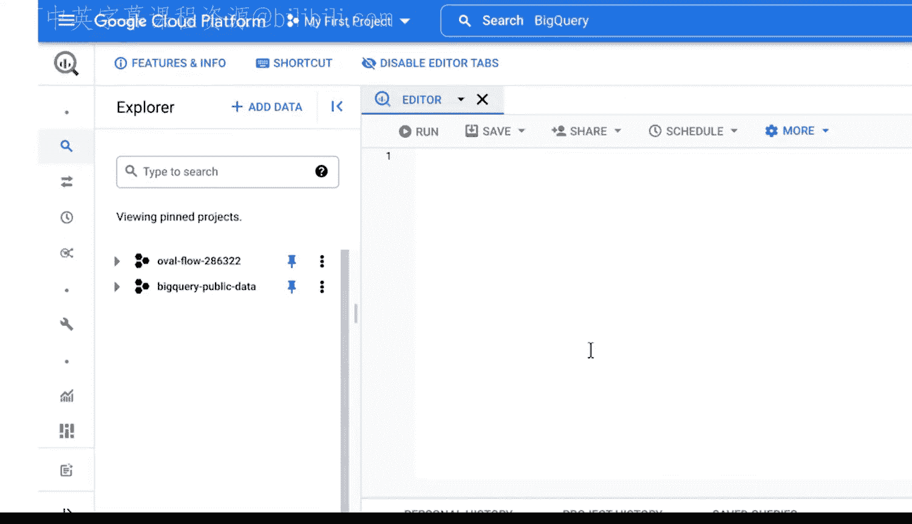

#  052：Dataflow简介 🚀

在本节课中，我们将学习Google Dataflow的基础知识。Dataflow是一个强大的数据处理服务，用于构建和管理数据管道。我们将介绍其核心功能、界面导航以及如何开始使用它。

## 概述

上一节我们介绍了数据管道的基本概念。本节中，我们将深入了解Google Dataflow，这是一个用于构建、运行和管理数据管道的服务器化服务。通过学习Dataflow，你可以将之前学到的管道知识付诸实践。

## Dataflow是什么？

Google Dataflow是一个无服务器的数据处理服务。它从数据源读取数据，进行转换处理，然后将结果写入目标位置。

其核心工作流程可以用一个简单的公式表示：

**数据输入 -> 转换处理 -> 数据输出**

Dataflow使用开源库创建管道，你可以使用多种编程语言与之交互，包括Python和SQL。

## Dataflow的主要功能

以下是Dataflow提供的几个关键功能：

*   **预构建模板**：Dataflow包含一系列预构建的管道模板，你可以直接使用或根据需要进行定制。
*   **SQL支持**：你可以使用SQL语句来构建自己的数据处理管道。
*   **安全特性**：该工具内置了安全功能，有助于保护你的数据安全。

## 导航Dataflow控制台

现在，让我们打开并探索Dataflow控制台。首先，登录并进入控制台界面。

控制台打开后，我们找到“作业”页面。如果你是第一次使用Dataflow，这里会显示“没有要显示的作业”。作业页面用于查看和管理你项目空间中的所有当前任务。

在作业页面，你有两个主要选项：
*   **从模板创建作业**
*   **从SQL创建作业**

“快照”功能可以保存流式管道的当前状态。这样，你可以在不丢失当前版本的情况下启动新版本。这对于测试管道、为用户无缝更新以及备份和恢复旧版本非常有用。

“管道”部分列出了你已经创建的所有管道。同样，首次使用时，这里会显示在开始构建管道前需要启用的必要流程。现在是一个好时机来完成这一步，只需点击“全部修复”来启用API功能并设置你的位置。

“笔记本”部分允许你创建和保存可共享的、包含实时代码的Jupyter笔记本。这对于初次使用ETL工具的用户查看示例和可视化数据转换过程很有帮助。

最后，我们来到“SQL工作区”。如果你之前使用过BigQuery，例如在谷歌数据分析证书课程中，你会对此感到熟悉。在这里，你可以在Dataflow环境中编写和执行SQL查询。

至此，你已经可以登录Google Dataflow并开始自行探索了。在接下来的课程中，我们将有更多机会使用这个工具来完成实际的商业智能任务。

## 总结

本节课我们一起学习了Google Dataflow的基础知识。我们了解了Dataflow作为一个无服务器数据处理服务的定义和核心功能，并逐步导航了其控制台的主要界面，包括作业管理、管道列表、笔记本和SQL工作区。掌握这些是开始构建你自己数据管道的第一步。