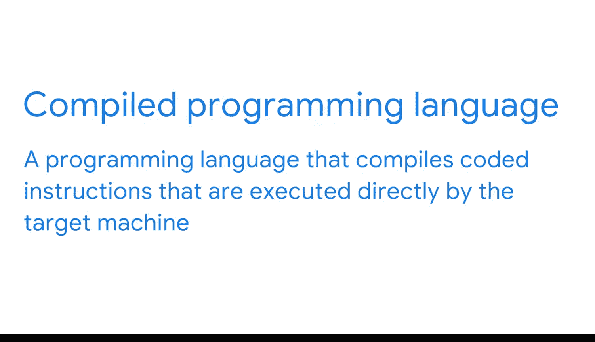

#  053：Python编程实践 🐍

在本节课中，我们将要学习Python编程语言的基础知识，了解它为何在商业智能领域如此重要，并探讨其核心特性。

如果你来自谷歌数据分析认证课程，或者曾使用过关系型数据库，你可能对查询语言SQL很熟悉。查询语言是用于与数据库通信的特定计算机编程语言。作为一名BI专业人士，你可能也需要使用其他类型的编程语言。这就是为什么在本视频中，我们将探索当下最流行的编程语言之一：Python。

编程语言是一种由单词和符号组成的系统，用于编写计算机遵循的指令。虽然存在许多不同的编程语言，但Python的开发初衷是让用户能用比其他大多数语言更少的行数来编写命令。Python也是开源的，这意味着它可以免费使用，并且可以被使用者修改和共享。庞大的Python用户社区不断开发工具和库来改进Python，这为BI专业人士提供了大量可用的资源。

Python是一种通用编程语言，可应用于多种场景。在商业智能中，它被用于连接数据库系统以读取和修改文件。它也可以与其他软件工具结合来开发数据管道，甚至可以处理大数据并执行计算。

---

## Python的核心特性

在开始你的编程之旅时，你应该理解关于Python的几个关键点。

首先，它主要是**面向对象**的和**解释型**的语言。

### 面向对象编程

让我们先理解什么是面向对象。面向对象的编程语言围绕数据对象进行建模。这些对象是包含特定信息的代码块。基本上，系统中的一切都是对象。一旦数据在代码中被捕获，它就会被系统标记和定义，以便以后无需重新输入数据即可重复使用。

由于Python已被数据社区广泛采用，因此开发了许多库来预定义数据结构以及可应用于系统中对象的常见操作。当你需要重复分析，甚至为多个项目使用相同的转换时，这非常有用。无需从头开始重新输入代码，这节省了大量时间。

需要注意的是，面向对象的编程语言不同于围绕函数建模的**函数式编程语言**。虽然Python主要是面向对象的，但它也可以用作函数式编程语言来创建和应用函数。Python如此受欢迎的部分原因在于它的灵活性。但对于BI来说，Python真正有价值的地方在于它能够创建和保存数据对象，然后通过代码与这些对象进行交互。

### 解释型语言

现在，让我们考虑Python是一种解释型语言这一事实。解释型语言是使用**解释器**（通常是另一个程序）来读取和执行编码指令的编程语言。这与**编译型编程语言**不同，后者编译的指令由目标机器直接执行。

这两种编程语言之间最大的区别之一是，机器执行的编译代码几乎无法被人类阅读。因此，Python的解释型特性对BI专业人士非常有用，因为它使他们能够以交互方式使用该语言。例如，Python可用于制作**Notebook**。Notebook是一个用于创建数据报告的交互式、可编辑的编程环境。这可以是为利益相关者构建动态报告的好方法。

---

## Python在BI工具箱中的应用

Python是BI工具箱中的一个强大工具。你甚至可以选择在Google Dataflow中使用Python命令。很快，当你开始在Dataflow工作区中编写Python时，你将有机会亲自体验它。

---

在本节课中，我们一起学习了Python编程语言的基础知识。我们了解到Python是一种开源、通用、主要面向对象的解释型语言，以其简洁性和灵活性著称。在商业智能领域，Python用于连接数据库、处理文件、构建数据管道、处理大数据以及创建交互式报告。理解其面向对象和解释型的特性，有助于我们更有效地利用Python来提升数据分析的效率和可复用性。