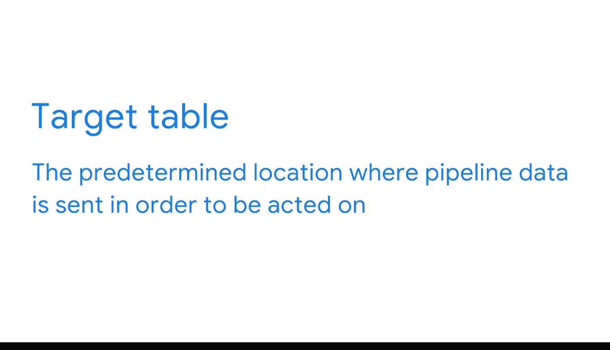

**谷歌商业智能课程：15：从利益相关方收集信息**

在本节课中，我们将学习如何从利益相关方那里收集关键信息，这是构建有效商业智能流程的基础。我们将探讨需要收集哪些信息，以及如何通过协作确保最终的工具能满足团队需求。

你已经了解了商业智能专业人员在一个组织中可能合作的不同利益相关方，以及如何与他们沟通。

你也了解到，在项目开始时从利益相关方那里收集信息是流程中的一个关键步骤。

既然你对数据管道有了更多了解，现在让我们来思考，在为利益相关方构建商业智能流程之前，你需要从他们那里收集哪些信息。这样，你就能确切知道他们的需求，并帮助他们的工作尽可能高效。

作为商业智能专业人员，你的部分工作是理解现有的流程，以及如何将商业智能工具整合到这些现有的工作流中。

通常，在商业智能领域，你不仅仅是每天试图回答个别问题。你是在试图发现你的团队正在提出哪些类型的问题，以便能为他们构建一个工具，使他们能够自己获取这些信息。

人们很少能确切知道自己需要什么并清晰地传达给你。相反，他们通常会带着一系列问题或现象来找你。而你的责任就是找出如何帮助他们。

对数据不太熟悉的利益相关方，往往不知道商业智能流程可以实现什么。这就是为什么跨业务协调如此重要。

你的目标是创建一个以用户为中心的设计，满足整个团队的所有需求。这样，你的解决方案就能一次性解决每个人的需求，从而作为一个整体来优化他们的流程。

弄清楚所有不同利益相关方的需求可能具有挑战性。

以下是收集信息的一些有效方法：

*   **举办研讨会**：创建一个演示文稿，并与不同的团队一起主持一个研讨会。这是支持跨业务协调和确定每个人需求的好方法。
*   **观察与提问**：花些时间观察利益相关方的工作，并就他们正在做什么以及为什么这样做向他们提问，这也非常有帮助。

此外，与跨团队的利益相关方尽早确定**指标**和目标表应包含的**数据**非常重要。这应该在你开始构建工具之前完成。

正如你所知，**指标**是一个单一的可量化数据点，用于评估绩效。在商业智能中，企业通常感兴趣的指标是**关键绩效指标**，这些指标帮助他们评估在实现特定目标方面的成功程度。理解这些目标以及如何衡量它们，是构建商业智能工具的重要第一步。

你也知道，**目标表**是数据被最终处理和使用的目的地。因此，理解最终目标有助于你设计最佳流程。

重要的是要记住，构建商业智能流程是一个协作和迭代的过程。你将持续从利益相关方那里收集信息，并运用所学知识，直到为你的团队创建一个有效的系统。即便如此，随着新需求的出现，你可能还会对其进行修改。

通常，你的利益相关方可能已经明确了他们的问题，但他们可能尚未明确他们对项目的**假设或偏见**。这正是商业智能专业人员可以提供见解的地方。

与利益相关方紧密合作，可以确保你在设计能够优化他们流程的商业智能工具时，始终将他们的需求放在心上。理解他们的目标、指标和最终目标表，并在多个团队之间进行沟通，将确保你构建出对每个人都有效的系统。

在本节课中，我们一起学习了从利益相关方收集信息的重要性与方法。我们明确了需要收集的关键信息包括：理解现有流程、识别核心问题、确定关键指标以及定义最终的数据目标表。通过举办研讨会、观察工作现场和持续沟通等协作方式，我们可以确保构建的商业智能工具真正满足团队需求，并支持跨业务的高效协作。记住，这是一个迭代的过程，需要持续反馈与调整。