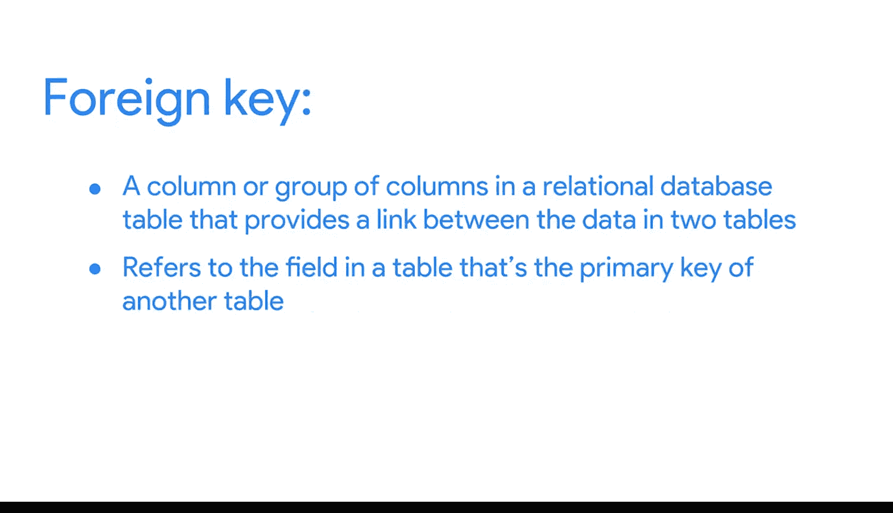

#  057：主键与外键

在本节课程中，我们将学习数据库中的两个核心概念：主键与外键。理解它们对于组织数据、建立表与表之间的关系至关重要。

数据库是数据分析师必不可少的工具。几乎所有需要访问的数据都存储在数据库中。数据库存储和组织数据，使数据分析师管理和访问信息变得更加容易。它们帮助我们更快地获取洞察、做出数据驱动的决策并解决问题。

您已经初步了解了数据库是什么以及数据分析师如何使用它们。现在，让我们更深入地学习数据库的特性和组成部分。

## 🏗️ 数据库结构与关系型数据库

这是一个简单的数据库结构示例，它包含来自一家汽车制造商的信息表。顶层包括汽车经销商、产品详情和维修零件等表。当您选择其中一张表并深入下一层时，会发现每个项目的更具体细节。

这种结构被称为**关系型数据库**。关系型数据库包含一系列相互关联的表，这些表可以通过它们之间的关系连接起来。

## 🔑 表关系的建立：主键与外键

要使两个表建立关系，它们内部必须存在一个或多个相同的字段。例如，在下图中，`branch_id` 字段同时存在于这张表和另一张表中。

如果某个字段同时存在于两个表中，我们就可以用它来连接这两个表。`branch_id` 字段就是连接这些表的关键。

键主要分为两种类型。

### 主键

**主键**是一个标识符，它引用的列中的每个值都是唯一的。您可以将其视为表中每一行的唯一标识符。

在我们的经销商信息表中，`branch_id` 是主键。同样，在关于每辆车的产品详情表中，`vin` 是我们的主键。

作为分析师，您可能需要创建表。如果您决定包含主键，它必须是唯一的，即任意两行都不能拥有相同的主键。此外，主键不能为空或空白。

**公式/概念**：
*   **主键**：表中每一行的**唯一**标识符。
*   **约束**：值必须唯一且不能为 `NULL`。

### 外键

**外键**是表中的一个字段，它是另一个表中的主键。换句话说，外键是连接一张表与另一张表的方式。

在我们的维修零件表中，由于它包含每个汽车零件的信息，其主键是 `part_id`。维修零件表中的每一行代表一个唯一的零件。该表中的所有其他键，例如 `vin`，都是**外键**，它们使得维修零件表能够连接到其他表。

如图所示，一张表只能有一个主键，但可以有多个外键。

**公式/概念**：
*   **外键**：表中的一个字段，其值是另一张表**主键**的值。
*   **作用**：建立表与表之间的关联。

## 📝 核心要点总结

理解主键和外键可能有些棘手，后续您将获得更多练习机会。但作为一个概括性总结：

*   **主键**用于确保特定列中的数据是唯一的。它唯一地标识关系数据库表中的一条记录。一张表只允许有一个主键，并且主键不能包含空值或空白值。
*   **外键**是关系数据库表中的一个列或一组列，它在两个表的数据之间提供链接。它引用的是表中作为另一张表主键的字段。
*   最后，需要注意的是，一张表中允许存在多个外键。

您可以随时重看本视频，以确保清晰地理解主键和外键。接下来，您将开始练习如何访问和分析实际数据库中的数据，这将是加深您对主键、外键、数据库组织方式的理解，以及思考如何在未来的分析职业生涯中使用数据库的绝佳机会。

在本节课中，我们一起学习了关系型数据库的基础，重点掌握了**主键**（唯一标识行）和**外键**（连接不同表）的定义、特点与作用，这是理解数据如何被有效组织和关联的基石。