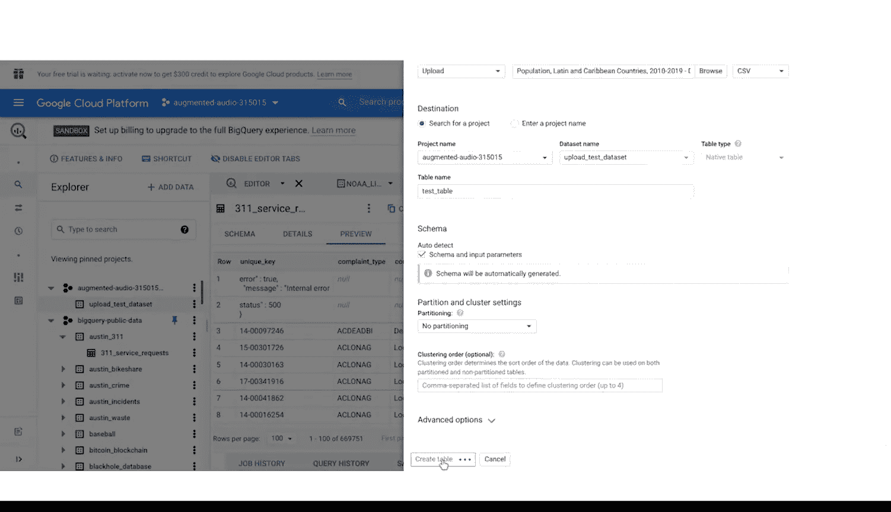

**谷歌商业智能：19_01_03：可选复习：BigQuery SQL工作区详解** 🚀

在本节课程中，我们将学习BigQuery SQL工作区的各个组成部分。掌握这个工具对于数据分析师至关重要，它在本课程乃至整个职业生涯中都将极具价值。

---

### **概述**

本节课我们将探索BigQuery的SQL工作区。主要内容包括：导航至工作区、搜索并使用公共数据集、运行SQL查询，以及上传自己的数据进行分析。即使界面有细微更新，也不影响我们掌握其核心操作。

---

### **导航至SQL工作区**

首先，访问BigQuery主页并登录您的账户。

要进入SQL工作区，请按照以下步骤操作：
1.  选择屏幕左侧的菜单。
2.  向下滚动至“大数据”标题。
3.  将鼠标悬停在“BigQuery”标签上。
4.  从下拉菜单中点击“SQL工作区”。

现在，我们已经成功进入SQL工作区。

---

### **探索与使用公共数据集**

上一节我们进入了工作区，本节中我们来看看如何查找并使用公共数据。

以下是具体操作步骤：

1.  **打开数据资源管理器**：在屏幕左侧的菜单中，找到“资源管理器”面板。
2.  **添加数据**：点击该面板右上角的“添加数据”按钮。
3.  **探索公共数据集**：在下拉菜单中，选择“探索公共数据集”。这将打开市场页面，显示所有可用的公共数据集。
4.  **搜索数据集**：让我们在搜索栏中输入 `NOAA_Lightning`，这是我们后续课程活动中将使用的一个数据集。
5.  **查看数据集**：点击“云到地闪电数据集”。页面会显示该数据集的描述和预览，其中包含了美国闪电活动和天气模式的观测数据。
6.  **加载到工作区**：点击“查看数据集”，系统将返回SQL工作区，并为该数据集创建一个新标签页。

此时，我们可以返回之前打开的编辑器标签页，或点击“编写新查询”开始编写SQL。

在左侧的“资源管理器”菜单中，您会看到“BigQuery公共数据”下拉列表。点击箭头可以展开列表并选择其他数据集。

例如，我们选择列表中的第一个数据集 `austin_311`。展开后，可以看到该数据集内的数据表。点击表名可以预览数据：
*   **架构**标签页：显示数据集中每一列的名称。
*   **详细信息**标签页：包含额外的元数据，例如数据集的创建日期。
*   **预览**标签页：显示数据的前几行。

在此页面上，点击“查询”按钮，系统会自动创建一个新的编辑器窗口，并已预填查询模板。

---

### **运行SQL查询**

现在我们已经选择了数据集，接下来学习如何运行查询。

在自动生成的编辑器窗口中，光标会自动定位在 `SELECT` 语句后。我们输入一个星号 `*` 来选择所有列，然后点击“运行”按钮。

恭喜！您已在BigQuery中成功运行了一条SQL查询。查询结果将显示在编辑器界面下方的窗口中，您运行任何查询的结果都会在此处显示。

---

### **上传并分析自有数据**

除了使用公共数据，数据分析师经常需要处理自己的数据。本节中我们来看看如何将数据上传到BigQuery。

假设您有一份调查结果，希望上传到BigQuery并用SQL进行分析。

以下是上传数据的步骤：

1.  **选择项目**：在“资源管理器”中，选择您想要添加数据的项目ID。
2.  **创建数据集**：
    *   点击项目右侧的三个垂直点图标，打开选项菜单。
    *   选择“创建数据集”。
    *   为数据集命名一个易于识别的名称，例如 `upload_test_dataset`。
    *   点击“创建数据集”。
3.  **在数据集中创建表**：
    *   在“资源管理器”菜单中，找到刚创建的数据集（位于项目下拉菜单下）。
    *   点击数据集右侧的三个垂直点图标。
    *   选择“创建表”图标，这会打开一个弹出窗口。
4.  **配置上传**：
    *   在“来源”下的“创建表自”选项中，选择“上传”或您偏好的其他方式。
    *   您可以上传任何数据文件，例如CSV文件。
    *   为表指定一个清晰的名称，如 `test_table`。
    *   确保“架构”设置为“自动检测”。
    *   点击“创建表”。

---

### **总结**

本节课中，我们一起学习了BigQuery SQL工作区的核心操作。我们掌握了如何导航至工作区、搜索并加载公共数据集、运行基本的SQL查询，以及上传自有数据进行分析。BigQuery的功能远不止于此，您可以随时回看本视频并持续练习以加深理解。

祝您学习愉快！😊