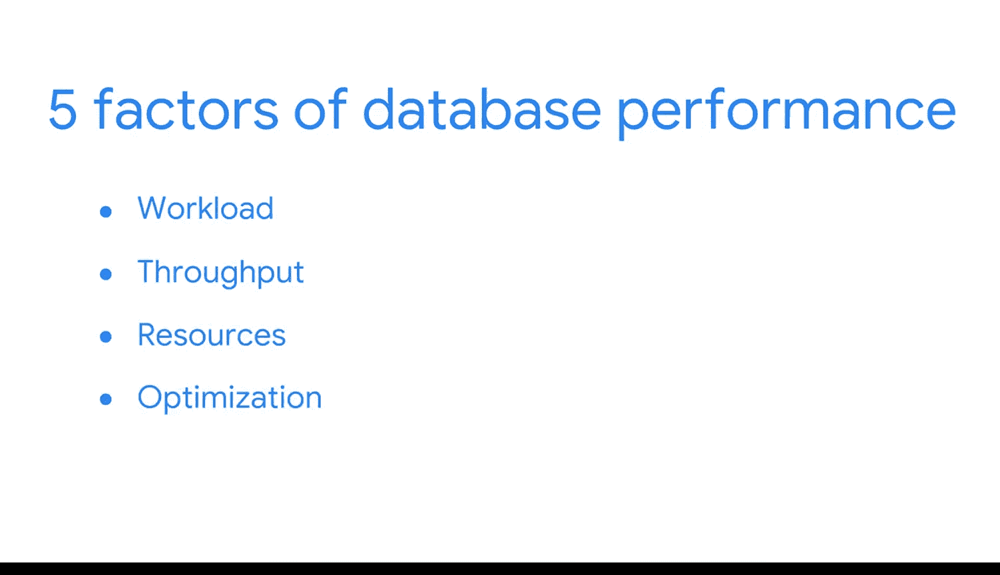

#  059：数据管道性能优化 🚀

在本模块中，我们将学习如何理解和优化数据管道的性能，以确保能够高效地向利益相关者提供最新的信息。我们将探讨提升系统吞吐量、减少资源竞争的方法，并深入了解数据库系统及其对整体效率的贡献。

---

为了高效地向利益相关者提供最新的信息，你必须首先理解并优化数据管道内的性能。

这正是我们接下来几个视频将要探索的内容。

我们将学习如何提升吞吐量，并最小化系统内的资源竞争，从而处理尽可能大的工作负载。

---

上一节我们介绍了模块的整体目标，本节中我们来看看将要涉及的具体技术系统。

我们将深入探讨数据库系统，包括数据集市、数据湖、数据仓库以及 **ELT** 过程。请注意，**ELT** 并非笔误，它与 **ETL** 不同。**ELT** 代表 **提取（Extract）、加载（Load）、转换（Transform）**。你将看到这些系统如何提升整个数据系统的效率。

---

除了了解系统构成，我们还需要评估其性能。以下是数据库性能的五个关键因素：

*   **工作负载**：系统需要处理的任务总量和类型。
*   **吞吐量**：系统在单位时间内处理工作的能力。
*   **资源**：可用的计算、内存和存储资源。
*   **优化**：对系统和查询进行的调优措施。
*   **竞争**：不同任务对有限资源的争用情况。

---

你还会获得一些确保数据库数据摄入和存储达到最佳状态的实用技巧。

---

最后，我们将开始思考如何设计高效的查询，以真正充分利用你的系统。

---

本节课中，我们一起学习了数据管道性能优化的重要性，预览了将要探讨的数据库系统（如数据仓库、ELT），并介绍了评估性能的五个关键因素。在接下来的课程中，我们将逐一深入这些主题。