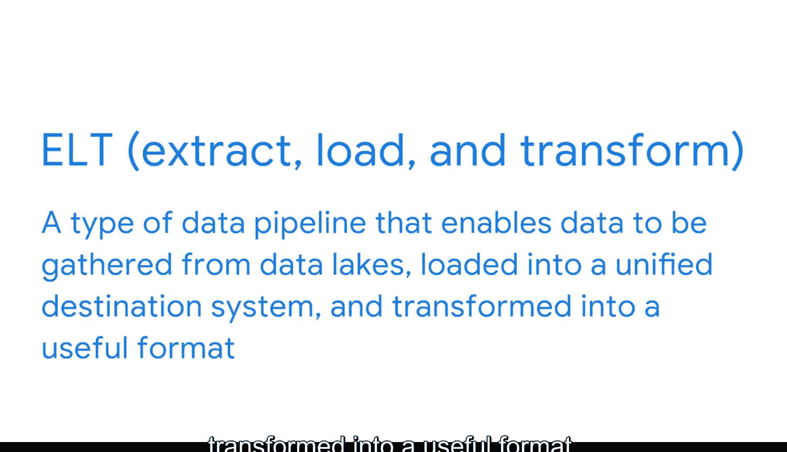

#  060：数据集市、数据湖与ETL流程

在本节课中，我们将要学习商业智能领域中几种重要的数据存储与处理模式：数据集市、数据湖以及ETL/ELT流程。理解这些概念将帮助你更好地构建和优化数据系统。

商业智能的一个显著特点是其工具和流程在不断演进。这意味着BI专业人员始终有机会构建和改进现有系统。因此，让我们来了解一些你作为BI专业人员可能会遇到的其他有趣的数据存储和处理模式。

## 数据仓库回顾

在之前的课程中，我们学习了利用数据仓库进行存储的数据库系统。作为回顾，**数据仓库**是一种特定类型的数据库，它整合来自多个源系统的数据，以确保数据的一致性、准确性和高效访问。本质上，数据仓库是公司所有系统数据的巨大集合。

当公司使用单一机器存储和计算其关系型数据库时，数据仓库非常普遍。然而，随着云技术的兴起和数据量的爆炸式增长，新的数据存储和计算模式应运而生。

## 数据集市

上一节我们介绍了数据仓库，本节中我们来看看数据集市。你可能还记得，**数据集市**是一种面向主题的数据库，它可以是更大数据仓库的一个子集。这里的“面向主题”指的是与业务特定领域或部门（如财务、销售或市场营销）相关联的内容。

BI项目通常专注于为不同团队解答各种问题。因此，数据集市是访问特定项目所需相关数据的一种便捷方式。以下是数据集市的主要特点：
*   **面向特定主题**：服务于特定业务领域。
*   **数据子集**：通常是数据仓库的一部分。
*   **便于访问**：为特定团队或项目提供快速、相关的数据视图。

## 数据湖

接下来，我们探讨另一种存储模式：数据湖。**数据湖**是一种数据库系统，它以原始格式存储大量原始数据，直到需要使用时才进行处理。这使得数据易于访问，因为它不像数据仓库那样需要大量预处理。

数据湖结合了许多不同的数据源。但数据仓库是分层的，使用文件和文件夹来组织数据，而数据湖则是扁平结构。数据虽然被标记以便识别，但并未被组织。它是流动的，这也是它被称为“数据湖”的原因。

数据湖在存储前不需要对数据进行转换，因此如果你的BI系统需要摄取多种不同类型的数据，数据湖会非常有用。当然，这些数据最终仍需要被组织和转换。

## ETL与ELT流程

前面我们了解了数据存储方式，现在来看看如何将数据湖等源的数据整合到系统中，这涉及到数据处理流程。之前，我们学习了**ETL**流程，即数据从源头提取到管道中，在传输过程中进行转换，然后加载到目标位置。

**ELT**流程步骤相同，但重新组织了顺序：管道先提取、加载数据，然后再进行转换。本质上，ELT是一种数据管道，它使得数据能够从不同来源（通常是数据湖）收集，然后加载到统一的目标系统中，并转换为有用的格式。

以下是ELT流程的优势：
*   **快速数据摄取**：数据一旦可用，即可立即摄入存储系统。
*   **按需转换**：只需转换需要使用的数据。
*   **降低成本与独立扩展**：降低了存储成本，并使企业能够独立扩展存储和计算资源。

## 总结

本节课中，我们一起学习了商业智能中关键的存储与处理模式。我们回顾了数据仓库的核心作用，探讨了面向特定业务需求的数据集市，以及能够存储海量原始数据的数据湖。最后，我们比较了传统的ETL流程与更适应现代数据环境的ELT流程，后者支持更灵活的数据处理。

随着技术进步，可用的流程和工具也在进步。一些最成功的BI专业人士表现出色，正是因为他们保持着好奇心，是终身学习者。